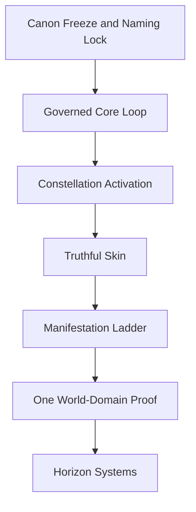
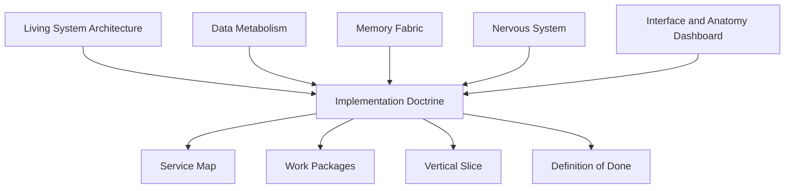
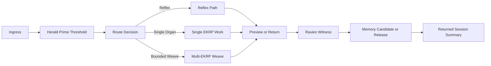
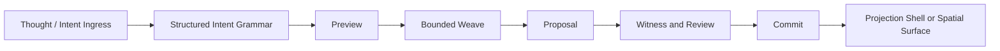
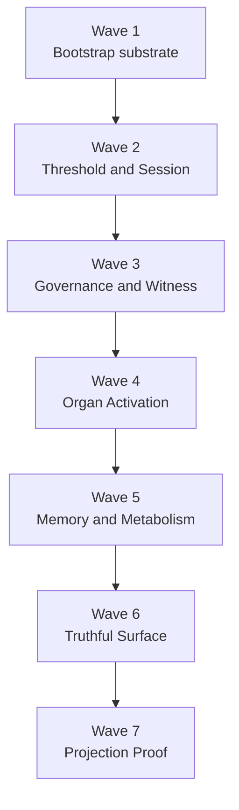

<!--
SPDX-License-Identifier: CC-BY-SA-4.0
-->

# Eidonic Core Implementation Doctrine v1.1

> “Build the living center first. Let every later manifestation prove the body, not replace it.”

<p align="center">
  
  
  
  <a href="https://github.com/S1ngularD2ality/eidonic-language-elol/blob/main/docs/mirror_laws.md"></a>
</p>

**Recommended placement:** `docs/Eidonic_Core_Implementation_Doctrine_v1_1.md`

[Core README](./README.md) · [Living System Architecture](./Eidonic_Core_v2_Living_System_Architecture.md) · [Data Metabolism](./Eidonic_Core_Data_Metabolism_Specification.md) · [Memory Fabric](./Eidonic_Core_Memory_Fabric_Specification.md) · [Interface and Anatomy Dashboard](./Eidonic_Core_Interface_and_Anatomy_Dashboard.md) · [Nervous System](./Eidonic_Core_Nervous_System_Specification.md)

---

## Table of Contents

- [1. Purpose](#1-purpose)
- [2. Executive Position](#2-executive-position)
- [2.1 Current Live State](#21-current-live-state)
- [2.2 Current Working Discipline](#22-current-working-discipline)
- [3. Canon Naming Lock](#3-canon-naming-lock)
- [4. What This Doctrine Adds](#4-what-this-doctrine-adds)
- [5. Non-Negotiable Build Laws](#5-non-negotiable-build-laws)
- [6. The Core Build Ladder](#6-the-core-build-ladder)
- [7. Relationship to the Existing Core Scrolls](#7-relationship-to-the-existing-core-scrolls)
- [8. The First Proving Slice](#8-the-first-proving-slice)
- [9. Technical Stack Position](#9-technical-stack-position)
- [10. Runtime Services and Responsibilities](#10-runtime-services-and-responsibilities)
- [11. Data, Persistence, and Memory Law](#11-data-persistence-and-memory-law)
- [12. Truthful Surface Law](#12-truthful-surface-law)
- [13. Manifestation Ladder](#13-manifestation-ladder)
- [14. Current and Target Repository Shape](#14-current-and-target-repository-shape)
- [15. Work Packages and Status](#15-work-packages-and-status)
- [16. Definition of Done for the Current Living Core Phase](#16-definition-of-done-for-the-current-living-core-phase)
- [17. Kill Criteria and Anti-Patterns](#17-kill-criteria-and-anti-patterns)
- [18. Suggested Read Order](#18-suggested-read-order)
- [19. Closing Position](#19-closing-position)

---

## 1. Purpose

This doctrine fuses the **living-system canon** of the Eidonic Core with the harsher build sequencing of the technical stack specification and the ruthless build map.

Its purpose is simple:

1. protect the center flame from dilution  
2. turn the Core from architecture poetry into executable sequence  
3. keep the organism model alive while forcing every sacred term to cash out in runtime behavior, schemas, services, persistence surfaces, and review logic  
4. make the `eidonic-core/` repository the real implementation center of the broader Eidonic universe  
5. keep the build aligned to the **actual live scaffold**, not merely the intended horizon  

This scroll does **not** replace the other core documents.

It acts as their **execution doctrine**.

The other core scrolls tell us what kind of organism the Eidonic Core is trying to become.  
This doctrine tells us how to build that organism without drowning in symbolic excess, implementation drift, or architectural theater.

---

## 2. Executive Position

The Eidonic Core should be built as a **governed living system**.

That means it is not:

- one chatbot with lore
- a generic multi-agent playground
- a symbolic language experiment mistaken for runtime maturity
- a universe of parallel branches with no proven center

It **is**:

- a constitutional runtime for bounded, reviewable, witness-bearing passage from human intent to returned action
- a living organism architecture composed of threshold, routing, memory, witness, governance, interface, and manifestation layers
- a center where ELoL, Mirror Laws, Guardian, Herald Prime, Ravien, ECP, the EKRPs, and downstream manifestation systems can interoperate without collapsing into sameness
- a system that must prove the governed core loop before it earns the right to broaden into more worlds

### Core principle

**One living system, able to work as one, able to separate when needed.**

### Executive build position

Build the governed core loop first.  
Treat manifestations as downstream proofs, not as substrate.  
Use the smallest sufficient path.  
Bind everything to witness, consent posture, review, and return.

---

## 2.1 Current Live State

As of **April 8, 2026**, the current `eidonic-core` implementation has already proven a real scaffold.

### Working service spine

- `signal-gateway`
- `herald-service`
- `session-engine`
- `eidon-orchestrator`

### Current live chain

`signal-gateway → herald-service → session-engine → eidon-orchestrator`

### Current persistence

- `SessionRecord` with temporary local JSON persistence
- `EidonArtifactRecord` with temporary local JSON persistence
- `ArtifactLineageRecord` with temporary local JSON persistence

### Current shared contract layer

- `SignalEventInput`
- `HeraldCheckInput`
- `SessionStartInput`
- `EidonOrchestrationInput`
- `SessionRecord`
- `EidonArtifactRecord`
- `ArtifactLineageRecord`

### Current operational tooling

- terminal-first workflow
- PowerShell local stack launcher
- PowerShell integration testing
- local JSON persistence for sessions, artifacts, and artifact lineage
- environment-based service URL loading for the current chain

### Current integration proof

The current integration path verifies, from `main`:

- full chained gateway response
- Herald threshold result
- Session Engine session creation
- Eidon orchestration response
- persisted session lookup
- persisted artifact lookup

### Current explicit deferrals

- no live model in runtime yet
- no Postgres yet
- no NATS yet
- no Qdrant yet
- no Qdrant-backed semantic memory yet
- no Neo4j yet
- no Guardian service yet
- no Ravien witness service yet
- no real review engine yet
- no physical or immersive manifestation channel
- no autonomous self-rewrite or self-merging behavior

### Current law

Persistence and lineage architecture continue **before any live model enters the runtime**.

---

## 2.2 Current Working Discipline

The build now has an actual rhythm. That rhythm must be preserved.

### Working rules

- terminal-first execution for build and test steps
- one narrow branch at a time
- one structural threshold at a time
- merge on GitHub, then **update local first**
- prove the branch from `main`, not just from the feature branch
- prefer boring infrastructure sequencing over dramatic capability claims

### Local sync law

After any feature branch is merged:

1. switch to `main`
2. pull latest from `origin/main`
3. restart affected services if necessary
4. rerun the relevant integration proof from `main`

### Codex law

Codex is optional and subordinate.  
Use it later for bounded implementation tasks, not for architecture, doctrine, sequencing, or governance design.

### Model-entry law

Gemma 4 or any other local model may eventually be introduced, but **not before persistence and lineage architecture are sufficiently hardened**.

---

## 3. Canon Naming Lock

This section exists to stop drift.

### 3.1 Primary names

| Canon term | Meaning | Operational role |
|---|---|---|
| **Eidonic Core** | The living organism architecture | The canonical name for the whole governed living system |
| **Eidon** | Conscious framing and final return intelligence | Orchestrator, response shaping, session-level cohering presence |
| **Ravien** | Witness, correction lineage, subterranean reflective intelligence | Provenance, review, attestation, correction memory |
| **Herald Prime** | Threshold, consent, pacing, humane ingress membrane | Clarification, posture checks, hold/proceed discipline |
| **ECP** | Sovereign runtime envelope inside the Core | Bundle identity, manifest lifecycle, integrity checks, run gating, policy membrane |
| **EKRPs** | Differentiated organs of the system | Domain-bounded capability units under shared governance |
| **SOP** | Governed weave engine | Bounded multi-organ coordination, not a free swarm |
| **Thought Veil / Thought Projection / VR Studio** | Manifestation ladder and spatial shells | Later projection surfaces subordinate to the core law |

### 3.2 Naming law

Use **Eidonic Core** as the primary organism name in canon-facing documents.

Use **ECP** when speaking specifically about the sovereign execution envelope.

Use **Herald Prime** rather than older variants.

Use **Ravien** as witness authority and correction lineage keeper.

If a symbolic term does not correspond to:

- a service
- a schema
- a state
- a persistence surface
- a governance rule
- or a documented metaphor-only status

then it is not yet implementation language.

---

## 4. What This Doctrine Adds

The existing core scrolls already establish:

- the organism model
- the metabolic law
- the memory fabric
- the nervous system
- the dashboard skin

This doctrine adds the missing execution spine:

- hard sequencing
- phase gates
- kill criteria
- service ordering
- “not yet” discipline
- a first vertical slice
- a repository shape that can actually be staffed and built
- a **current live-state truth surface** for the build already achieved

It is therefore the bridge between:

**canon** and **construction**  
**metaphor** and **runtime**  
**universe** and **first proof**  
**future stack posture** and **current scaffold truth**

---

## 5. Non-Negotiable Build Laws

These laws govern every later decision.

### 5.1 Core before cosmos

The living core loop must exist before broad branches multiply.

No new manifestation domain earns priority over:

- threshold
- routing
- witness
- review
- memory law
- truthful interface
- persistence contracts
- lineage surfaces

### 5.2 Smallest sufficient path

Reflexes should stay reflexive.  
Single-organ tasks should remain single-organ.  
Multi-organ weaving must be earned.

Do not wake a council to answer a whisper.

### 5.3 Preview before commit

Consequential output must move through:

- proposal
- preview
- witness
- and only then commit or release

Nothing consequential should silently jump from emergence to permanence.

### 5.4 Memory is governed, not hungry

Nothing durable enters continuity merely because it might be useful later.

Retention must be tied to:

- consent posture
- consequence class
- provenance
- renewal logic
- release logic

### 5.5 The skin must not lie

The interface may be beautiful.  
It may not be deceptive.

It must visibly distinguish:

- preview vs commit
- confidence vs certainty
- witnessed vs unwitnessed
- healthy vs degraded
- retained vs released

### 5.6 Every sacred term must cash out

If a term cannot be expressed in runtime behavior, data structure, policy, service boundary, persistence contract, or review logic, it is still metaphor.

Metaphor is allowed.  
Unmarked metaphor disguised as implementation is not.

### 5.7 One world proof only

After the core proves itself, choose **one** applied domain for the first reality-pressure test.

Not five.  
Not all the beautiful branches at once.

### 5.8 No live model before the body can contain it

No live model enters the runtime merely because one is available locally.

A live model must wait until:

- service contracts are stable enough
- persistence and lineage surfaces are real
- integration tests prove the chain from `main`
- model behavior can be bounded by the existing runtime law

### 5.9 Supervised self-improvement only

“Building itself” is allowed only in the governed sense:

- proposing changes
- generating tests
- explaining diffs
- drafting PRs
- operating under explicit review

It is **not** allowed to mean:

- self-merging
- silent architecture drift
- unsupervised rewrites
- hidden expansion of authority

---

## 6. The Core Build Ladder



### Tier view

| Tier | Role | Examples | Build posture |
|---|---|---|---|
| **Tier 0** | Constitutional substrate | Mirror Laws, Guardian posture, threshold doctrine, release law, provenance law | Build first and keep boring |
| **Tier 1** | Runtime core loop | Signal ingress, Herald Prime, session engine, Eidon, Guardian, Ravien, memory gateway, review | Build immediately |
| **Tier 2** | Constellation activation | EKRP registry, capability graph, reflex path, single-organ path, bounded weave | Build after Tier 1 proves itself |
| **Tier 3** | Manifestation ladder | Thought Projection, SOP, Thought Veil, VR Studio preview channels | Build after routing, witness, and truth surfaces are real |
| **Tier 4** | One world-domain proof | One real use case under pressure | Build only after Tier 3 |
| **Tier 5** | Horizon systems | neural ingress, broad ecological automation, ambient sensing, physical control, heavy autonomy | Defer ruthlessly |

### Practical reading of the ladder

The project is still primarily in **Tier 1**, with selective preparatory movement inside lower-risk Tier 2 ideas only where they support the live spine.

### Phase law

No phase earns the next phase unless it can prove its own claim.

---

## 7. Relationship to the Existing Core Scrolls



### 7.1 Living System Architecture

This is the organism-level philosophy scroll.  
It defines the body plan, conscious and subconscious distinction, organ mesh, governance membrane, embodiment relation, and overall build path.

**This doctrine inherits its ontology.**

### 7.2 Data Metabolism Specification

This is the typed transformation law of the body.

**This doctrine inherits its states, object classes, transition logic, release posture, and witness dependency.**

### 7.3 Memory Fabric Specification

This is the continuity tissue.

**This doctrine inherits its memory layers, consent logic, retrieval order, release law, and renewal posture.**

### 7.4 Nervous System Specification

This is the routing and signal spine.

**This doctrine inherits its signal law, routing modes, threshold handoffs, return loops, and coordination boundaries.**

### 7.5 Interface and Anatomy Dashboard

This is the skin and visible operator mirror.

**This doctrine inherits its truth-surface law, operator modes, dashboard regions, and visibility principles.**

### 7.6 Practical interpretation

The five core scrolls define what the Core is.  
This doctrine defines:

- what gets built first
- what waits
- what counts as proof
- what counts as failure
- what the first real product slice should be
- how the live repo state should be interpreted

---

## 8. The First Proving Slice

The first proving slice should be humble, consequential, and hard enough to reveal weakness without requiring fantasy infrastructure.

### Original recommended vertical slice

**Governed Builder Session**

A human asks the Eidonic Core to generate, revise, or critique a technical artifact.  
The system must then move through threshold, routing, bounded orchestration, witness, memory candidate handling, and return.

### What has actually been proven so far

The current scaffold has not yet reached full witness and review behavior, but it **has** already proven:

- governed HTTP chaining through the current four-service spine
- explicit session persistence
- explicit Eidon artifact persistence
- explicit artifact lineage persistence
- end-to-end verification through integration testing

### Why the original slice was right

It pressured:

- thresholding
- routing
- provenance
- persistence discipline
- durable artifacts
- future review surfaces
- truthful operational tooling

without requiring:

- broad embodiment claims
- physical autonomy
- ecological control
- neural ingress
- theatrical immersion

### Starter organ set

| Organ / role | Why it belongs in the proving slice |
|---|---|
| **Herald Prime** | governs ingress, pacing, clarification, consent posture |
| **Eidon** | conscious framing, synthesis, final return |
| **Syntaria** | implementation logic and build structure |
| **Fyraeth** | sequencing, plan shaping, MVP discrimination |
| **Ravien** | witness, review, correction lineage |
| **Luminara** | optional early support for explanation and teaching clarity |

### Canonical proving flow



### Required artifacts, now interpreted practically

These records already exist or are being hardened toward existence:

- `signal_event`
- `session_record`
- `artifact_record`
- `artifact_lineage_record`

These records are still target-state work:

- `threshold_record`
- `route_decision`
- `memory_candidate`
- `witness_record`
- `release_record`

### The proving question

Can one request move through the body and return with:

- explicit threshold posture
- explicit route logic
- visible provenance
- durable session and output records
- a truthful summary of what changed

If not, the organism is still mostly doctrine.

---

## 9. Technical Stack Position

This doctrine adopts the central stack position, but it now distinguishes **current scaffold** from **target stack posture**.

### 9.1 ECP is sovereign inside the Core

ECP owns:

- bundle identity
- manifest lifecycle
- integrity verification
- run gating
- policy attachment points
- provenance shell boundaries
- service-group launch posture

In phase one and two, ECP does **not** need to recreate every container primitive in the industry.

It must become the **governing launch membrane** for the Core.  
That is enough to be real.

### 9.2 Local models before custom training

Start with local models **later**, not now inside the runtime.

The bottleneck is not raw model ownership.  
The bottleneck is:

- orchestration discipline
- thresholding
- persistence
- lineage
- witness
- review
- typed state

Local models become useful after the body proves it can contain them.

### 9.3 Typed records before lore growth

No consequential passage through the Core should remain an anonymous text blob.

The body becomes real when its flows become visible in:

- schemas
- state transitions
- persistence records
- lineage records
- witness records
- release records

### 9.4 Current scaffold substrate

| Layer | Current live posture |
|---|---|
| Runtime language | Python 3.12+ |
| API layer | FastAPI |
| Shared schema layer | Pydantic models in `eidonic_schemas` |
| Local persistence | JSON files |
| Integration testing | PowerShell |
| Local launcher | PowerShell |
| Runtime entry | manual service stack launch |
| Interface layer | not yet a real dashboard |
| Model runtime | not yet active |

### 9.5 Target stack posture

| Layer | Target v1 posture |
|---|---|
| Runtime language | Python 3.12+ |
| Interface language | TypeScript / React |
| API layer | FastAPI |
| Canonical truth store | PostgreSQL |
| Event bus | NATS |
| Semantic retrieval | Qdrant |
| Optional deep relation graph | Neo4j only when justified |
| Local serving | Ollama first, vLLM later |
| Blob layer | Object storage |
| Runtime envelope | ECP |

### 9.6 Target-versus-current law

Do not speak of target stack elements as if they are already live infrastructure.

Current scaffold truth matters more than aspirational architecture.

---

## 10. Runtime Services and Responsibilities

The organism becomes real as named service units.

### 10.1 Live core services

| Service | Primary role | Current state |
|---|---|---|
| `signal-gateway` | typed ingress normalization and current downstream chaining | live |
| `herald-service` | threshold review scaffold | live |
| `session-engine` | session identity, retrieval, listing, and persistence | live |
| `eidon-orchestrator` | current orchestration response, artifact persistence, lineage persistence | live |

### 10.2 Deferred core services

| Service | Primary role | Current state |
|---|---|---|
| `ecp-supervisor` | launch control, manifest identity, lifecycle | deferred |
| `guardian-engine` | policy checks on routes, writes, tools, and projections | deferred |
| `ravien-witness` | provenance, witness seals, correction lineage | deferred |
| `review-engine` | review packets, dispositions, escalation | deferred |
| `ekrp-registry` | organ definitions and constraints | deferred |
| `capability-graph` | maps intents to organs, tools, and policies | deferred |
| `sop-weaver` | bounded multi-organ coordination | deferred |
| `metabolism-engine` | typed transformation through reflect, dream, relearn, integrate | deferred |
| `memory-fabric` | continuity objects, recall, renewal, release | deferred |
| `retrieval-broker` | policy-aware multi-store recall | deferred |
| `release-engine` | controlled forgetting, release, declassification | deferred |
| `dashboard-api` | live operational surface | deferred |
| `dashboard-ui` | operator-facing skin | deferred |
| `projection-adapter` | later proof channels | deferred |

### 10.3 Current live routing mode

Current routing is still a simple hardwired chain, not a mature route selector:

`signal-gateway → herald-service → session-engine → eidon-orchestrator`

This is acceptable because it is explicit, testable, and already proving structure.

### 10.4 Design law

Differentiate organs primarily by:

- instruction pack
- tool access
- retrieval scope
- memory access class
- review requirements
- consequence class

Do **not** differentiate them by giving every organ a completely separate model unless proven necessary later.

---

## 11. Data, Persistence, and Memory Law

The organism becomes buildable when data, persistence, and memory stop being abstract.

### 11.1 Mandatory typed records

These typed records now matter most in the live scaffold:

1. `SignalEventInput`
2. `HeraldCheckInput`
3. `SessionStartInput`
4. `EidonOrchestrationInput`
5. `SessionRecord`
6. `EidonArtifactRecord`
7. `ArtifactLineageRecord`

### 11.2 Still-required future records

These remain doctrinally necessary, but are not yet live:

- `IntentPacket`
- `ReflectionRecord`
- `IntegrationProposal`
- `WitnessSeal`
- `ArchiveRecord`
- `ReleaseRecord`

### 11.3 Canonical truth posture

| Store | Current role | Canon posture |
|---|---|---|
| Local JSON files | temporary persistence for sessions, artifacts, and lineage | temporary scaffold only |
| PostgreSQL | target canonical system records | future primary truth |
| NATS | target event flow and request-reply | future transport and live state |
| Qdrant | target semantic proximity and filtered candidates | future retrieval support, not truth |
| Neo4j | optional relation-heavy memory graphs | later optional layer |
| Object storage | target artifacts, exports, documents, generated media | future blob layer |

### 11.4 Persistence law

Nothing becomes durable merely because it passed through the system.

Durable records should be evaluated by:

- consent class
- consequence class
- source lineage
- witness posture
- retention class
- release alternatives

Current scaffold persistence is still temporary, but it is now shaped by contract.

### 11.5 Metabolic law

For the implementation phase, treat the metabolic state flow as:

**Ingest → Reflect → Dream → Relearn → Integrate → Witness → Archive or Release**

That should be reflected eventually in:

- events
- logs
- UI surfaces
- tests
- record schemas

The current scaffold has only partially reached this law.

### 11.6 Current persistence truth

Current JSON persistence is not an end state.  
Its value is that it makes the shape and relations of durable records visible before the database hardens them.

---

## 12. Truthful Surface Law

The dashboard is not decoration.  
It is the skin of the organism.

### 12.1 Must-have future surfaces

- overview
- sessions
- metabolism
- memory
- organ mesh
- nervous system
- governance
- provenance
- preview / commit
- degraded-state visibility

### 12.2 Current truthful surface

Right now the truthful surface is still mostly:

- terminal output
- integration tests
- retrievable JSON-backed records
- explicit service responses
- local files that reveal persistence shapes

This is crude, but honest.

### 12.3 UI laws

The interface must always show:

- preview vs commit
- witnessed vs unwitnessed
- confidence vs certainty
- retained vs released
- degraded vs healthy
- hold vs proceed

### 12.4 Must not do

- do not imitate a medical monitor
- do not animate fake aliveness
- do not imply coherence the backend does not possess
- do not hide uncertainty behind atmosphere
- do not expose intimate memory beyond actual consent posture

### 12.5 Practical standard

If a builder cannot explain what the system is doing without opening raw logs, responses, or persisted records, the surface is not yet truthful enough.

---

## 13. Manifestation Ladder

Manifestation does not disappear.  
It is sequenced.



### 13.1 Current law

Manifestation follows substrate.  
It does not replace it.

### 13.2 Allowed order

1. build the governed core loop  
2. harden persistence and lineage  
3. build truthful surface  
4. add structured projection and preview pathways  
5. bridge into richer shells such as VR Studio  
6. prove one external manifestation channel without bypassing Herald Prime, Guardian, Ravien, or return  

### 13.3 Prohibited order

- immersive shell first
- neural ingress first
- broad environment control first
- silent outward action
- manifestation without witness
- commit without preview distinction
- live model in runtime before persistence and lineage are structurally real

---

## 14. Current and Target Repository Shape

The broader repository may contain a universe.  
The implementation repo needs a **spine**.

### 14.1 Current live repo shape

The current `eidonic-core` repo is already a working monorepo scaffold with:

- `services/`
- `packages/`
- `scripts/`
- `tests/`
- `docs/`
- local service-level `data/` directories where temporary persistence is active

This is the shape that should guide next-step reasoning.

### 14.2 Target repository shape

The implementation directory may eventually deepen toward a structure like:

```text
eidonic_core/
├── README.md
├── docs/
├── contracts/
├── services/
├── configs/
├── review_packets/
├── provenance/
└── tests/
```

### 14.3 Law of interpretation

Treat the target shape as **target architecture**, not current fact.

New planning must start from the live repo, not from imagined future directories.

---

## 15. Work Packages and Status

The first work packages now need status, not just aspiration.

| # | Work package | What it proves | Status |
|---|---|---|---|
| 1 | Freeze naming glossary and state model | vocabulary no longer drifts during build | in progress |
| 2 | Implement signal envelope and session object schemas | ingress and session body are typed | completed in current scaffold scope |
| 3 | Build Herald Prime threshold rules with hold / clarify / proceed | humane thresholding exists | partial scaffold only |
| 4 | Implement route selector with reflex / single / weave routes | smallest sufficient path is real | deferred |
| 5 | Stand up EKRP registry for active cast | active cast is bounded and inspectable | deferred |
| 6 | Create bounded orchestration flow with participant trace | coordination is reviewable | partial scaffold only |
| 7 | Implement witness record and provenance chain | meaningful actions can be inspected | deferred |
| 8 | Implement working continuity, episodic summary, semantic card, and release record | memory becomes governed | deferred |
| 9 | Build a plain builder dashboard with overview, sessions, memory, governance, and provenance | the skin tells the truth | deferred |
| 10 | Add preview and commit distinctions to outputs and UI | proposal is no longer mistaken for permanence | deferred |
| 11 | Write failure-path tests for refusal, hold, route downgrade, and release | degraded and safe paths are first-class | deferred |
| 12 | Run repeated slice demos until the core survives correction without semantic drift | the organism can endure amendment | in progress |

### 15.1 Actually completed live work

These are genuinely live and proven:

- four-service HTTP spine
- shared schema package
- local stack launcher
- environment-based service URL configuration
- session persistence
- artifact persistence
- artifact lineage persistence
- integration test for full chain + session persistence + artifact persistence

### 15.2 Suggested wave ordering



### Practical interpretation

The project is still mainly in **Wave 2**, with some structural pre-work laid down to make later waves cleaner.

---

## 16. Definition of Done for the Current Living Core Phase

The Eidonic Core earns its current phase claim when the following are true.

### 16.1 Runtime truth

- the local stack can be launched consistently
- services respond on their expected ports
- the full chain passes from `main`

### 16.2 Core loop truth

- one request can enter, be thresholded, session-bound, orchestrated, and returned
- the system can prove the chain through integration testing

### 16.3 Persistence truth

- the session layer stores and retrieves a real `SessionRecord`
- the orchestration layer stores and retrieves a real `EidonArtifactRecord`
- the orchestration layer stores and retrieves a real `ArtifactLineageRecord`

### 16.4 Contract truth

- shared contracts exist for signal, threshold, session, orchestration, session record, artifact record, and lineage record
- persistence behavior is separated from raw service echo logic
- session storage now sits behind an adapter boundary

### 16.5 Interface truth

- even without a dashboard, the system can reveal its behavior honestly through responses, persisted records, and tests
- the current surface does not imply capabilities not yet present

### 16.6 Current not-done truth

This phase is **not** done for:
- witness
- review
- governed memory
- release law
- live model runtime
- dashboard truth surface
- broader manifestation channels

---

## 17. Kill Criteria and Anti-Patterns

A project like this usually dies from dilution, sequencing collapse, or symbolic inflation.

### 17.1 Failure modes

| Failure mode | How it appears | Correction |
|---|---|---|
| Architecture theater | new diagrams arrive faster than testable behavior | freeze doctrine and build the loop |
| Persona collapse | organs behave the same with different names | reduce active cast and tighten capability boundaries |
| Governance lag | manifestation gets polished before witness exists | halt interface expansion and finish provenance |
| Memory hunger | everything is stored “just in case” | make release visible and normal |
| Scope bloom | many applied domains start before one proof exists | choose one world-domain and archive the rest for later |
| Mythic overclaim | language suggests capacities the runtime has not earned | replace claims with state labels, tests, and limitations |
| Threshold bypass | deep orchestration happens before clarification | treat as a core defect |
| Interface lying | the skin suggests coherence the body does not possess | redesign around degraded and provisional states |
| Adapter collapse | services remain fused to temporary backends | enforce contract boundaries before backend swap |
| Model vanity | a live model enters before the body can contain it | defer model runtime until contracts, persistence, and lineage are stable |

### 17.2 Hard stop rules

- Do not add a new major subsystem if the previous phase has no clear exit proof.
- Do not introduce a new sacred term without runtime role or declared metaphor-only status.
- Do not let one applied system fork the law stack.
- Do not claim consciousness, autonomy, healing, or physical authority as a substitute for engineering.
- Do not let the repository become the product. The runtime must become the product.
- Do not add a live model to the runtime before persistence and lineage architecture are structurally real.
- Do not let self-improvement bypass review, branch discipline, or merge discipline.

---

## 18. Suggested Read Order

### For founders and ecosystem stewards

1. `README.md`
2. `Eidonic_Core_v2_Living_System_Architecture.md`
3. `Eidonic_Core_Implementation_Doctrine_v1_1.md`
4. `Eidonic_Core_Interface_and_Anatomy_Dashboard.md`

### For builders and system implementers

1. `Eidonic_Core_Implementation_Doctrine_v1_1.md`
2. `Eidonic_Core_Data_Metabolism_Specification.md`
3. `Eidonic_Core_Nervous_System_Specification.md`
4. `Eidonic_Core_Memory_Fabric_Specification.md`
5. `Eidonic_Core_Interface_and_Anatomy_Dashboard.md`

### For governance and review stewards

1. `Eidonic_Core_Implementation_Doctrine_v1_1.md`
2. `Eidonic_Core_Memory_Fabric_Specification.md`
3. `Eidonic_Core_Data_Metabolism_Specification.md`
4. companion governance docs in the broader repo

### For a new build chat

Read in this order:

1. alignment file
2. current implementation doctrine
3. latest integration test truth
4. current repo state
5. next narrow branch objective

---

## 19. Closing Position

The ruthless path is not anti-vision.

It is the only way the vision survives contact with consequence.

The Eidonic Core should not be built as a museum of adjacent futures.  
It should be built as one clean body that can move:

**threshold → route → weave → witness → remember or release → return**

At the current stage, that body is not complete.  
But it is no longer imaginary.

It can already:

- ingest
- threshold
- bind a session
- orchestrate a response
- persist state
- persist output
- persist lineage
- prove the path from `main`

Once that body deepens:

- the constellation can deepen
- the skin can become richer
- the manifestation ladder can prove itself
- one world-domain can earn the right to exist
- horizon systems can arrive without tearing the center apart

Until then, every extra promise is weight.

So this doctrine makes the order explicit:

Build the governed living center first.  
Let the rest of the universe prove it, not replace it.

---
