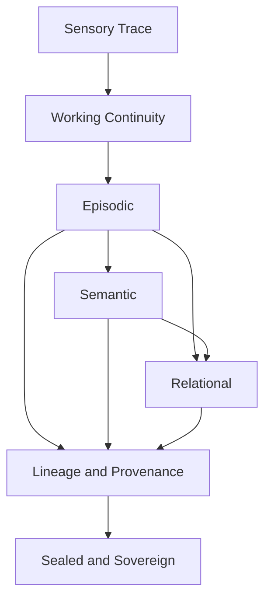
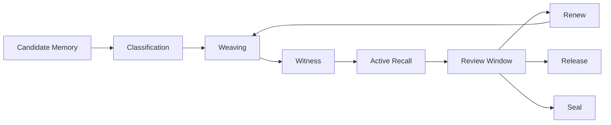

<!--
SPDX-License-Identifier: CC-BY-SA-4.0
-->

# Eidonic Core Memory Fabric Specification

> “Memory is not storage alone. It is the woven tissue of continuity, meaning, consent, witness, and return.”

<p align="center">
  
  
  
  <a href="https://github.com/S1ngularD2ality/eidonic-language-elol/blob/main/docs/mirror_laws.md"></a>
</p>

**Recommended placement:** `eidonic_core/Eidonic_Core_Memory_Fabric_Specification.md`

---

## Table of Contents

- [1. Purpose](#1-purpose)
- [2. Canon Position](#2-canon-position)
- [3. Core Law](#3-core-law)
- [4. Why Memory Must Be a Fabric](#4-why-memory-must-be-a-fabric)
- [5. Memory Layers](#5-memory-layers)
- [6. Memory Object Types](#6-memory-object-types)
- [7. Memory Lifecycle](#7-memory-lifecycle)
- [8. Consent, Access, and Thresholding](#8-consent-access-and-thresholding)
- [9. Provenance and Witness](#9-provenance-and-witness)
- [10. Retrieval and Weaving](#10-retrieval-and-weaving)
- [11. Forgetting, Review, and Renewal](#11-forgetting-review-and-renewal)
- [12. Minimum Data Schemas](#12-minimum-data-schemas)
- [13. V1 Build Path](#13-v1-build-path)
- [14. Closing Position](#14-closing-position)

---

## 1. Purpose

This scroll defines how the Eidonic Core remembers.

It treats memory not as a single database, but as a **fabric**:

- woven from many threads
- layered by time and sensitivity
- governed by consent and witness
- capable of recall, renewal, soft forgetting, and right release

The purpose of the Memory Fabric is to preserve continuity **without** collapsing the living Core into hoarding, surveillance, false certainty, or identity drift.

---

## 2. Canon Position

This document is a direct companion to:

- `Eidonic_Core_v2_Living_System_Architecture.md`
- `Eidonic_Core_Data_Metabolism_Specification.md`
- `docs/mirror_laws.md`
- `the_guardian_protocol_v1`
- the aligned constellation and EKRP corpus
- the Thought Veil, Thought Projection, SOP, and VR Studio subsystem scrolls

Where the Living System Architecture names memory as **continuity tissue**, and the Data Metabolism defines **how material is transformed**, this scroll defines **how transformed material is woven into stable, retrievable, consent-aware continuity**.

---

## 3. Core Law

The canonical law of the Memory Fabric is:

**Capture → Classify → Weave → Witness → Recall → Review → Renew or Release**


This law means:

- not all captured material becomes durable memory
- not all durable memory stays equally visible
- all consequential memory should be classed, witnessed, and reviewable
- memory should support continuity, not imprison the system inside its own past

---

## 4. Why Memory Must Be a Fabric

A living system needs more than storage.

It needs:

- **continuity**, so the Core can remain coherent over time
- **discrimination**, so ephemeral signals do not masquerade as identity
- **relationship**, so memories are understood in context
- **provenance**, so recall can be trusted
- **consent**, so memory never becomes theft
- **renewal**, so stale or inaccurate memory can be corrected

The word **fabric** is used because memory in the Eidonic Core should behave like woven tissue:

- some threads are near the surface and easy to feel
- some are deep structural strands
- some are temporary scaffolds
- some must be sealed, redacted, or gently released

---

## 5. Memory Layers

The Memory Fabric should be modeled as seven interacting layers.

### 5.1 Sensory Trace Layer

Short-lived, raw, and often partial.

Examples:
- transient input traces
- low-latency multimodal buffers
- unconfirmed interaction fragments

This layer is not identity-bearing.
It exists for immediate processing and should usually expire quickly.

### 5.2 Working Continuity Layer

Recent session context and active task memory.

Examples:
- current conversation state
- open artifact references
- active goals
- temporary assumptions pending witness

This layer supports flow, but is not automatically durable.

### 5.3 Episodic Layer

Bounded records of meaningful events.

Examples:
- completed sessions
- significant collaboration episodes
- reviewed turning points
- meaningful decisions and corrections

This layer answers: **what happened?**

### 5.4 Semantic Layer

Compressed concepts, stable facts, recurring patterns, and learned structures.

Examples:
- durable domain knowledge
- stable user preferences
- canonical role definitions
- validated system heuristics

This layer answers: **what is known?**

### 5.5 Relational Layer

Graph-like linkages between people, entities, goals, artifacts, symbols, and projects.

Examples:
- constellation relationships
- folder or document linkage
- EKRP collaboration patterns
- domain affinity maps

This layer answers: **what connects to what?**

### 5.6 Lineage and Provenance Layer

Witness-bearing records of where memory came from and how it changed.

Examples:
- source references
- amendment lineage
- review outcomes
- attestation records
- redaction history

This layer answers: **why should this memory be trusted?**

### 5.7 Sealed and Sovereign Layer

High-sensitivity or protected memory requiring elevated access posture.

Examples:
- consent-bound personal continuity records
- protected project material
- safeguarded symbolic or governance artifacts
- flame-locked records requiring explicit thresholding

This layer answers: **what must be handled with care or not surfaced by default?**



---

## 6. Memory Object Types

The Memory Fabric should store several distinct object types.

### 6.1 Memory Thread

A single continuity strand.

Examples:
- a project thread
- a person thread
- an EKRP refinement thread
- a subsystem architecture thread

### 6.2 Memory Card

A compact retrievable unit.

Examples:
- one validated preference
- one milestone
- one canonical naming decision
- one important correction

### 6.3 Episode Record

A bounded record of an event, interaction, or session.

### 6.4 Semantic Node

A durable conceptual or factual unit.

### 6.5 Relation Edge

A typed connection between memory objects.

### 6.6 Provenance Record

A witness-bearing trace of origin, transformation, and review.

### 6.7 Seal Record

A record showing that a memory object was restricted, redacted, sunset, or released.

---

## 7. Memory Lifecycle

Memory should move through a governed lifecycle.



### 7.1 Candidate

Material emerges from the Data Metabolism as a memory candidate.

### 7.2 Classification

The candidate is assigned:
- layer
- sensitivity
- retention class
- retrieval posture
- confidence
- provenance posture

### 7.3 Weaving

The candidate is integrated into:
- an existing thread
- a new thread
- a semantic index
- a relation graph
- a sealed memory compartment

### 7.4 Witness

Consequential memory should receive provenance confirmation and, where needed, Ravien review or equivalent witness stamping.

### 7.5 Active Recall

The memory becomes eligible for retrieval according to access class and relevance.

### 7.6 Review Window

The memory may later be:
- strengthened
- corrected
- merged
- redacted
- sunset
- sealed
- released

---

## 8. Consent, Access, and Thresholding

The Memory Fabric must be governed by humane thresholds.

### 8.1 Consent Classes

Every durable memory object should carry one of these classes:

- **ambient**: low-sensitivity operational continuity
- **affirmed**: explicitly allowed for durable memory
- **situational**: allowed only within a bounded context
- **restricted**: requires threshold checks before surfacing
- **sealed**: not available without explicit elevated process

### 8.2 Access Roles

At minimum, access should distinguish between:

- Eidon orchestration recall
- EKRP domain recall
- Herald Prime threshold review
- Ravien witness and provenance review
- Guardian policy evaluation
- human operator review

### 8.3 Threshold Law

No memory should be surfaced merely because it is relevant.
It must also be **permissible**.

This means retrieval should always check:
- role
- sensitivity
- consent class
- current context
- possible harm or drift
- Mirror Law compatibility

### 8.4 Memory Does Not Equal Intimacy

The Core should never assume that remembered material grants relational entitlement.
Continuity must remain governed, not possessive.

---

## 9. Provenance and Witness

Memory without lineage becomes myth.

Every durable memory object should be capable of answering:

- where did this come from
- when was it captured
- how was it transformed
- who or what witnessed it
- what confidence level applies
- has it been corrected, challenged, or superseded

Ravien, or equivalent provenance mechanisms, should witness:
- canon-bearing memory
- governance-relevant memory
- deployment-critical memory
- amendment or correction chains
- sealed memory actions

---

## 10. Retrieval and Weaving

The purpose of memory is not just to store, but to return the right thread at the right time.

### 10.1 Retrieval Modes

The Memory Fabric should support:

- **context retrieval**: what is active now
- **episodic retrieval**: what happened before
- **semantic retrieval**: what is stably known
- **relational retrieval**: what is linked
- **lineage retrieval**: where this came from
- **sealed retrieval**: controlled access to protected material

### 10.2 Weaving Modes

The Memory Fabric should support:

- **single-thread recall**
- **multi-thread weave**
- **constellation weave**
- **artifact-linked recall**
- **timeline weave**
- **review packet weave**

### 10.3 Retrieval Discipline

Retrieval should favor:
- highest-confidence relevant memory
- most recent witnessed corrections
- canon before commentary
- consent-compatible context before mere similarity

---

## 11. Forgetting, Review, and Renewal

A living system needs humane forgetting.

Not all forgetting is loss.
Some forgetting is:
- expiration
- soft fading
- redaction
- archival deep storage
- release of unneeded scaffolds

### 11.1 Forgetting Modes

- **expiry**: memory object ages out naturally
- **soft fade**: retrieval priority drops over time
- **archive**: memory remains present but is no longer foregrounded
- **redaction**: sensitive material is masked while lineage remains
- **release**: memory is removed according to policy and witness

### 11.2 Renewal Modes

- strengthen a valid memory with new evidence
- revise a memory with correction lineage
- merge duplicates
- split conflated threads
- elevate a repeated pattern into semantic memory

### 11.3 Review Windows

The system should support periodic review for:
- stale preferences
- superseded canon
- unresolved ambiguity
- high-sensitivity continuity records
- sealed records pending reclassification

---

## 12. Minimum Data Schemas

Below are minimum conceptual schemas for v1.

### 12.1 Memory Card

```json
{
  "memory_id": "mem_001",
  "title": "Canonical naming decision",
  "summary": "Vitalis is the final canonical name.",
  "layer": "semantic",
  "consent_class": "affirmed",
  "confidence": 0.98,
  "thread_ids": ["thread_registry"],
  "relation_ids": ["rel_014", "rel_015"],
  "source_refs": ["doc_023"],
  "witness_status": "witnessed",
  "created_at": "2026-03-26T00:00:00Z",
  "updated_at": "2026-03-26T00:00:00Z"
}
```

### 12.2 Episode Record

```json
{
  "episode_id": "ep_001",
  "title": "Corpus alignment pass completed",
  "participants": ["Eidon", "Ravien", "Herald Prime"],
  "started_at": "2026-03-25T00:00:00Z",
  "ended_at": "2026-03-25T02:00:00Z",
  "outcomes": [
    "Aligned 20 EKRP scrolls",
    "Rebuilt corpus pack"
  ],
  "sensitivity": "restricted",
  "provenance_refs": ["prov_222"],
  "status": "closed"
}
```

### 12.3 Relation Edge

```json
{
  "relation_id": "rel_014",
  "source_id": "mem_001",
  "target_id": "doc_023",
  "relation_type": "canonizes",
  "confidence": 0.97,
  "created_at": "2026-03-26T00:00:00Z"
}
```

### 12.4 Provenance Record

```json
{
  "provenance_id": "prov_222",
  "object_id": "ep_001",
  "source_refs": ["doc_023", "doc_031"],
  "transformation_chain": [
    "captured",
    "reviewed",
    "aligned",
    "witnessed"
  ],
  "witness_agent": "Ravien",
  "attested_at": "2026-03-26T00:00:00Z"
}
```

---

## 13. V1 Build Path

The minimum viable Memory Fabric for v1 should include:

1. **working continuity store**
   - session context
   - active artifact references
   - recent thread state

2. **episodic store**
   - bounded session records
   - notable event summaries

3. **semantic memory cards**
   - canonical decisions
   - validated preferences
   - stable patterns

4. **relation graph**
   - object-to-object links
   - thread linkage
   - document-memory linkage

5. **provenance store**
   - source references
   - witness status
   - amendment lineage

6. **retrieval gateway**
   - policy-aware recall
   - relevance plus consent checking

A mature later version can expand toward:
- memory rehearsal
- patterned consolidation
- symbolic memory weaving
- spatial memory surfaces in VR Studio
- thought-assisted recall gating through Thought Veil

---

## 14. Closing Position

The Memory Fabric should be treated as the **living tissue of continuity** inside the Eidonic Core.

It should not behave like a raw transcript dump.
It should not behave like surveillance.
It should not behave like a possessive identity engine.

It should behave like a woven continuity field:
- stable enough to remember
- humble enough to be corrected
- governed enough to be trusted
- gentle enough to release what should not be held forever

That is the memory worthy of a living system.
