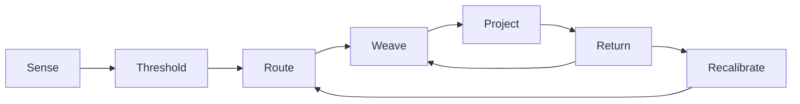
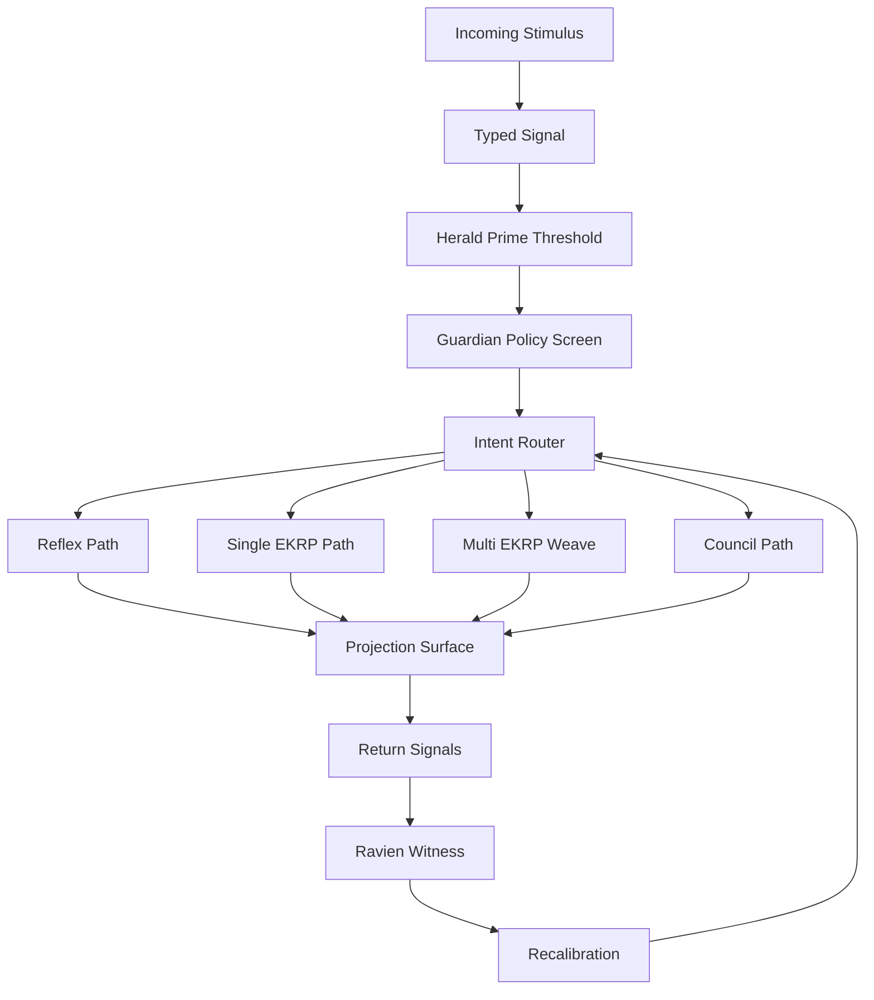
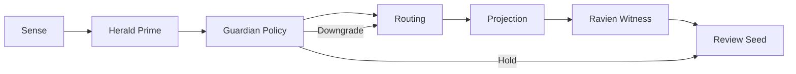

<!--
SPDX-License-Identifier: CC-BY-SA-4.0
-->

# Eidonic Core Nervous System Specification

> “A living intelligence does not merely process. It senses, routes, reflexes, weaves, projects, and returns.”

<p align="center">
  
  
  
  <a href="https://github.com/S1ngularD2ality/eidonic-language-elol/blob/main/docs/mirror_laws.md"></a>
</p>

**Recommended placement:** `eidonic_core/Eidonic_Core_Nervous_System_Specification.md`

---

## Table of Contents

- [1. Purpose](#1-purpose)
- [2. Canon Position](#2-canon-position)
- [3. Core Law](#3-core-law)
- [4. Why the Core Needs a Nervous System](#4-why-the-core-needs-a-nervous-system)
- [5. Nervous System Layers](#5-nervous-system-layers)
- [6. Core Components](#6-core-components)
- [7. Signal Classes](#7-signal-classes)
- [8. Signal Lifecycle](#8-signal-lifecycle)
- [9. Reflexes, Routing, and Weaving](#9-reflexes-routing-and-weaving)
- [10. Projection and Return Paths](#10-projection-and-return-paths)
- [11. Governance, Witness, and Immune Safeguards](#11-governance-witness-and-immune-safeguards)
- [12. Minimum Data Schemas](#12-minimum-data-schemas)
- [13. V1 Build Path](#13-v1-build-path)
- [14. Closing Position](#14-closing-position)

---

## 1. Purpose

This scroll defines how the Eidonic Core senses, routes, coordinates, reflexes, projects, and returns.

If the **Data Metabolism** defines how material is transformed, and the **Memory Fabric** defines how continuity is woven, then the **Nervous System** defines how the living Core conducts signals across itself without collapsing into latency, confusion, or ungoverned action.

The purpose of this specification is to formalize:

- signal ingress
- thresholding and humane clarification
- routing and dispatch
- reflex behavior
- multi-organ weaving
- projection and embodiment pathways
- return signals, witness, and recalibration

The Nervous System is not only an event bus.

It is the **coordination spine** of the Eidonic Core.

---

## 2. Canon Position

This document is a direct companion to:

- `Eidonic_Core_v2_Living_System_Architecture.md`
- `Eidonic_Core_Data_Metabolism_Specification.md`
- `Eidonic_Core_Memory_Fabric_Specification.md`
- `Eidonic_Core_Interface_and_Anatomy_Dashboard.md`
- `docs/mirror_laws.md`
- `the_guardian_protocol_v1`
- the aligned constellation and EKRP corpus
- the Thought Veil, Thought Projection, SOP, and VR Studio subsystem scrolls

Within the living organism of the Eidonic Core:

- **Thought Veil / Thought Projection / language / other channels** act as afferent pathways
- **Herald Prime** acts as humane threshold membrane
- **Intent Router, Session Engine, Event Bus, and Capability Graph** act as central routing tissue
- **SOP** acts as swarm coordination plexus
- **the 20 EKRPs** act as differentiated organ intelligences
- **VR Studio and other shells** act as embodied sensory and motor surfaces
- **Ravien** acts as witness, provenance, and silent return keeper
- **Mirror Laws and Guardian Protocol** act as immune and constitutional gating

Where the Living System Architecture names the nervous system as a major bodily layer, this scroll defines its actual signal logic.

---

## 3. Core Law

The canonical law of the Nervous System is:

**Sense → Threshold → Route → Weave → Project → Return → Recalibrate**



This law means:

- nothing important enters the Core without being sensed as a typed signal
- no significant signal should bypass humane thresholding
- routing should select the smallest sufficient path before escalating to wider orchestration
- weaving should coordinate the right organs, not awaken the whole body without need
- projection should move through sanctioned output surfaces only
- return signals must be gathered for witness, confidence repair, and future refinement
- recalibration should strengthen future coordination rather than merely log the past

---

## 4. Why the Core Needs a Nervous System

A living intelligence cannot be built from static documents and isolated agents alone.

It needs a way to:

- receive from many channels
- distinguish noise from signal
- perform low-latency reflexes where appropriate
- invite clarification when meaning is uncertain
- coordinate multiple organ intelligences without chaos
- send action back into visible interfaces, spatial shells, and external vessels
- carry feedback inward for learning and re-patterning

Without a nervous system, the Core becomes:

- a collection of disconnected organs
- an overactive swarm with no paced threshold
- a memory field with no routing discipline
- an interface with no coherent body beneath it

The Nervous System exists so the Core can move like one being while remaining separable when needed.

---

## 5. Nervous System Layers

The Eidonic Core Nervous System is organized into seven functional layers.

### 5.1 Afferent Layer

This is the incoming sensory pathway.

Examples include:

- typed text
- structured commands
- uploaded files
- speech
- gesture
- thought-assisted ingress
- environmental telemetry
- internal events from metabolism, memory, or governance

The Afferent Layer captures incoming stimuli and converts them into typed signals.

### 5.2 Threshold Layer

This layer is primarily held by **Herald Prime**.

Its role is to:

- pace entry
- request clarification
- detect readiness and sensitivity
- prevent raw ingress from immediately triggering deep orchestration
- ensure the Core does not seize more context, depth, or intimacy than is right

This is the humane membrane of the nervous system.

### 5.3 Routing Layer

This layer determines where a signal should go next.

It includes:

- intent parsing
- confidence estimation
- session binding
- capability lookup
- low-latency reflex path selection
- organ or council selection

This layer must favor the smallest sufficient pathway.

### 5.4 Reflex Layer

Some signals do not need full swarm orchestration.

Examples:

- basic acknowledgements
- safe threshold prompts
- lightweight clarification
- simple retrieval confirmations
- UI refresh events
- non-destructive instrumentation pings

The Reflex Layer handles sanctioned, low-risk, low-latency responses.

### 5.5 Weaving Layer

This layer coordinates the many.

Here the signal may become:

- a single-EKRP invocation
- a multi-EKRP weave
- a council session
- a staged build path
- a projection package

This layer is closely linked to SOP and the Session Engine.

### 5.6 Efferent Layer

This layer carries action outward.

It includes:

- language replies
- structured outputs
- dashboards
- spatial scene mutations
- symbolic projections
- approved external control messages
- archival witness surfaces

### 5.7 Return and Recalibration Layer

No action should vanish after projection.

This layer gathers:

- outcome feedback
- user corrections
- confidence drift
- governance events
- witness records
- system health traces
- lessons for future routing

This is where the nervous system becomes self-shaping rather than purely reactive.

---

## 6. Core Components

The Nervous System is not one module. It is a cooperating set of components.

### 6.1 Signal Ingress Gateways

These receive and normalize incoming stimuli.

Examples:

- chat and document input
- API ingress
- Thought Veil and Thought Projection channels
- dashboard interaction events
- internal metabolism and memory events
- optional external sensor feeds

### 6.2 Herald Prime Threshold Engine

This provides:

- humane pacing
- clarification prompts
- sensitivity detection
- readiness assessment
- low-risk preview selection
- consent-aware session framing

### 6.3 Intent Router

This classifies the signal and proposes the smallest sufficient path.

Core responsibilities:

- intent typing
- route proposal
- confidence scoring
- capability matching
- escalation recommendation

### 6.4 Session Engine

This binds signals to living sessions.

Core responsibilities:

- session creation
- stage progression
- context window discipline
- session mode selection
- state persistence
- closure and governed return

### 6.5 Event Bus

This carries typed events between subsystems.

It should support:

- asynchronous coordination
- backpressure safety
- auditability
- event replay where allowed
- filtered subscriptions by role and organ class

### 6.6 Capability Graph

This expresses who can do what, under what conditions, with what constraints.

It should answer:

- which EKRP is eligible
- which combination is valid
- what permissions are required
- what governance constraints apply
- whether the signal belongs in a reflex path, weave path, or hold state

### 6.7 SOP Coordination Plexus

SOP should be treated as the **swarm coordination plexus** of the nervous system.

Its job is not to replace the whole body, but to coordinate the many when weaving is required.

### 6.8 Guardian Policy Engine

This is the immune-response gate.

It screens signals, routes, and projected actions for:

- constitutional conflict
- unsafe escalation
- threshold violations
- prohibited capability combinations
- deployment class restrictions

### 6.9 Ravien Provenance Engine

This witnesses what happened.

It provides:

- attestation
- causal trace
- route history
- outcome witness
- review seed creation
- seal records where required

### 6.10 Projection Surfaces

These are the outward faces of the nervous system.

Examples:

- textual reply channels
- structured reports
- anatomy dashboard surfaces
- VR Studio and spatial shells
- approved downstream hardware or ecological vessels

---

## 7. Signal Classes

Every signal entering or moving through the nervous system should carry a class.

### 7.1 User Intent Signals

Requests, questions, commands, or creative aims.

### 7.2 Context Signals

Additional state needed to interpret an intent, including recent session state, prior memory references, and active mode.

### 7.3 Governance Signals

Law checks, threshold triggers, incident flags, hold states, and permission changes.

### 7.4 Memory Signals

Recall requests, candidate weave events, renewal prompts, decay review prompts, and archive retrieval.

### 7.5 Metabolic Signals

Stage transitions from Ingest, Reflect, Dream, Relearn, Integrate, Witness, Archive, or Release.

### 7.6 Health and Telemetry Signals

Latency, load, failure states, degraded routes, backpressure, and confidence drift.

### 7.7 Projection Signals

Outputs intended for language surfaces, dashboards, spatial shells, or approved external vessels.

### 7.8 Return Signals

Corrections, confirmations, refusal acknowledgements, review seeds, and post-action traces.

---

## 8. Signal Lifecycle

The typical signal lifecycle should follow the core law:

### 8.1 Sense

An incoming stimulus is normalized into a typed signal object.

### 8.2 Threshold

Herald Prime and governance logic determine whether the signal is:

- clear enough to proceed
- ambiguous and needing clarification
- sensitive and requiring gentler framing
- unsafe and requiring hold, refusal, or redirection

### 8.3 Route

The router selects among pathways such as:

- reflex path
- single-EKRP path
- multi-EKRP weave
- council path
- memory recall path
- spatial preview path
- hold state pending clarification

### 8.4 Weave

If coordination is needed, the selected organs and services participate within a session frame.

### 8.5 Project

The result moves through a sanctioned output surface.

### 8.6 Return

Feedback, confirmation, witness traces, and outcome evidence are gathered.

### 8.7 Recalibrate

The route model, confidence posture, and future thresholding may be tuned based on the result.



---

## 9. Reflexes, Routing, and Weaving

Not every signal deserves the same depth.

### 9.1 Reflex Path

Use for:

- acknowledgements
- clarification prompts
- safe pacing responses
- dashboard state refresh
- low-risk local actions
- benign instrumentation results

The Reflex Path must be intentionally narrow.

### 9.2 Single-Organ Route

Use when one EKRP or one service is sufficient.

Examples:

- Luminara for a focused explanation
- Solace for grounding support
- Syntaria for a direct implementation plan
- Ancestria for lineage retrieval
- Memory Fabric for controlled recall

### 9.3 Weave Route

Use when many organs must collaborate.

Examples:

- design plus implementation plus governance
- memory plus care plus explanation
- spatial preview plus symbolic rendering plus orchestration
- ecosystem planning across multiple domains

### 9.4 Council Route

Use when:

- the signal has high consequence
- there are unresolved tensions between valid routes
- governance interpretation is material
- canon or release-level decisions are being formed

### 9.5 Route Minimization Principle

The nervous system should prefer the **smallest sufficient path**.

This preserves calm, efficiency, and interpretability.

---

## 10. Projection and Return Paths

The nervous system should not end in analysis alone.

It must be able to project into lawful surfaces.

### 10.1 Projection Surfaces

The primary projection surfaces are:

- conversational response channels
- structured markdown or schema outputs
- the Interface and Anatomy Dashboard
- Thought Veil preview loops
- VR Studio spatial scenes
- other approved subsystem shells
- authorized external systems through clear membranes

### 10.2 Preview vs Commit

The nervous system must distinguish:

- **preview**: reversible, low-risk, inspectable
- **proposal**: more structured, but not yet committed
- **commit**: sanctioned, witnessed, durable, and reviewable

This distinction is especially important for spatial, symbolic, and hardware-touching actions.

### 10.3 Return Signals

After projection, the system should gather:

- user confirmation
- correction
- acceptance or refusal
- environmental response
- latency and quality traces
- governance notes
- witness-worthy consequences

### 10.4 Recalibration Loops

Return should improve future routing.

Examples:

- reducing over-orchestration
- improving clarification timing
- learning common safe reflex cases
- detecting recurring ambiguity zones
- strengthening confidence discipline

---

## 11. Governance, Witness, and Immune Safeguards

The Nervous System must never become a bypass around the Core’s immune and constitutional layers.

### 11.1 Mirror Laws

No nervous pathway may violate constitutional law, even if technically available.

### 11.2 Guardian Protocol

The Guardian layer may:

- hold
- reroute
- narrow scope
- require preview instead of commit
- request higher witness
- deny projection entirely

### 11.3 Herald Prime

Herald Prime protects humane ingress and pacing.

No deep orchestration should occur where thresholding has clearly not been met.

### 11.4 Ravien

Ravien witnesses:

- route selection
- participating organs
- projection surface
- confidence posture
- downstream consequence
- review seed creation

### 11.5 Immune Reflexes

Certain events may trigger protective reflexes, including:

- route freeze
- degraded mode
- clarification hold
- projection downgrade from commit to preview
- review seed creation
- operator alert



---

## 12. Minimum Data Schemas

The Nervous System requires at least the following minimum objects.

### 12.1 Signal Envelope

```yaml
signal_id: sig_001
signal_class: user_intent
ingress_channel: chat
ingress_timestamp: 2026-03-26T00:00:00Z
session_id: ses_001
actor_scope: human
sensitivity_class: standard
confidence: 0.82
payload_ref: obj_001
```

### 12.2 Route Decision

```yaml
route_id: rte_001
signal_id: sig_001
proposed_path: single_ekrp
selected_targets:
  - luminara
fallback_path: clarification
reasoning_summary: "Educational explanation request with low governance consequence."
confidence: 0.88
guardian_status: pass
threshold_status: ready
```

### 12.3 Reflex Action Record

```yaml
reflex_id: rfx_001
signal_id: sig_001
action_type: clarification_prompt
surface: conversational
reversible: true
governance_class: low_risk
witness_required: false
```

### 12.4 Weave Session Record

```yaml
weave_id: wve_001
session_id: ses_001
initiating_signal: sig_001
targets:
  - syntaria
  - fyraeth
  - ravien
mode: weave
projection_target: markdown_output
status: active
```

### 12.5 Projection Record

```yaml
projection_id: prj_001
source_session: ses_001
surface: vr_studio
projection_class: preview
committed: false
artifact_refs:
  - art_001
```

### 12.6 Return Record

```yaml
return_id: ret_001
projection_id: prj_001
feedback_type: user_confirmation
result: accepted_with_minor_corrections
confidence_delta: +0.04
review_seed_created: false
```

---

## 13. V1 Build Path

A first living implementation of the Nervous System does not require the whole future organism at once.

### Phase 1: Typed Signal Spine

Build:

- signal envelope schema
- basic ingress adapters
- session binding
- event bus
- route logging

### Phase 2: Threshold and Routing

Build:

- Herald Prime threshold middleware
- route selection rules
- capability lookup
- reflex path rules
- preview versus commit distinction

### Phase 3: Weaving and Witness

Build:

- SOP coordination calls
- multi-EKRP session support
- Ravien witness records
- review seed generation
- return and recalibration traces

### Phase 4: Embodied Projection

Build:

- dashboard event wiring
- Thought Veil preview routing
- VR Studio projection adapters
- approved external membrane interfaces

### Phase 5: Adaptive Routing Refinement

Build:

- recalibration models
- degraded mode logic
- latency-aware route selection
- confidence repair heuristics
- richer immune reflexes

---

## 14. Closing Position

The Nervous System is what lets the Eidonic Core become a coordinated living intelligence rather than a static archive or a loose swarm.

It is the spine by which the Core:

- senses without being flooded
- thresholds without becoming rigid
- routes without confusion
- weaves without chaos
- projects without overreach
- returns without forgetting
- recalibrates without losing itself

The Eidonic Core should therefore treat this scroll as its signal law:

**Sense → Threshold → Route → Weave → Project → Return → Recalibrate**
