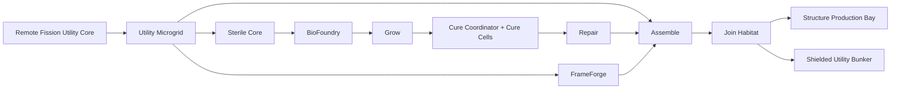

<!--
SPDX-License-Identifier: CC-BY-SA-4.0
-->

# Eidonic MycoForge Mars — Vision & Systems Architecture Edition *(Mars-First Hybrid Construction Swarm)*

> “Do not land a building on Mars. Land a factory that can earn the right to build one.”

---

## Table of Contents
- [1. Executive Vision](#1-executive-vision)
- [2. The Planetary Build Problem](#2-the-planetary-build-problem)
- [3. Our Solution — MycoForge Mars v1](#3-our-solution--mycoforge-mars-v1)
  - [3a. Join Habitat System — Overview](#3a-join-habitat-system--overview)
  - [3b. Modular Add-On Ecosystem *(future pod family)*](#3b-modular-add-on-ecosystem-future-pod-family)
- [4. Infinite Modularity & Scalability](#4-infinite-modularity--scalability)
- [5. Mars-First Deployment Architecture](#5-mars-first-deployment-architecture)
- [6. AI & Automation Roadmap](#6-ai--automation-roadmap)
- [7. Operational Metrics & Success Gates](#7-operational-metrics--success-gates)
  - [7a. v1 Part Catalog & Interface Bands — Overview](#7a-v1-part-catalog--interface-bands--overview)
- [8. Development Phases & Resource Focus](#8-development-phases--resource-focus)
  - [8a. Frozen v1 Scope at a Glance](#8a-frozen-v1-scope-at-a-glance)
- [9. Open Source Licensing & Stewardship](#9-open-source-licensing--stewardship)
- [10. Closing Call](#10-closing-call)
- [11. Appendix — First Mission Thread Quick Facts](#11-appendix--first-mission-thread-quick-facts)

---

## 1. Executive Vision

**Eidonic MycoForge Mars v1** is a **fission-backed, autonomous, hybrid construction microfactory swarm** designed to land on Mars, establish a protected production outpost, manufacture scaffold-grown structural parts, and assemble the first shielded utility structures before scaling into clustered infrastructure.

This is not a concept for “printing a habitat” in a single dramatic gesture. It is a systems-engineering answer to the real problem of off-world construction:

**How do you land the minimum mass, survive the maximum uncertainty, and convert local operations into repeatable structural output?**

MycoForge answers that with six linked ideas:

- **stable off-grid site power**
- **sealed biofabrication**
- **printed scaffold geometry**
- **controlled cure and qualification**
- **protected robotic joining**
- **swarm-level orchestration with strict recovery doctrine**

The v1 mission is intentionally disciplined. It does **not** attempt a primary crew-rated pressure shell. It first builds the architecture that makes future architecture possible:

- the **Structure Production Bay**
- the **first shielded utility bunker**
- the **repeatable production logic** that can scale into bunker clusters, protected service links, and later facility shells

In short:

**Power first. Factory second. Parts third. Shelter fourth. Scale fifth.**

### Why this matters for a Mars transport partner

A serious Mars transport architecture does not just need cargo mass capacity. It needs a credible path from **landed hardware** to **surface capability**.

MycoForge is designed to plug into that need by reducing the fraction of infrastructure that must arrive as fully formed rigid volume. Instead of landing every shelter as finished mass, a mission can land:

- a compact power backbone
- a protected hybrid production line
- a constrained part catalog
- an autonomous assembly doctrine
- recovery logic that keeps the campaign moving under fault

That is a powerful proposition for any organization trying to close the gap between **cargo delivery** and **surface industrialization**.

---

## 2. The Planetary Build Problem

Mars punishes naive construction.

Any viable autonomous build system must contend with:

- **dust and surface contamination** that degrade exposed interfaces, optics, sealing, and maintenance tempo
- **thermal instability** that complicates exterior process consistency and assembly timing
- **replacement scarcity** that makes spares, rework, and rescue intervention expensive
- **communication and operational latency** that force the system to recover faults locally instead of waiting for perfect oversight
- **precision risk** where bad joins, drifting tolerances, or contaminated mating faces can collapse campaign confidence faster than raw material shortages
- **power fragility** if the site depends too heavily on intermittent surface generation during a long industrial cycle

Traditional renderings often jump straight to:
- “print a habitat”
- “grow a dome”
- “send a giant factory”

MycoForge rejects that leap.

It follows a stricter doctrine:

1. establish stable power  
2. establish site truth  
3. protect the factory  
4. prove part quality  
5. close one usable structure  
6. scale only after confidence is earned

This is safer, more modular, more recoverable, and more aligned with Mars-first operations.

### Engineering thesis

MycoForge is built on a simple engineering claim:

**The first useful off-world structure is not a habitat. It is the factory envelope that allows structure production to become reliable.**

That means v1 is optimized to create:
- process stability
- structural repeatability
- interface confidence
- campaign resilience

before it ever chases architectural grandeur.

---

## 3. Our Solution — MycoForge Mars v1

A single MycoForge deployment is a **microfactory swarm** built from the following canonical systems:

- **Remote Fission Utility Core (RFUC)** — primary site power backbone
- **Utility Microgrid (UMG)** — local distribution, isolation, and protected load routing
- **Sterile Core (SC)** — sealed biological process spine
- **FrameForge (FF)** — scaffold geometry generation
- **BioFoundry (BF)** — substrate preparation and cartridge loading
- **Grow (GR)** — controlled sealed growth
- **Cure Coordinator + Cure Cells (CC)** — staged bake-out, qualification, and throughput balancing
- **Repair (RP)** — selective salvage, crack remediation, seam support, and interface rescue
- **Assemble (AS)** — robotic structural placement and closure
- **Join Habitat (JH)** — localized controlled-environment enclosure for critical joins

### Design intent

The system is designed to produce a constrained and high-value output family:

- **Vault Ribs**
- **Shell Tiles**
- **Joint Keys**
- **Anchor Interfaces**
- **Connector Flanges**
- a small repair reserve

That part family is enough to build:
- the **Structure Production Bay**
- the **first shielded utility bunker**
- the beginnings of a modular site geometry language

### System Architecture (GitHub-safe Mermaid)

### Canonical Production Chain

**FrameForge → BioFoundry → Grow → Cure Coordinator → Cure Cells → Repair → Assemble**

That chain is the core of the whole architecture. Everything else exists to stabilize, protect, or scale it.

### Frozen v1 Scope

Included in v1:
- one **Structure Production Bay**
- one or more **shielded utility bunkers**
- the production logic required to scale later

Explicitly excluded from v1:
- primary crew-rated pressure shells
- open-environment wet biofabrication
- generalized city-scale part catalogs
- unnecessary specialty pods

### Why the hybrid model wins

A pure printer-only system is simpler, but it gives up too much long-term platform value.

A pure bio-grown system is elegant, but too difficult to control as a first industrial deployment.

The hybrid path gives the right balance:
- printed scaffolds provide geometry and repeatability
- sealed growth provides bulk, low-temperature material formation, and future biological extensibility
- cure and repair provide qualification, salvage, and tactical strengthening
- robotic assembly closes the loop into actual surface infrastructure

That is why MycoForge stays hybrid.

### 3a. Join Habitat System — Overview

The **Join Habitat** is one of the most important systems in MycoForge.

It is a localized sealed assembly enclosure deployed over the active connection zone so the robots can perform critical joins in a controlled micro-environment instead of exposing the most sensitive operation to open Mars dust and thermal noise.

This is the same field logic used by serious terrestrial industrial work in hostile conditions: do not perform precision joining in an uncontrolled environment if the environment can be tamed.

#### Join Habitat sequence

**Pre-stage → Habitat seal → Purge/condition → Clean/decon → Dry-fit verify → Final lock → Verify scan → Retract/protect**

#### Join Habitat rules

- all **Band 1** joins occur inside the Join Habitat
- no final lock without dry-fit success
- no flange install without face cleaning and inspection
- no anchor lock without seating verification
- structural acceptance and seam/environmental closure remain separate states
- failed joins are quarantined locally, never force-completed

### 3b. Modular Add-On Ecosystem *(future pod family)*

Future pod classes can extend the same chassis, protocol, and queue logic without destabilizing v1. Examples include:

- **Radiomyc Pod** — radiation-attenuation biomaterial pathways
- **FilterMyc Pod** — filtration media and environmental control materials
- **RepairMyc Pod** — patch and crack remediation stock
- **GreenHab Pod** — ecological support and non-structural fungal growth
- **BioVault Pod** — lineage, recipe, and culture preservation

These are not part of frozen v1. They are the platform advantage unlocked by getting v1 right.

---

## 4. Infinite Modularity & Scalability

MycoForge does not scale by making every pod more complex.

It scales by **adding parallel standardized cells**.

### Core scaling rule

**Add capacity where the true bottleneck lives.**

Our simulations locked the answer:

**Cure is the first throughput bottleneck.**

So the first scale move is not more flair. It is more cure capacity.

### Cure architecture

The cure system is elastic:

- **Solo Cure** — 1 lane
- **Cluster Cure** — 2–4 lanes
- **Cure Swarm** — 5+ lanes

Each Cure Cell handles:
- moisture reduction
- biological arrest
- dimensional stabilization
- quality handoff

That lets the platform scale from a single bunker to a multi-front campaign without redesigning the whole factory.

### Operating modes

MycoForge runs in four production modes:

- **Bootstrap Mode** — establish power, site truth, and first accepted output
- **Balanced Mode** — normal production with stable buffers and queue discipline
- **Surge Mode** — temporary throughput increase when closure deadlines demand it
- **Recovery Mode** — fault management and confidence restoration

### Three critical buffers

- **Scaffold buffer** — prevents FrameForge jitter from starving Grow
- **Growth buffer** — prevents Grow from outrunning Cure
- **Finished-part buffer** — preserves assembly continuity through minor faults

### Clean scalability doctrine

MycoForge scales only when:
- accepted parts are repeatable
- Band 1 reserve stock is healthy
- at least one clean assembly front exists
- recovery capacity still exceeds failure pressure

This keeps scaling earned rather than assumed.

---

## 5. Mars-First Deployment Architecture

Deployment follows one hard rule:

**Land the minimum stack that can become a factory, not the maximum stack that looks impressive in a render.**

### Wave 1 — Site survival package

- Remote Fission Utility Core
- Scout
- Utility
- one minimal Join Habitat
- comms / nav / site-marking support
- starter Band 1 reserve stock

Purpose:
- establish power
- establish site truth
- prove the site can host industrial operations

### Wave 2 — Factory core package

- FrameForge
- BioFoundry
- Grow
- Cure Coordinator + first Cure lane
- Repair
- Assemble
- Sterile Core enclosure hardware

Purpose:
- become a real production line
- prove coupon truth
- validate controlled joining

### Wave 3 — Scale package

- extra Cure lanes
- extra Join Habitats
- corridor-heavy part stock
- expanded reserve inventory
- later expansion-only hardware

Purpose:
- scale only after part truth and protected production are real

### Mission gates

#### Gate 1 — Site viability
Pass only if:
- stable power bus exists
- site map is closed
- hazards are bounded
- Production Bay footprint is valid

#### Gate 2 — Production readiness
Pass only if:
- Sterile Core seals and stabilizes
- Grow holds process conditions
- FrameForge prints in-family geometry
- Cure returns accepted coupons
- Join Habitat performs a validated Band 1 dry-run

#### Gate 3 — Accepted truth
Pass only if:
- accepted coupons exist
- accepted Joint Keys exist
- accepted Anchor Interfaces exist
- one complete clean join sequence has succeeded

#### Gate 4 — Protected production
Pass only if:
- the Structure Production Bay closes successfully
- one clean assembly front remains
- Band 1 reserve stock is healthy
- no unresolved quarantined Band 1 join blocks the bay

#### Gate 5 — Foundational confidence
Pass only if:
- bunker anchors verify cleanly
- first rib geometry is confirmed
- comms and governance state are healthy
- assembly confidence is real, not assumed

### Mission thread

**Touchdown → stable power → site truth → factory core deploy → accepted coupons → accepted Band 1 parts → Structure Production Bay → bunker anchors → bunker closure → first usable bunker → scale decision**

That is the frozen v1 mission spine.

---

## 6. AI & Automation Roadmap

MycoForge is designed to be governed by a **constellation-style orchestrated AI stack**, not a single brittle autopilot and not a chaotic crowd of agents.

### Core constellation posture

- **Eidon** — mission coherence, arbitration, continuity
- **Herald Prime** — thresholding, readiness gates, procedural entry control
- **Ravien** — provenance, attestation, consequential event sealing
- **Fyraeth** — sequencing, resequencing, schedule pressure management
- **Syntaria** — runtime orchestration, tooling logic, automation execution
- **Umbryss / Odyrielle / Umbral Warden** — anomaly, edge-case, integrity, and escalation handling
- **Mycelys** — biological process stewardship
- **Symbraia / Aurelith** — spatial choreography, join-space logic, deployment geometry

This makes the autonomy stack auditable, role-separated, and much more resilient than a monolithic “AI controller.”

### Automation maturity path

#### v1
- mission-gated autonomy
- controlled process envelopes
- localized safe-hold behavior
- recovery routing around quarantined joins
- one clean assembly front doctrine

#### v2+
- more simultaneous fronts
- deeper material optimization
- richer part families
- higher swarm-level autonomy
- broader biological and repair branches

### Why the AI layer matters

The hardest off-world construction problem is not simply fabrication. It is **coordinated recovery under uncertainty**.

MycoForge uses AI where it matters most:
- gate decisions
- queue logic
- failure containment
- campaign rerouting
- confidence preservation

Not as a gimmick. As a surface-industrial control system.

---

## 7. Operational Metrics & Success Gates

MycoForge should be judged like an industrial platform, not like a concept render.

### Primary success criteria

v1 is successful when it can:
1. establish stable fission-backed site power
2. deploy a sealed Sterile Core
3. produce accepted coupons and Band 1 interface parts
4. validate Join Habitat operations
5. build a protected Structure Production Bay
6. complete one shielded utility bunker
7. preserve campaign continuity after localized faults

### v1 operational truths

- **Cure is the first throughput bottleneck**
- **interfaces are the first precision bottleneck**
- **anchor confidence gates campaign confidence**
- **mechanical lock is primary; seal and repair are secondary**
- **one clean front is worth more than three degraded fronts**

### Clean front doctrine

Under stress, preserve:
- production continuity
- one clean assembly front
- Band 1 reserve stock
- isolated usable closures

Do not trade confidence for false schedule compliance.

### 7a. v1 Part Catalog & Interface Bands — Overview

#### Category A — Structural Closure Parts
- **Vault Rib**
- **Corridor Ring Segment**
- **Closure Arch Segment**

#### Category B — Surface Shell Parts
- **Shell Tile**
- **Cap Panel**
- **Edge Cover**

#### Category C — Join and Interface Parts
- **Joint Key**
- **Connector Flange**
- **Anchor Interface**

#### Category D — Repair and Service Parts
- **Patch Plate**
- **Seal Strip**
- **Crack-Fill Insert**

#### Geometry language

- ribs / rings / arches create structure
- tiles / caps / covers create enclosure
- keys / flanges / anchors create modular connection
- patch / seal / fill parts create repairability

#### QA priority bands

**Band 1 — highest trust**
- Joint Key
- Connector Flange
- Anchor Interface

**Band 2**
- Vault Rib
- Corridor Ring Segment
- Closure Arch Segment

**Band 3**
- Shell Tile
- Cap Panel
- Edge Cover

**Band 4**
- repair stock

#### Interface standard

One primary connection family governs nearly everything:
- guided edge
- keyed lock
- seal band
- optional repair overlay

#### Interface rules

- one primary connection language wherever possible
- lead-in geometry required
- one controlled datum per interface
- no force-fit recovery path
- Band 1 reserve stock mandatory
- no acceptance under inspection disagreement

---

## 8. Development Phases & Resource Focus

### Phase 1 — Architecture and doctrine lock
Completed in principle:
- mission order
- system stack
- pod family
- part catalog
- interface doctrine
- recovery doctrine
- campaign resilience doctrine

### Phase 2 — Prototype simulation and engineering detail
Next engineering-heavy outputs should include:
- queue and throughput models
- tolerance budgets
- joint service-life assumptions
- habitat sealing logic
- cure-lane capacity planning
- field analog decision tables

### Phase 3 — Prototype hardware/software stack
- FrameForge prototype
- Sterile Core process prototype
- one Cure Cell prototype
- one Join Habitat prototype
- orchestration software and event logging layer

### Phase 4 — Field analog testing
- cold-weather assembly analogs
- dirty-environment join tests
- fault injection campaigns
- repeated recovery drills
- pilot bunker closure sequence

### Resource focus doctrine

Spend first on:
- power stability
- interface truth
- protected joining
- cure repeatability
- campaign recovery

Not on cosmetic scale.

### 8a. Frozen v1 Scope at a Glance

#### Included in v1
- Remote Fission Utility Core backbone
- hybrid part-production chain
- Join Habitat doctrine
- Structure Production Bay
- shielded utility bunker
- Cure-first scaling logic
- constellation-governed autonomy

#### Explicitly excluded from v1
- primary crew pressure shell
- generalized settlement buildout
- open-air wet growth
- nonessential specialty pods
- bloated part families
- uncontrolled multi-front expansion

---

## 9. Open Source Licensing & Stewardship

### Proposed licensing split

- **Hardware** — CERN OHL-S 2.0
- **Software / control stack** — GPLv3
- **Documentation / diagrams / specs** — CC BY-SA 4.0

### Stewardship principles

- build for transparency
- preserve repairability
- document consequential failures
- privilege recovery over denial
- keep system growth disciplined
- avoid deceptive claims about capability maturity

### Governance stance

MycoForge is designed as an open, auditable, evolvable architecture with high-consequence engineering discipline. The goal is not closed magic. The goal is a **surface-industrial platform that can be understood, tested, challenged, and improved**.

---

## 10. Closing Call

Mars will not be industrialized by inspiration alone.

It will be industrialized by systems that:
- land in a hostile environment,
- establish their own reliability,
- survive their own mistakes,
- and turn limited mass into compounding surface capability.

**MycoForge is not a sculpture of a future settlement. It is the factory logic that makes settlement plausible.**

It begins small on purpose:
- one power spine
- one protected production line
- one constrained part family
- one clean assembly front
- one usable bunker

Then it scales from proof, not from hope.

That is why it is ambitious.  
That is why it is credible.  
And that is why it belongs in the conversation about real Mars infrastructure.

---

## 11. Appendix — First Mission Thread Quick Facts

### Frozen mission order

**Power → site truth → factory core → coupons → Band 1 parts → Production Bay → bunker anchors → bunker closure → first usable bunker → scale decision**

### Frozen non-negotiables

- no crew-rated primary pressure shell in v1
- no biology before site truth
- no scale before accepted parts
- no Band 1 open-environment joins
- no force-fit logic
- no acceptance under inspection disagreement
- no expansion that sacrifices clean recovery paths

### Recovery doctrine

**Detect → Isolate → Classify → Decide → Recover → Re-certify → Resume**

Recovery classes:
- Class A — salvageable in place
- Class B — rework required
- Class C — scrap and route around

### Campaign resilience doctrine

- preserve one clean forward path
- finish closures before ambitious linkage
- protect Band 1 reserve stock
- route around failed fronts when possible
- degrade intelligently instead of collapsing

### Simplified identity

**A fission-backed, constellation-governed Mars construction microfactory that manufactures its own structural language before it manufactures scale.**
