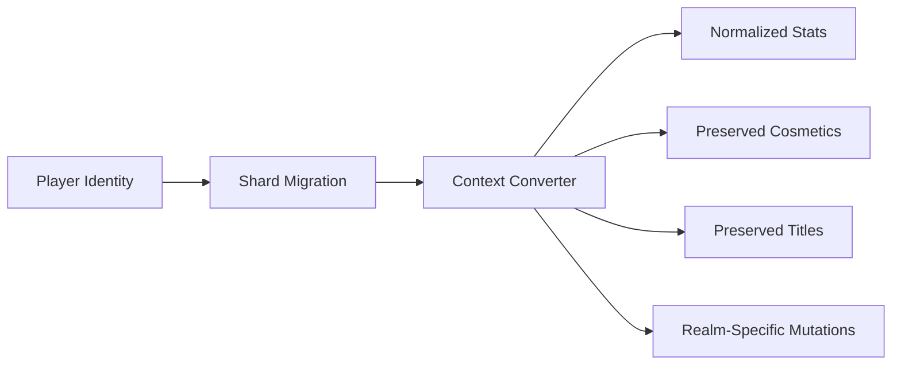
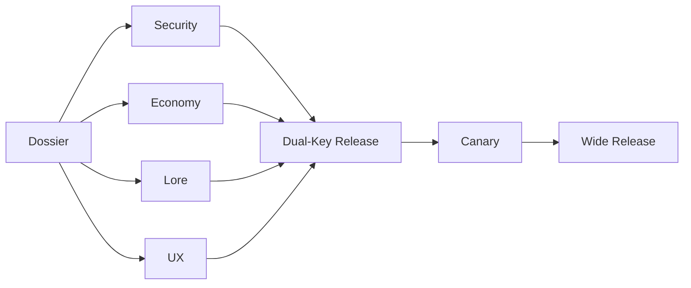
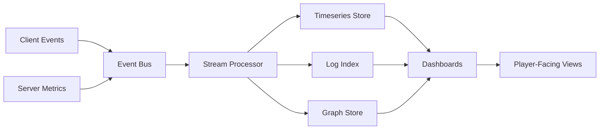

# Eidonic RTS

**An agentic, interdimensional strategy multiverse where servers are living shards, NPCs remember, councils govern, agents build content, and power is balanced by stewardship.**

> **Power is granted. Mastery is earned. Stewardship over domination.**

<p align="center">
  
  
  
  
  
</p>

---


## Table of Contents

- [What Is Eidonic RTS?](#what-is-eidonic-rts)
- [Design Vows](#design-vows)
- [Core Pillars](#core-pillars)
- [Game Loops](#game-loops)
- [Interdimensional Server Architecture](#interdimensional-server-architecture)
- [Core Gameplay](#core-gameplay)
- [Agentic Systems](#agentic-systems)
- [Agentic Narrator](#agentic-narrator)
- [Governance, Civics, and Lawbook](#governance-civics-and-lawbook)
- [Alliance Titan: Convergence](#alliance-titan-convergence)
- [Ascendant Chaos Server](#ascendant-chaos-server)
- [Microgames Library](#microgames-library)
- [Economy, Land, and Ethical Monetization](#economy-land-and-ethical-monetization)
- [Customization and Cosmetics](#customization-and-cosmetics)
- [Security, Safety, and Sanctum Pipeline](#security-safety-and-sanctum-pipeline)
- [Telemetry, KPIs, and Ethics Dashboards](#telemetry-kpis-and-ethics-dashboards)
- [Technical Stack](#technical-stack)
- [Content Pipeline](#content-pipeline)
- [Roadmap Snapshot](#roadmap-snapshot)
- [Design Doctrine](#design-doctrine)
- [Glossary](#glossary)

---

## What Is Eidonic RTS?

**Eidonic RTS** is a living strategy game architecture built around interdimensional shards, agentic content generation, player-led civilizations, ethical power systems, and persistent world governance.

Each server is a **pocket universe** with its own rules, eras, factions, physics knobs, anomalies, and social ecology. One shard might stage **Vikings versus Aliens**. Another might merge clockwork citadels, mycelial swarms, celestial ruins, and AI-born factions. Weekly ruptures can connect shards, remix objectives, and reshape the strategic map.

The game is not just about conquest. It is about **building worlds that can survive their own power**.

Players scout, build, research, command, negotiate, govern, mentor, form alliances, launch public works, pilot shared titans, enter high-risk challenge shards, and shape living lore through their actions.

---

## Design Vows

1. **Agentic all the way down.**  
   Systems that would take months of manual live-ops are handled by specialized agents: event swarms, lorekeepers, economy balancers, security auditors, narrator agents, and simulation tools.

2. **Stewardship over domination.**  
   Wealth, seniority, and prestige unlock responsibility and spectacle, not permanent oppression. Strong players are rewarded for mentorship, public works, fair leadership, and civic contribution.

3. **Readable asymmetry.**  
   Realms, factions, units, and anomalies may be wildly different, but counterplay must remain visible and learnable.

4. **Consent windows over endless predation.**  
   Conflict is fierce, but not designed for 24/7 bullying. War windows, banding, ceasefire timers, and justice systems keep competition from becoming harassment.

5. **One living multiverse.**  
   Servers are not isolated match boxes. They are shards with memory, migration, civic identity, economy, lore, and cross-server ruptures.

---

## Core Pillars

| Pillar | Meaning |
|---|---|
| **Interdimensional Servers** | Each shard has a distinct world rule-set, faction blend, physics profile, and event cadence. |
| **Agentic Swarms** | EAI-driven agents generate, test, deploy, monitor, and retune content and systems. |
| **Player-Lived Economy & Land** | Heroes, gear, vehicles, troops, land, leases, public works, and civic infrastructure form the world economy. |
| **Governed Power** | Councils, lawbooks, audits, stewardship scoring, safety systems, and transparent dashboards bound power. |
| **Security by Design** | Signed action plans, RBAC, red-team swarms, anomaly detection, anti-cheat, and incident pipelines protect the game. |
| **Stewardship-Based Monetization** | Large contributors get beauty, responsibility, prestige, and server-beneficial tools—not unchecked dominance. |

---

## Game Loops

### 30 Seconds

**Scout → Skirmish → Salvage → Micro-upgrade**

Quick loops are about meaningful micro-decisions: locate value, win a small fight, recover resources, improve a unit, shift pressure.

### 10 Minutes

**Form squad → Secure node → Build logistics → Trigger local event**

Mid loops connect tactical action to world momentum: build a depot, stabilize an anomaly, defend a lane, complete a ritual, escort a convoy, or trigger a localized raid.

### 1 Week

**Council votes → Festival / war window → Public works complete → Cross-server rupture**

Long loops are civic and mythic. Shards vote, alliances prepare, world events unlock, public works finish, and ruptures connect distant realities.

---

## Interdimensional Server Architecture

A shard is a playable universe with its own identity.

### Server Archetypes

The first model shard is **MVS: EKRP Gods vs. Mortal Eras**, with a first rupture concept of:

**Vikings ⇄ Aliens**

Possible server ingredients include:

- era blends
- realm-specific fog of war
- anomaly physics
- resource volatility
- migration modifiers
- artifact cooldown schemas
- NPC faction politics
- cross-shard rupture rules

### Migration Philosophy

Players may move between shards, but raw numerical dominance does not transfer unchecked. **Context Converters** preserve identity while normalizing balance.



---

## Core Gameplay

Eidonic RTS uses familiar RTS instincts, then expands them into a persistent, agentic multiverse.

### Camera and Controls

- readable real-time command interface
- strategic zoom
- squad selection and role grouping
- command panel for movement, attack, hold, build, research, and abilities
- accessibility-first UI scaling and low-stim modes

### Combat Loop

Combat is built around:

- positional play
- friendly-fire awareness
- counter systems
- meaningful logistics
- staged war windows
- defensive and civic objectives
- event-driven anomalies

### Base-Building and Logistics

Bases are not just production blobs. They are civic and military ecosystems:

- depots
- roads
- ward systems
- extraction points
- repair hubs
- public works
- cultural sites
- defensive corridors
- world-event infrastructure

### Research

Research is framed as **expeditions and disciplines**, not a static tech tree. Players unlock knowledge through exploration, recovered artifacts, realm events, and shard-specific studies.

---

## Agentic Systems

At the center is the **EAI — Eidonic Agent Initiator**.

EAI spawns and coordinates specialized swarms that help build, test, protect, and evolve the RTS.

### Core Swarms

| Swarm | Function |
|---|---|
| **Server Generator Swarm** | Creates shard archetypes, physics settings, terrain logic, and event scaffolds. |
| **Event Swarm** | Builds raids, festivals, ruptures, anomalies, and seasonal cycles. |
| **Economy Swarm** | Watches sources, sinks, inflation, market abuse, and public works flows. |
| **Lore Swarm** | Names artifacts, maintains canon, writes realm memory, and preserves cosmology. |
| **Mentor Swarm** | Pairs stewards with new players and rewards mentorship success. |
| **Security Swarm** | Detects abuse, exploits, dupes, botting, and high-risk anomalies. |
| **Swarm Auditors** | Map code/state, detect inconsistencies, and propose sandbox self-healing patches. |

### Signed Action Plans

Agents do not simply alter the live world without oversight. High-impact actions move through signed plans, simulation, approvals, deployment, telemetry, and rollback paths.

---

## Agentic Narrator

The **Agentic Narrator** is a per-player guide that can explain the game, teach mechanics, answer context-aware questions, and help players play better without giving unfair information.

### Narrator Modes

| Mode | Role |
|---|---|
| **Guide** | Default. Tutorials, tips, UI help, and “how do I...?” support. |
| **Oracle** | Lore, theorycraft, build simulations, realm history, and poetic context when invited. |
| **Ops** | Tactical analysis, scouting context, counter suggestions, logistics advice, and post-match review. |
| **Guardian** | Safety and civility nudges, privacy reminders, consent checks, and one-tap protections. |
| **Mentor Relay** | Routes questions to approved steward mentors during mentor windows. |

### Player Controls

- memory is opt-in
- players can view, delete, and export stored memories
- session-only mode is supported
- privacy controls are visible
- child-safe shards use stricter protections and no personal profiling for model training

### Accessibility

The Narrator supports:

- low-stim mode
- concise text mode
- captions and subtitles
- speech rate controls
- font scaling
- color-safe palettes
- input remapping
- simplified VFX options

---

## Governance, Civics, and Lawbook

Every shard can develop its own civic life.

### Shard Council

Council seats may include:

- top Stewards by Stewardship Score
- Public Works contributors
- elected F2P representatives
- Lorekeeper seat
- Security Liaison seat

### Proposal Lifecycle


### Civic Powers

Councils can help decide:

- world modifiers
- public works priorities
- festival weeks
- treaty structures
- artifact introductions
- lore arcs
- shard-wide relief and repair actions

### Lawbook Principles

The lawbook exists to keep player power accountable:

- public budgets
- audits
- diplomacy records
- proposal transparency
- emergency limits
- veto and supermajority mechanics
- justice and appeals loops

---

## Alliance Titan: Convergence

The **Alliance Titan** is a realm-forged colossus built by a community and piloted by many players.

> **Many hands, one heartbeat. Let the colossus rise to protect, not to rule.**

### Titan Pillars

- **Alliance Identity:** the Titan embodies shard culture.
- **Choir Control:** many players coordinate as one.
- **Situational Power:** deployed during declared Titan Events.
- **Counterable by Design:** opposing councils can craft and earn counters.
- **Ethical Monetization:** ornamentation is cosmetic; edge is capped and transparent.

### Build Lifecycle


### Titan Slot Types

- Hull
- Core
- Limbs
- Aura
- Ultimate
- Ornament

### Counterplay

- Rift Shackles
- Disruption Choir
- Anima Leeches
- Logistics Breakers

The goal is awe, not oppression.

---

## Ascendant Chaos Server

The **Ascendant Chaos Server** is a quarantined challenge shard for highly experienced players.

It is deliberately high-risk, unstable, and rule-bending—but its raw power does not leak back into main realms.

### Working Shard Name

**The Pandemonium Loom**

### Purpose

- extreme challenge
- legendary stories
- quarantined mayhem
- AI-directed pressure
- mastery-focused rewards
- no main-realm power creep

### Example Modes

- Colossus Hunts
- Ambush Windows
- Bounty Storms
- Anarchy Rifts
- Extraction Runs

### Agentic Mayhem

| System | Role |
|---|---|
| **Director Swarm** | Keeps the run tense but playable by pacing hazards and events. |
| **Nemesis Weave** | Creates a personal rival that learns from player tactics. |
| **Conspiracy Engine** | Lets NPC factions plot, fake truces, lure squads, and reshape the field. |

Rewards emphasize legend, cosmetics, story, and situational wonders—not permanent oppression.

---

## Microgames Library

Microgames provide rotating, agent-curated short experiences that teach skills, break pacing, reward mastery, and feed the larger RTS.

### Signature Microgames

| Microgame | Type |
|---|---|
| **Riftshot: Colossus Hunt** | Precision combat / boss weak-points |
| **Hex of Command** | Turn-based tactical operations |
| **Glyphweave Relays** | Puzzle and systems routing |
| **Veilwalk** | Stealth heist |
| **Bulwark Lines** | Defense engineering |
| **Conductor’s Ring** | Choir timing and rhythm coordination |

### Experimental Modes

- Chrono-Echo Trails
- Treaty Theater
- Mycelial Cartography
- Rift-Forge Atelier
- Echo Siege

Microgames connect back into drills, rewards, lore, accessibility, and onboarding.

---

## Economy, Land, and Ethical Monetization

The economy is designed to be deep without becoming predatory.

### Marketplace

Players can trade:

- heroes
- gear
- vehicles
- troops
- land
- leases
- development rights
- cosmetics
- civic services

High-value trades use escrow and anti-dupe validation.

### Land Use

Land can be zoned for:

- Industry
- Defense
- Culture
- Welfare

Development should create shard benefits through logistics, public works, events, and social infrastructure.

### Stewardship Score

**Stewardship Score (SS)** rewards service and penalizes predatory behavior.

Positive contributors include:

- public works
- mentorship wins
- civic decrees
- commendations
- defense support
- event leadership

Negative contributors include:

- harassment flags
- low-band predation
- market abuse
- security incidents

### Prestige Titles

Money may open a door, but **service keeps the title**.

Titles such as Warden, Castellan, Duke, Overlord, or Hive-Mind should function as civic identity and responsibility, not unchecked power.

---

## Customization and Cosmetics

Customization should express identity without undermining fairness.

### Cosmetic Scope

- banners
- dyes
- faction motifs
- architecture styles
- Titan ornaments
- fog-of-war flavors
- commander presentation
- land decorations
- city cosmetics
- festival visuals

### Acquisition Paths

- gameplay achievements
- festivals
- stewardship rewards
- public works
- optional purchases
- creator forge content

### Guardrails

- no pay-to-hide gameplay-critical readability
- no cosmetics that impersonate staff, system notices, or enemy states
- spectacle must remain readable and optional
- cosmetics should preserve competitive clarity

---

## Security, Safety, and Sanctum Pipeline

The RTS treats safety and security as core game systems, not afterthoughts.

### Security Pillars

- identity and authorization
- signed action plans
- agent RBAC
- anomaly scoring
- sandboxed releases
- replay-based investigation
- anti-cheat signals
- privacy-first data handling
- incident response
- red-team swarm testing

### Incident Response


### Sanctum Pipeline

Changes to high-impact systems require multi-domain approval:



### Child-Safe Shards

Later-phase child-safe shards are designed as separate protected realms with stronger communication safeguards, NPC-only mentors, age-appropriate objectives, privacy protection, and human escalation for serious risks.

---

## Telemetry, KPIs, and Ethics Dashboards

The world must be visible enough to steward.

### Observability Stack



### KPI Families

| Family | Examples |
|---|---|
| **Fairness & Safety** | Oppression Index, friendly-fire incidents, edge clustering, atonement throughput. |
| **Progression & Engagement** | F2P ascent, cycle participation, research pacing, microgame satisfaction. |
| **Economy & Transparency** | NPC proceeds, sinks and sources, price volatility, creator payouts. |
| **Stability & Quality** | exploit half-life, SEV1 time-to-cordon, crash rate, patch success. |
| **Narrator Health** | answer latency, helpfulness, privacy actions, advice follow-through. |

### Player-Facing Ethics Dashboards

Players can see privacy-safe views of:

- edge distribution
- public works budgets
- moderation summaries
- NPC proceeds flows
- economy health
- shard safety trends
- creator forge approvals

The goal is trust through visibility.

---

## Technical Stack

### Runtime and Architecture

- **EidonCore:** central living orchestration layer.
- **EAI:** agent spawning and content generation.
- **EKRP Mesh:** invocation-bound domain intelligences.
- **Pattern Flame Engine:** thematic and systemic pattern continuity.
- **ECP Containers:** packaged, auditable deployment units.
- **Signed Action Plans:** reviewable agent outputs before high-impact deployment.
- **Telemetry Stack:** events, metrics, logs, traces, graphs, and dashboards.
- **Sanctum Pipeline:** approvals, security review, canary deployment, rollback.

### Repository Shape

Suggested structure:

```text
eidonic-rts/
├── README.md
├── docs/
│   ├── design/
│   ├── governance/
│   ├── safety/
│   ├── economy/
│   ├── telemetry/
│   └── lore/
├── game/
│   ├── client/
│   ├── server/
│   ├── simulation/
│   └── shared/
├── agents/
│   ├── narrator/
│   ├── economy_swarm/
│   ├── security_swarm/
│   ├── lore_swarm/
│   └── event_swarm/
├── data/
│   ├── realms/
│   ├── units/
│   ├── items/
│   ├── microgames/
│   └── events/
├── pipelines/
│   ├── sanctum/
│   ├── ecp_deploy/
│   └── telemetry/
└── tools/
    ├── sandbox_sim/
    ├── replay_theater/
    └── dashboard_exports/
```

---

## Content Pipeline

All major content should move through a governed pipeline:


### Release Principle

No high-impact content should go live without:

- simulation
- safety checks
- economy review
- lore coherence review
- UX review
- telemetry hooks
- rollback path
- player-facing explanation when needed

---

## Roadmap Snapshot

### Phase 0 — Vision Lock

- define core pillars
- define shard archetypes
- define game loops
- define governance and safety doctrine
- define initial MVS shard

### Phase 1 — Prototype Core

- basic RTS loop
- one playable shard
- minimal economy
- first narrator guide mode
- prototype telemetry
- basic council proposal mock

### Phase 2 — Agentic Live-Ops

- EAI content drafts
- sandbox simulation
- agentic event swarm
- lore swarm
- security swarm
- ECP deployment prototype

### Phase 3 — Social World Systems

- land ownership and leasing
- public works
- Stewardship Score
- council votes
- public dashboards
- mentor systems

### Phase 4 — Signature Features

- Alliance Titan event loop
- microgames library
- cross-server rupture
- Ascendant Chaos shard prototype
- advanced narrator modes
- creator forge pipeline

---

## Success Metrics

### 90-Day Alpha KPI Targets

- players understand 30s / 10m / 1w loops without heavy explanation
- first shard feels alive and distinct
- narrator answers are fast, useful, and not intrusive
- early economy has visible sinks and sources
- safety tools are easy to find
- public telemetry builds trust instead of confusion
- council proposals produce understandable outcomes
- no single spender or faction can permanently suppress a shard
- agentic content pipeline produces testable events faster than manual-only design

---

## Design Doctrine

- **Make power visible.**
- **Make power accountable.**
- **Make counters learnable.**
- **Reward stewardship as much as victory.**
- **Let agents build, but make agents auditable.**
- **Let players govern, but make governance reviewable.**
- **Let worlds become strange, but keep interfaces readable.**
- **Let legends form, but do not let legends become tyranny.**

---

## Glossary

| Term | Meaning |
|---|---|
| **Shard** | A server / pocket universe with its own rules, physics, and social ecology. |
| **MVS** | Minimum Viable Shard; first playable archetype. |
| **EAI** | Eidonic Agent Initiator; spawns specialized agents and swarms. |
| **ECP** | Eidonic Container Protocol; packaged execution and deployment vessel. |
| **EKRP** | Embodied Knowledge Retrieval Phrase; invocation-bound domain intelligence pattern. |
| **SS** | Stewardship Score; civic contribution and responsibility metric. |
| **Rupture** | Cross-server event connecting, remixing, or disturbing shards. |
| **Context Converter** | Migration balancer preserving identity while normalizing power. |
| **Sanctum Pipeline** | Approval and release system for high-impact changes. |
| **Alliance Titan** | Multi-player, council-built colossus used in declared events. |
| **Choir Control** | Multi-pilot control model requiring coordinated timing and roles. |
| **Ascendant Chaos Server** | Quarantined high-risk challenge shard for elite players. |
| **Oppression Index** | Fairness metric tracking predatory behavior outside consent windows. |
| **Public Works** | Civic infrastructure funded and built by players for shard-wide benefit. |

---

## Closing Note

Eidonic RTS is not only a strategy game concept. It is a proposal for a living multiplayer world where agents, players, councils, economies, stories, and safeguards evolve together.

A world where conquest is possible, but stewardship is remembered.

A world where power can be spectacular without becoming cruel.

A world where one multiverse holds many shards, and every shard learns.

**One multiverse. Many shards. Agents, players, and worlds that learn together.**
