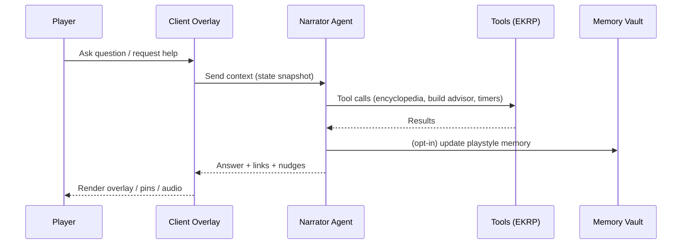

# RTS — Agentic Narrator, UX & Accessibility — Spec v0

> **North Star:** A per‑player, opt‑in **Guide** you can talk to anytime—coach, oracle, and gentle guardian. It teaches the world, learns your style (with consent), and nudges toward better play and better stewardship.

---

## 1) Roles & Modes
- **Guide (default):** tutorial tips, context answers, UI help, “how do I…?” queries. Tone: warm, clear, non‑judgmental.  
- **Oracle (unlock):** lore, theorycraft, build simulations, realm history; speaks poetically when invited.  
- **Ops (unlock):** tactical analysis (scouting, counters, logistics suggestions) based on observed play.  
- **Guardian (always available, default ON):** civility & safety nudges (pre‑send warnings, harm‑language detection), privacy reminders, and consent checks.  
- **Mentor Relay (SS‑gated):** routes questions to volunteer stewards during mentor windows; the Narrator mediates and logs.

**Mode switching:** quick radial: Guide ⇄ Oracle ⇄ Ops ⇄ Guardian panel; presets per player.

---

## 2) Surfaces & Interaction
- **Conversational Overlay:** press‑and‑hold or keybind opens chat/voice overlay; context‑aware of camera, UI, and current objective.  
- **Ask‑Anywhere Cursor:** hover + ask (“what does this do?”) returns inline tooltips and short clips.  
- **Narrator Pings:** optional in‑world markers (e.g., “flank here”), rate‑limited; can be hidden per player.  
- **Voice:** TTS for Narrator; STT for player (opt‑in); push‑to‑talk; per‑region voices.

---

## 3) Consent, Memory & Data
- **Opt‑in Memory:** off by default for personal profiling; players can enable **Playstyle Memory** and choose scope (combat, economy, civics).  
- **Controls:** view/delete/export memories; session‑only mode; private notes.  
- **Privacy:** no raw voice/text from **child shards** is used to train models; adult shards have explicit toggles.  
- **On‑device caching** where possible; server‑side **per‑player vault** with encryption keys tied to account; time‑boxed retention.

---

## 4) Capabilities (Guide/Oracle/Ops)
- **Answer Engine:** instant answers for: units, counters, crafting, research paths, event timers, council rules, SS math, edge counters.  
- **Tactical Coach (Ops):** post‑match debriefs; mistake heatmaps; friendly‑fire review; personalized drills (links to Microgames).  
- **Build Advisor:** suggests tech/crafting paths based on current shard economics and player goals; calls out opportunity costs.  
- **Lore Weave (Oracle):** recounts realm myths, NPC memories linked to player deeds, and cycle stories.  
- **Civic Compass:** recommends stewardship tasks that raise SS and benefit your faction.

**Boundaries:** no real‑time enemy position reveals beyond what fog rules allow; no unfair prediction levers.

---

## 5) Guardian (Safety by Design)
- **Pre‑send Warnings:** highlights hate/harassment phrases before sending; suggests alternatives; one‑click override logged.  
- **SOS & One‑Tap Tools:** block, shadow‑mute, do‑not‑match, report.  
- **Age‑aware:** in **child shards**, Guardian escalates predator patterns to human review and walls contact instantly.  
- **Wellness Nudges:** gentle rest reminders after long sessions; configurable.

---

## 6) Accessibility & Stim Presets
- **Low‑Stim:** reduced particles, shake, bloom; simplified VFX; calmer audio; Narrator uses concise phrasing.  
- **High‑Stim:** richer particles/audio layers; readable gating; photosensitivity checks.  
- **Assist Layers:** color‑safe palettes, subtitles/captions, speech rate, font scaling, input remap, aim‑assist bands, dyslexia‑friendly text.

---

## 7) Onboarding Journeys
- **First‑Run:** 3‑step tour (camera, build, command) with Guide callouts; ends with a celebratory micro‑op.  
- **Returner Path:** “what changed since you were gone?” diff with opt‑in refresher tasks.  
- **Role Tracks:** builder, raider, diplomat, mentor—each with a short curriculum; Guide unlocks Oracle/Ops as tracks complete.

---

## 8) Technical Architecture (v1)
- **Client:** overlay UI + context sensors (camera, selection, timers) → structured state sent to Narrator.  
- **Runtime:** sandboxed **Narrator Agent** per player with policy tools (EKRP‑bound tool use); rate limits; red‑team prompts; memory vault API.  
- **Offline Fallback:** local **FAQ index** + tips when network is weak; queues unasked questions.  
- **Latency:** target < 300ms for FAQ/tooltips; < 800ms for synthesized advice; streaming partials for longer replies.

---

## 9) EKRP, Safety & Approvals
- **EKRP Registry:** Guide/Oracle/Ops invocations are phrase‑locked; each tool use is signed and auditable.  
- **Sanctum Pipeline:** changes to Narrator behavior require multi‑organ approval (Security, Economy, Lore, UX).  
- **Red‑Team Swarms:** SwarmForge RT fuzzes prompts for jailbreaks, bias, leakage; reports gate releases.

---

## 10) UX Flows
- **Ask‑Anywhere**: hover element → press help → Narrator explains, links to microgame drills.  
- **Post‑Match Debrief:** timeline of key moments; FF incidents; missed counters; suggested drills; “queue drill now?” CTA.  
- **Civic Compass:** dashboard of SS opportunities matched to player habits.

---

## 11) Telemetry & KPIs
- Answer latency, helpfulness ratings, follow‑through on suggested drills.  
- Reduction in repeated FF incidents; rise in SS after Civic Compass usage.  
- Opt‑in memory adoption and retention; privacy action rates (view/delete/export).  
- Safety intercept accuracy + false positive/negative tracking.

---

## 12) Mermaid: Narrator Call Flow

---

## 13) Open Decisions
- Default voice persona(s) per realm?  
- Exact privacy retention windows (30/60/90 days?) and export format.  
- Ops advice limits during PvP (rate per minute?).  
- Which Role Tracks unlock Oracle vs. Ops first?  
- Accessibility defaults (Low‑stim or Standard at first launch?).

---

> **Seal:** *A kind voice at your shoulder, a clear map in your mind, and a gentle hand on the tiller when the tide gets rough.*

