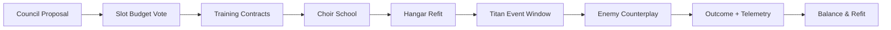

# RTS — Alliance Titan (Convergence) — Spec v0

> **North Star:** A realm‑forged colossus piloted by many, built by stewardship, and balanced by counterplay. Awe over oppression; choir over ego.

---

## 1) Purpose & Pillars
- **Alliance Identity:** the Titan embodies a shard’s culture (bio‑mycelial, clockwork, celestial, etc.).
- **Choir Control:** many players act as one; mastery is coordination. 
- **Situational Power:** appears in declared Titan Events (defense windows, festival raids, council wars). 
- **Counterable By Design:** enemy councils craft tools to ground, disrupt, or invert a Titan’s edge.
- **Ethical Monetization:** ornaments are cosmetic; edge modules are situational, capped, and transparent.

---

## 2) Build Lifecycle
1. **Intention:** council proposes a Titan season (duration 4–6 weeks).  
2. **Slots & Votes:** alliance votes on **slot loadout** (see §3) within a limited **slot budget**.  
3. **Training:** players complete **Training Contracts** (PvE/PvP chores) to level chosen slots; progress fuels choir unlocks.  
4. **Ornamentation:** cosmetic sets earned via feats/festivals; no power outside declared events.  
5. **Fielding:** Titan can be summoned X times per cycle with shard‑wide cooldowns and public notices.  
6. **Retirement/Refit:** end‑of‑cycle refit vote; heritage plates remain cosmetic history.

---

## 3) Slot System (limited by Budget)
**Budget:** each realm tier grants a **Build Budget** (e.g., 10 points). Slots cost points; some combos are mutually exclusive.

| Slot | Examples | Cost | Notes |
|---|---|---:|---|
| **Hull** | Bastion Plating (kinetic DR), Ley Weave (anomaly DR), Mycelial Regrowth (slow self‑heal) | 2–3 | DR = damage reduction; pick one |
| **Core** | Chrono Heart (Echo uptime), Grav Core (pull/knock), Solar Furnace (beam charge) | 3–4 | Core defines ultimate form |
| **Limbs** | Siege Arms (ballistae), Shepherd Arms (aegis net), Harrow Arms (rupture lash) | 2–3 | Choose two arms |
| **Aura** | Rally (ally morale/FF mitigation), Logistics (resupply aura), Dissonance (enemy cast time +) | 1–2 | Buffs **allies more than self** |
| **Ultimate** | World Echo, Sunlance, Root Cathedral | 3–4 | Choir‑timed finisher |
| **Ornament** | Anthem lights, murals, chapel, banners | 0 | Cosmetic only |

**Edge Budget:** the Titan’s **total combat advantage** is capped per event tier; additional power converts to **teamwide logistics** or **pure visuals**.

---

## 4) Training Contracts (leveling slots)
- **Contract types:** Convoy Escorts, Siege Emplacement Builds, Anomaly Stabilization, Civic Restorations, Choir Drills (timing QTEs).  
- **XP Flow:** contracts feed the selected slot (e.g., Siege Arms XP).  
- **Failure States:** grief metrics reduce XP; repeat abuse freezes a slot for the cycle.  
- **Bonuses:** mentor‑led squads earn small multipliers.

---

## 5) Choir Control (multi‑pilot UX)
- **Stations (roles):** Core Pilot, Left/Right Arm, Navigator, Aura Conductor, Logistics Marshal, Echo Caller (ultimate), Spotter(s).  
- **Input model:** each station has 2–3 abilities with **shared cooldown budget**; big moves require **Chord**—a timed multi‑input (rhythm QTE) across roles.  
- **Latency Tolerance:** predictive windows (±120ms) with server reconciliation.  
- **Onboarding:** **Choir School** mini‑sims unlock stations; practice lobbies score timing.

---

## 6) Counters & Counter‑Play
- **Rift Shackles:** place 3 pylons to ground Titan; mini‑game to protect/deny.  
- **Disruption Choir:** enemy players perform an inverse rhythm to **desync** Titan chords (short silence debuff).  
- **Anima Leeches:** elite squads tether to siphon Titan aura → convert to **ally buff** if not shaken off.  
- **Logistics Breakers:** strike depots to starve Titan ammo/cooldowns.

> **Fairness:** counter tools are earnable via play; visibility & timers are public.

---

## 7) Event Types Using Titans
- **City Defense Rite (default):** defend megastructure under siege; Titan shines in **aura & shield** roles.  
- **Festival Hunt:** raid a colossal anomaly beast; physics weak‑points + choir bursts.  
- **Council War:** limited windows; Titan may capture lanes or break walls—only after counters spawn.

---

## 8) Safety & Etiquette
- **Friendly Fire:** still **ON**; Titan FF penalties scale high; repeated accidents trigger station lockouts.  
- **Choir Vote Kick:** democratic kick for grief; temporary ban from stations.  
- **Duty Meter:** stations consume **Duty**; refill via civic acts. Abuse freezes Duty.

---

## 9) Monetization (ethical)
- **Ornament Sets:** chapel interiors, banners, anthem cues, murals (cosmetic).  
- **Edge Modules (situational):** unlocked via **Cycle Caches/Festival** with full transparency; capped by **Edge Budget** and only during Titan Events; all have **counters** (see §6).  
- **Alliance Patronage:** donors fund training contracts for the community; yields plaza engravings + small logistics buffs during Titan Events.

---

## 10) UI Flows
- **Hangar View:** slot budget meter, slot picks, XP bars, ornament grid, choir seats.  
- **Training Board:** contracts list, timers, rewards, squad queue.  
- **Event Briefing:** timeline, counters available, enemy intel, victory/defeat conditions.  
- **Choir HUD:** station abilities, chord ring, rhythm meter, call‑outs.

---

## 11) Audio/Art Direction
- **Theme:** the Titan has an evolving **anthem**; chords change with slot loadout.  
- **Call‑and‑response:** abilities sing motifs that allies hear; opponents hear a dissonant version.  
- **Silhouette:** readable at all zoom tiers; ornament LODs; photo‑mode hooks.

---

## 12) Telemetry & Balancing
- **Chord Accuracy:** average timing window success per station.  
- **Counter Efficacy:** % of events with successful shackles/disruptions/leeches.  
- **Edge Budget Usage:** how often the Titan hits the cap (convert to logistics).  
- **Abuse Flags:** FF incidents, grief kicks, station bans.  
- **Outcome Mix:** win rates vs. presence of counters; time‑to‑break; festival satisfaction surveys.

---

## 13) Mermaid: Build & Event Pipeline

---

## 14) Open Decisions
- Build Budget baseline per shard tier (e.g., 10/12/14)?  
- Station count (6–8?) and exact ability kits.  
- Event window frequency (per week? per festival?).  
- Edge Module list & counter pairings for MVS.  
- Choir School scoring thresholds.

---

> **Seal:** *Many hands, one heartbeat. Let the colossus rise to protect, not to rule.*