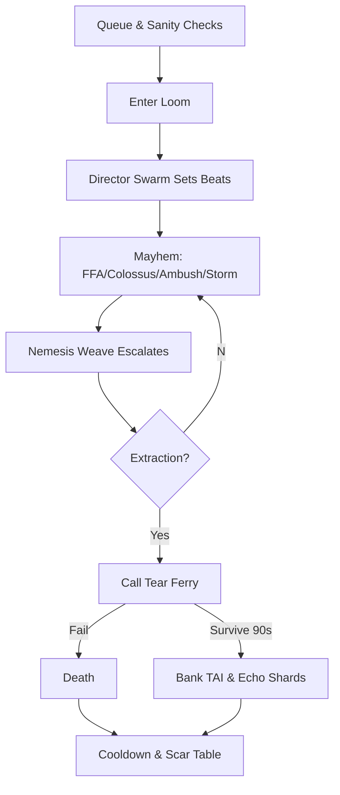

# RTS — Ascendant Chaos Server — Spec v0

> **North Star:** A quarantined shard of pure mayhem for God‑Tier ascendants—unforgiving, AI‑directed, and gloriously unfair by design. No consent windows. No mercy. Only mastery. The reward is legend.

---

## 1) Purpose & Lore Weave
- **Shard Name (working):** *The Pandemonium Loom* (a broken mirror where Mirror Laws distort).  
- **Fiction:** every cycle, the Loom rips open. Those who cross are written into a living saga; the Loom remembers and hunts them.  
- **Civic Contract:** this chaos is quarantined—its lessons and legends inspire the realms, but its raw power stays caged.

---

## 2) Entry, Eligibility & Costs
- **Eligibility:** God‑Tier SS + completion of three Ascendant Trials (siege grandmaster, diplomacy grandmaster, anomaly master).  
- **Solo or Squad:** queue solo, duo, or four—**friendly fire ON** and **betrayal allowed**.  
- **Stakes:** bring a **Chaos Kit** (loadout token) crafted from main‑realm feats; perish and kit is consumed.  
- **Lockouts:** death or extraction triggers **cooldowns** and **sanity checks** (account‑level). Depth reached extends cooldown.

---

## 3) Absolute Ruleset (breakable only by Chaos)
- **Un‑declared PvP:** FFA at all times.  
- **FF ON x2:** double lethality; misplays leave scars on your record.  
- **Entropy Physics:** time slips, gravity flickers, projectile drifts.  
- **Law Roulette:** realm‑specific fog swaps mid‑fight (Technomantic ⇄ Miasma ⇄ Lawlight ⇄ Echo).  
- **No appeals.** The Loom adjudicates.

---

## 4) Scoring & Progression (Legend Index)
- **Time‑Alive Index (TAI):** primary leaderboard = total **continuous survival** time.  
- **Style Multipliers:**
  - **Skirmisher:** outnumbered wins, low damage taken.  
  - **Choir Master:** perfect team chords in Titan arenas.  
  - **Mercy in Madness:** save a doomed squad (teaches altruism under chaos).  
  - **Atoner:** spare weakened enemies during ambush phase (rare, high risk).  
- **Nemesis Level:** the Loom assigns a **Nemesis** that grows with you (see §6). Higher Nemesis → higher score weight.  
- **Depth Bands:** every 10m adds a **Depth**; higher depths increase hazard density, boss tiers, and bounty triggers.

---

## 5) Modes within Chaos
- **Colossus Hunts:** multi‑phase kaiju raids; weak‑points rotate; choir bursts; rival squads can third‑party.  
- **Ambush Windows:** the Loom declares *double shadows*—NPC and player ambushes gain bonuses for 3m.  
- **Bounty Storms:** top TAI players get **open bounties**; killing them grants **Echo Shards**.  
- **Anarchy Rifts:** micro‑arenas with warped physics; last one standing; winner gets a **Legend Spike** (temporary score multiplier).  
- **Extraction Runs:** call a **Tear Ferry** under fire; extraction succeeds only if ferry survives a 90s gauntlet.

---

## 6) Agentic Mayhem (Only AI could do this)
- **Director Swarm:** a Left‑4‑Dead‑like conductor for RTS that watches stress/skill, spawns chaos beats (ambushes, hunts, storms) to keep flow at **"barely survivable"**.  
- **Nemesis Weave:** the shard creates a personal **Nemesis** (NPC or hybrid) mirroring your tactics; learns from you; taunts in your style.  
- **Conspiracy Engine:** NPC factions **plot**, hire assassins, fake truces, or lure you with false loot pings.  
- **Betrayal Contracts:** AI tempts squads with betrayals: deliver a teammate’s token for a **Legend Spike**—but the Loom remembers disloyalty elsewhere.  
- **Echo Twins:** time‑lag phantoms of *your past self* appear as enemies in future runs.  
- **Chaos Choir:** public “songs” of the shard—if many players perform actions in rhythm (kills, wards), global modifiers trigger briefly.

---

## 7) Boss Design (Raid Philosophy)
- **Multi‑Axis Checks:** mechanics demand positioning, target swaps, rhythm chords, logistics, and puzzle solves under pressure.  
- **Adaptive Scripts:** bosses learn counter‑patterns across attempts; repeated cheese earns **Adaptive Anger** modifiers.  
- **FFA Twist:** rival squads can trigger **Phase Bleed** to intrude into your fight for a time.

---

## 8) Death, Extraction & Cooldowns
- **On Death:** lose kit, roll on **Scar Table** (see §9), TAI session ends, cooldown starts.  
- **On Extraction:** bank TAI, keep Echo Shards, apply smaller cooldown; high‑depth extractions unlock banners.  
- **Cooldown Scaling:** `base 2h + 30m per Depth + Nemesis Level/10` (tune later).  
- **Sanity Checks:** re‑entry requires resource, health, and **conduct** thresholds (recent grief spikes delay entry).

---

## 9) Rewards (No raw power leaks; bragging rights + situational wonders)
- **Chaos Provenance:** every reward carries run IDs, depth, choir scores.  
- **Cosmetics:**
  - **Chaos Auras** (unstable shader, stim‑rated), **colossus trophies**, **vehicle skins**, **anthem shards** (music layers).  
  - **Scars & Tattoos:** visible lore marks from Scar Table (cosmetic, toggleable).  
  - **Titles:** *Loom‑Torn*, *Depth‑Warden*, *Echo‑Breaker*.  
- **Situational Wonders (main realms, gated):**
  - **Echo Ward:** one extra defensive ward **only during declared defense windows**; counterable by Wardbreakers.  
  - **Legend Chorus:** choir timing window +10% **only in Titan Events** if your Chaos choir rank ≥ Gold.  
  - **Rift Whisper:** +1 anomaly hint **per week** in microgames (Riftshot).  
- **No 24/7 DPS buffs** outside chaos shard.

---

## 10) Economies & Ethics
- **No monetization inside** the Chaos shard (pure skill & courage).  
- **Echo Shards** (non‑trade) convert to **heritage cosmetics** or **public‑works donations** back home with visible plaques.  
- **Spectator Sagas:** view runs as epic reels; ad‑free; shareable provenance pages.

---

## 11) UX, Safety & Access
- **Adults‑only** shard by default; hard content warnings; high‑stim defaults with opt‑down.  
- **One‑Key Bail:** emergency evac once per run (consumes all score).  
- **Streamer Mode:** hides rival names; anti‑sniping delays.  
- **Anti‑Cheat Max:** strict attestation + replay verify; immediate exile on tamper.

---

## 12) Tech & Tuning
- **Server Profile:** 60–120 tick micro‑arenas for precision; cloud autoscale; deterministic windows for boss phases.  
- **Matchmaking:** Elo‑like placement seeded by SS, raid history, microgame ranks.  
- **Director Inputs:** stress index, TTK curves, resource burn, betrayal rates, abandon spikes.

---

## 13) Integration to Realms
- **Lore Bridges:** weekly murals in cities depicting top runs; NPC bards retell feats with your choices.  
- **Festival Keys:** top squads can open **Spectator Hunts** at home (PvE showcases for the community).  
- **Mentor Credits:** Chaos veterans can mentor raid schools; **Civic SS** gains only if they teach, not if they boast.

---

## 14) Telemetry & KPIs
- TAI distribution & median; depth reach; extraction rates.  
- Betrayal frequency vs. long‑term SS changes in main realms.  
- Nemesis accuracy (match to player style) & defeat times.  
- Boss wipe causes (mechanic vs. grief vs. intrusion).  
- Scar adoption (cosmetic on/off) & social signaling effects.  
- Crash/cheat rates (must be near zero).  
- Return rate post‑cooldown; burnout indicators.

---

## 15) Mermaid: Chaos Run Flow

---

## 16) Open Decisions
- Official shard name; adult‑only policy exceptions (if any).  
- Scar Table entries & toggle rules.  
- Betrayal Contract reward magnitude and reputational echoes at home.  
- Director Swarm guardrails (ceiling for “unfairness”).  
- Situational wonder caps (weekly/monthly) for main realms.

---

> **Seal:** *Here, the mirror shatters on purpose. Survive, and the shards spell your name across the sky.*

