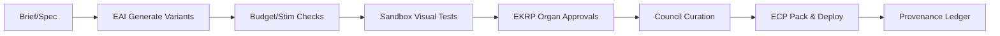
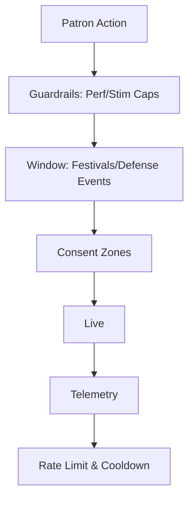

# RTS — Customization & Cosmetics — Spec v0

> **North Star:** Identity is play. Make it expressive, non‑predatory, and deeply earnable. Spectacle without oppression; ceremony without casino.

---

## 1) Philosophy & Guardrails
- **Non‑predatory:** no loot boxes; price caps; every premium cosmetic has at least one **earnable** path (events, stewardship, Pilgrim Path, feats).  
- **Accessibility‑aware:** every cosmetic declares a **Stim Rating** (low/med/high) respected by player settings (Low‑stim/High‑stim).  
- **Performance‑budgeted:** cosmetics ship with budgets (poly, particles, audio) and fallback LODs.
- **Transparency:** each item carries a **Provenance & Impact Card** showing source, creator share, and where proceeds fund (public works, education, charities).

---

## 2) Cosmetic Scope (what can be customized)
- **Avatars & Heroes:** skins, faces, hairstyles, voice packs, emotes, aura trails, death/respawn FX, idle loops.  
- **Units:** hull patterns, banners, exhaust/footstep SFX, formation animations.  
- **Buildings & Land:** facades, rooftops, architectural motifs, plaza statues, garden biomes, **city theme tracks**.  
- **Logistics & Vehicles:** convoy wraps, sail/vinyl designs, thruster FX.  
- **Titans (Alliance‑level):** ornament sets, anima‑aura, anthem cues, cockpit chapel interiors.  
- **UI/UX:** minimap frames, cursor glyphs, construction VFX, victory/defeat stingers.  
- **Companions:** cosmetic pets/mounts (no combat bonuses).  
- **Banners & Sigils:** realm‑themed with EKRP glyph slots.

**Dye & Material System**  
- Channels: **Base**, **Dye1**, **Dye2**, **Metal/Emissive**, **Pattern**.  
- Patterns: stripes, fractals, runes, mycelial veining, circuit‑lace; unlocked via play.

---

## 3) Acquisition Paths (earnable + optional purchase)
- **Event Prizes:** anomaly playlists, siege festivals, lore arcs; leaderboards offer cosmetics, not power.  
- **Stewardship Milestones:** SS‑gated sets; losing SS mutes visuals until restored.  
- **Pilgrim Path:** streaks/mentorship unlock QoL cosmetics (stashes, banners, emotes).  
- **Crafted Cosmetics:** blueprints + reagents from anomalies/festivals.  
- **Patron Packs (ethical):** transparent contents, price‑capped, often funding specific public works; patron names etched into plazas/credits.  
- **Graduations/Birthdays:** opt‑in age ceremonies grant unique trims; never FOMO‑locked.  
- **Creator Forge (UGC):** player artists submit blueprints → agentic review → council curation → revenue share.

**Reissue Policy**  
- We avoid hard FOMO by allowing **heritage reissues** after X cycles with tasteful palette/trim changes and “Heritage” tags.

---

## 4) Spectacle for Patrons (Whale‑only, non‑oppressive)
> Power is situational; **spectacle is civic**. These do not grant 24/7 domination.

- **Aurora Engines:** paint the city sky with patron‑chosen auroras during festivals; shard cooldowns; opt‑out visibility for low‑stim players.  
- **Processional Arches:** spawn ceremonial parades (NPC bands, banners) across owned plazas on designated days.  
- **Resonance Orchestra:** unlocks **city theme tracks** and call‑and‑response motifs that play in plazas.  
- **Beacon of Accord:** casts a realm‑wide **truce glow** in civic areas; reduces friendly‑fire penalties during declared **defense events** only.  
- **Sky Looms:** deploy floating tapestry billboards that show achievement art during festivals; strictly cosmetic.  
- **Constellation Gates:** cosmetic portals linking patron plazas across allied cities during celebrations.  
- **Titan Sanctum:** alliance‑only **interior** with customizable chapel, banners, hull murals, and anthem programming.

> Note: *Aegis of the Rift* remains as a defensive artifact, but spectacle wonders above fulfill the “larger than a 15‑minute shield” ask without breaking fairness.

---

## 5) Alliance Titan Customization (Convergence Titan)
- **Training Tree (limited slots):** **Hull** (armors), **Core** (law attunement), **Limbs** (weapon forms), **Aura** (anthem VFX), **Ultimate** (choir ability).  
- **Build Process:** alliance votes; resource pledges; EAI sim shows tradeoffs; choir assignments for abilities.  
- **Ornament Sets:** earned from alliance feats and festivals; purely cosmetic unless within declared titan events.

---

## 6) Fog of War — Realm‑Dependent Flavors
- **Technomantic Fog:** sensor nets & jamming; sci‑fi/industrial realms.  
- **Memory Miasma:** areas “forget” unless anchored; arcane/mystic realms.  
- **Lawlight:** visibility tied to stabilized laws; cosmic/weird realms.  
- **Echo Fog:** past‑ghost trails of enemy motion; chrono realms.  
- **Additive catalog:** more fogs will be introduced per realm needs.

---

## 7) Land Development & Siege Playlists
- **Structures:** outposts, castles, ranches, workshops, tradeports, observatories; each with socketed defenses.  
- **Opt‑in Sieges (recurring):** our twist on tower defense with physics throws/lobs, destructible cover, boss weak‑points, co‑op roles (sapper/healer/spotter), logistics resupply lanes.  
- **Rewards:** cosmetic sets, titles, blueprint drops, festival invitations.

---

## 8) Micro‑Games Library (rotating, agent‑curated)
- **Physics Archery Clash:** lob/lead/compensate for wind & gravity; hit colossal weak‑points; later cannons/bombs.  
- **Turn‑Based Tactics Ops:** grid/hex micro‑battles; perfect for quick 5–10m arcs.  
- **Puzzles & Relays:** glyphs, bridge‑builds, power reroutes.  
- **Stealth Heists:** infiltrate with limited tools; cosmetics as trophies.  
- **Agents rotate** playlists weekly; new modes arrive continuously via EAI.

---

## 9) NPC Market Program (rollout + charity)
- **Rollout:** Launch **0%** participation (observe) → **10%** → **25%** with dashboards & guardrails.  
- **Proceeds Ledgers:** each NPC shows where their profits go—plaza upkeep, newcomer bursaries, education content, environmental/animal charities. Players choose who to fund by trading.  
- **Escrow & AML:** all trades through audited marketplace; taxes fund public works.

---

## 10) Creator Forge (UGC) — Safe, Audited, Abundant
- **Pipeline:** player submission → agentic checks (IP similarity, budget, stim rating) → human/EKRP organ approvals → council curation.  
- **Blueprint Marketplace:** limited runs or open editions; transparent royalty splits; reissue rules with heritage tags.  
- **Anti‑plagiarism:** perceptual hashing + semantic checks; dispute resolution via Magistrates.  
- **Education tie‑ins:** approved lesson‑cosmetics (museum skins, eco missions) with proceeds routed to real‑world orgs.

---

## 11) Systems Data Model (for engineering)
- **CosmeticItem:** id, scope, slot, channels{base,dye1,dye2,emissive,pattern}, stimRating, perfBudget, provenance, acquisition{paths[]}, ledger{publicWorks,education,charity}, visibilityFlags{lowStimHide,photoModeOnly}, lods[].  
- **Ownership:** accountId, realmId, editionNo, heritageTag, mutableDyes, transferability policy.

---

## 12) Pipelines & Diagrams

### 12.1 Agentic Cosmetic Pipeline

### 12.2 Patron Spectacle Safety

---

## 13) Policies (players stay sovereign)
- **Hide Others’ Cosmetics:** per‑category toggles for performance/comfort.  
- **FF Always On:** cosmetic cues indicate danger zones; penalties scale with harm.  
- **No Ads, No Gamble:** cosmetics are celebration, not compulsion.

---

## 14) Open Decisions
- Titan ornament slot count per realm (4–6)?  
- Heritage reissue cycle length (3–4 cycles?)  
- Default dye channel unlock pace via Pilgrim Path?  
- Creator Forge royalty split (e.g., 60/30/10: creator/public works/platform)?

---

> **Seal:** *Identity is a gift, not a weapon. Let beauty be abundant, fair, and earned—so every banner in our world tells a story worth hearing.*

