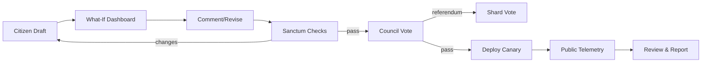
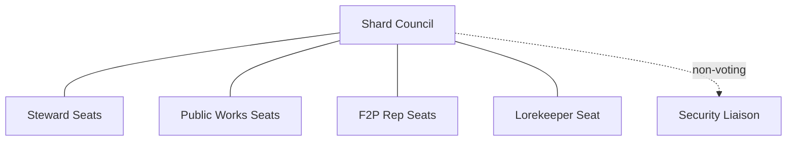

# RTS — Governance, Civics & Council Lawbook — Spec v0

> **North Star:** Player governance that feels like civic play—transparent, auditable, fun. Stewardship confers responsibility, not tyranny.

---

## 1) Foundations
- **Shard Constitution:** players possess a baseline charter of rights: clarity, consent windows, safety tools, due process, transparent ledgers, and appeal paths.
- **Civic Entities:** **Shard Council**, **Public Works Office**, **Magistrate Court**, **Ambassador Corps**, and **Audit Guild**.
- **EKRP Binding:** all civic actions are phrase‑locked, signed, and published to the governance ledger.

---

## 2) Council Composition & Seats
- **Seat Types:**  
  - **Steward Seats (SS):** top Stewardship Score stewards (decay resistant, service‑weighted).  
  - **Public Works Seats (PW):** top contributors to shard projects (weighted by *impact* not only spend).  
  - **F2P Representative Seats (F2P):** elected by free‑to‑play reputation pool.  
  - **Lorekeeper Seat:** elected from active contributors to canon (agent‑mediated).  
  - **Security Liaison (non‑voting):** publishes risk notes & coverage gates.  
- **Term Length:** 4 cycles; staggered terms to ensure continuity.  
- **Eligibility:** minimum SS; no current sanctions; conflict‑of‑interest declarations required.

---

## 3) Elections & Reputation
- **Voting Rights:** every citizen (account age > N, clean conduct).  
- **Ballot Weighting:** base = 1; **Service Multipliers** for mentorship hours and public works *time* (cap applies).  
- **Anti‑Whale Guard:** monetary spend **never** multiplies ballots; spend only influences PW candidacy via *impact‑weighted* contributions.

---

## 4) Proposal Lifecycle (What‑If by Default)
1) **Draft:** any citizen submits a proposal using a structured form.  
2) **What‑If Dashboard:** EAI simulates effects (economy, balance, safety, retention) → public preview.  
3) **Comment & Revision:** open period with civility guardrails.  
4) **Sanctum Check:** Security/Economy/Lore/UX “light green” or returns with changes.  
5) **Vote:** council vote; in some cases shard‑wide referendum (see §6).  
6) **Rollout:** canary → staged release; telemetry posted.  
7) **Review:** mandatory post‑implementation report.

---

## 5) Powers & Limits
- **Council Powers:**  
  - World modifiers (weather weights, spawn pacing) within safe ranges.  
  - Festival scheduling; anomaly playlists; public works budgets; artifact introductions.  
  - Treaty ratifications; emergency declarations (see §10).  
- **Hard Limits:** cannot grant permanent combat power; cannot bypass safety, age rules, or Sanctum gates; no retroactive punishments.

---

## 6) Referenda & Supermajorities
- **Referenda:** required for taxes, shard migrations rules, and major economy shifts.  
- **Thresholds:** standard pass 60%; constitutional 66%; emergency 50% + 1 (time‑boxed, auto‑sunset).  
- **Quorum:** 35% of active citizens by last cycle.

---

## 7) Lawbook (Core Statutes)
- **Consent Windows:** all high‑impact PvP must be declared; timers visible.  
- **Dominance Decay:** predation on lower bands outside consent windows triggers decay and sanctions.  
- **Atonement:** routing rules, parole criteria, relapse resets.  
- **Transparency Mandate:** public dashboards for funds, edges, sanctions, and proposal telemetry.  
- **Conflict of Interest:** councilors must recuse if directly benefiting; Audit Guild enforces.  
- **Lobbying Disclosure:** gifts, sponsorships logged; caps on value.

---

## 8) Public Works & Budgets
- **Budget Categories:** Infrastructure (roads/walls/grids), Culture (plazas, museums, festivals), Defense (wards, depots), Welfare (newcomer bursaries).  
- **Funding Sources:** patron packs, marketplace taxes, NPC proceeds ledgers, event tithes.  
- **Awards:** builders earn **Civic Crests** (cosmetic) and SS boosts; zero raw DPS.

---

## 9) Treaties & Diplomacy (Public + Secret)
- **Public Treaties:** tariffs, borders, shared events—fully visible, enforceable.  
- **Secret Clauses:** hidden triggers; discoverable by scouts/spies; leaks cause SS penalties and *Casus Belli* modifiers.  
- **Ambassador Corps:** elected envoys negotiate drafts; EAI sim posts What‑If outcomes before ratification.

---

## 10) Emergencies & Vetoes
- **Emergency Powers:** limited to 7 days; scope: safety patches, cordons, disaster relief; requires Security note + postmortem.  
- **Veto:** Magistrate may veto unlawful acts; council can override with 66% supermajority post‑review.

---

## 11) Magistrates & Justice Loop (interface)
- **Case Intake:** from Security/Civility/Bounty swarms or reports.  
- **Evidence Packets:** logs, replays, classifier confidence; privacy‑scrubbed.  
- **Sanctions:** nudge → mute → quarantine → title suspension → Atonement → ban.  
- **Appeals:** time‑boxed; restorative tasks available for mid‑tier cases.

---

## 12) Audit Guild & Anti‑Corruption
- **Mandate:** verify budgets, disclosures, proposal telemetry, and councilor recusals.  
- **Tools:** read‑only ledger access; sampling audits; whistleblower shield.  
- **Outputs:** public monthly audits + red‑flags with remediation plans.

---

## 13) Migration & Identity
- **Friend Gate:** one safe relocation; Context Converters normalize numbers; cosmetics/titles persist.  
- **Constellation Caravan:** alliance migration with caravan taxes (economy sinks) and market advisories.  
- **Archon Track:** God‑tier stewards gain **multi‑server civic levers** (logistics, relief), never raw DPS.

---

## 14) Meeting Procedure & UX
- **Agenda System:** proposals in queue with timers; comment windows; voting windows.  
- **What‑If Dashboards:** graphs for economy, edge distribution, Oppression Index deltas.  
- **Open Mic:** limited time; civility filters; Guardian reminders.  
- **Recordings:** searchable transcripts with summaries; privacy‑preserving.

---

## 15) Mermaid Diagrams

### 15.1 Proposal Flow

### 15.2 Council Composition

---

## 16) KPIs
- Proposal cycle time (draft → deploy)  
- Participation rate (comments, votes)  
- Oppression Index trend post‑policy  
- Budget delivery vs. commitments  
- Audit findings resolved on time  
- Treaty breach incidents and outcomes

---

## 17) Open Decisions
- Seat counts per shard size (e.g., 3 SS, 2 PW, 2 F2P, 1 LK).  
- Referendum topics list and thresholds.  
- Lobbying caps & recusal enforcement penalties.  
- Archon lever catalog (exact civic knobs).  
- Comment period length and quorum specifics.

---

> **Seal:** *Let councils be lanterns, not thrones. What we change, we show; what we spend, we prove.*

