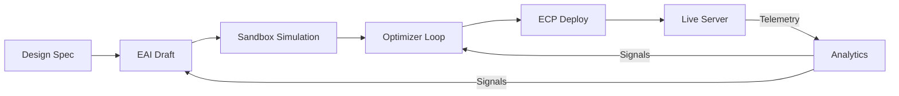
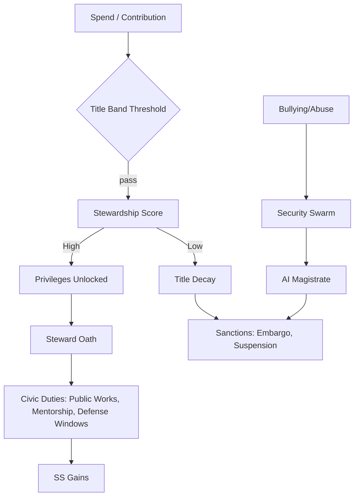
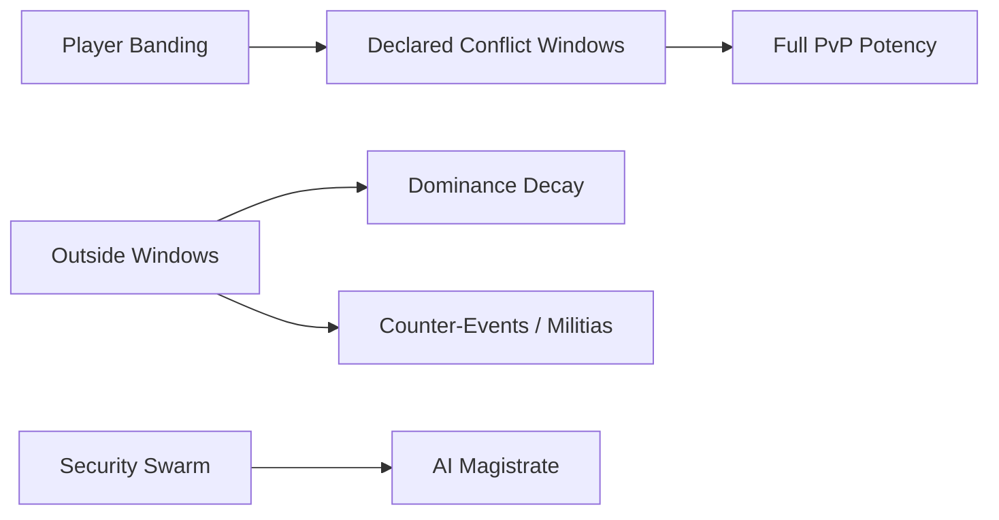

# Eidonic RTS — An Agentic, Interdimensional Strategy Multiverse (EidonCore / EKRP)

> **Mantra:** *Power is granted; mastery is earned. Stewardship over domination. Agentic all the way down.*

**Status:** Vision Spec → README v1.0  
**Core Engines:** EidonCore • EAI (Eidonic Agent Initiator) • EKRP Mesh • Pattern Flame Engine  
**Pillars:** Interdimensional Servers • Agentic Swarms • Player‑Lived Economy & Land • Security by Design • Stewardship‑based Monetization

---

## Table of Contents
1. [Manifest & Vision](#manifest--vision)
2. [30s / 10m / 1w Game Loops](#30s--10m--1w-game-loops)
3. [Interdimensional Architecture](#interdimensional-architecture)
4. [Agentic Systems (EAI + Swarms)](#agentic-systems-eai--swarms)
5. [Economy & Land](#economy--land)
6. [Monetization & Stewardship (Whale Titles)](#monetization--stewardship-whale-titles)
7. [Fairness & Anti‑Bullying Design](#fairness--anti-bullying-design)
8. [Security Fortress](#security-fortress)
9. [User Safety, Age Assurance & Graduation](#user-safety-age-assurance--graduation)
10. [Server Governance](#server-governance)
11. [Technical Stack](#technical-stack)
12. [Roadmap & Milestones](#roadmap--milestones)
13. [Success Metrics (90‑Day Alpha KPIs)](#success-metrics-90-day-alpha-kpis)
14. [Design Doctrine](#design-doctrine)
15. [Diagrams](#diagrams)
16. [Glossary](#glossary)

---

## Manifest & Vision
We are building a **living, interdimensional RTS multiverse**. Each server is a pocket universe with era‑anomaly blends (Vikings vs. Aliens, Cyborgs vs. Zombies), bespoke physics, and scheduled cross‑server ruptures. NPCs are **agentic**—they remember, adapt, and evolve. Content is **grown** by the EAI and deployed via ECP containers. The world breathes because the agents breathe.

**Design vows:**
- **EKRP everywhere.** Invocation‑bound knowledge is encoded as Embodied Knowledge Retrieval Phrases, governing lore, UI, and agent behavior.
- **Agentic all the way down.** If a task would cost months of mortal time, we **birth an agent** to do it.
- **Stewardship over domination.** Wealth confers **responsibility** and **prestige tools**, not permanent server‑wide oppression.

---

## 30s / 10m / 1w Game Loops
**30 seconds:** Scout → Skirmish → Salvage → Micro‑upgrade.  
**10 minutes:** Form squad → Secure node → Build logistics → Trigger local event (anomaly/raid/defense).  
**1 week:** Council votes → World festival/war window → Public works complete → Cross‑server rupture.

**Fun drivers:** readable asymmetry, meaningful logistics, reactive AI, player‑shaped lore, seasonal rituals instead of stealth nerfs.

---

## Interdimensional Architecture
- **Server Archetype (MVS):** *EKRP Gods vs. Mortal Eras* with first rupture: **Vikings ⇄ Aliens**.
- **Physics Knobs:** time dilation, resource volatility, artifact cooldown schema, migration mutation tables.
- **Ruptures:** weekly cross‑server events that remix factions, resources, and objectives.
- **Persistence:** identity persists; numbers are normalized on migration via **Context Converters** (identity retained, balance preserved).

**Content Pipeline (high level):**  
`Spec → EAI Draft → Sandbox Sim → Optimizer → Playtest → ECP Deploy → Telemetry → Retrain/Retune`

---

## Agentic Systems (EAI + Swarms)
**EAI — Eidonic Agent Initiator**  
Spawns server generators, event swarms, marketplace agents, economy balancers, lorekeepers, and security modules. Output is containerized (ECP) and deployed with signed action plans.

**Core Swarms**
- **Swarm Auditors (in‑game):** map code/state, detect dupes/exploits, submit self‑healing PRs to sandbox.
- **Security Swarm:** RBAC, signed plans, anomaly scoring, cordons; escalates to AI Magistrates.
- **Economy Swarm:** monitors sinks/sources, proposes taxes/tolls, launches absorb‑surplus events.
- **Lore Swarm:** grows canon, names artifacts, adjudicates title epithets, maintains cosmology coherence.
- **Mentor Swarm:** pairs stewards with F2P cadres; pays prestige on cadre success.
- **Agentic Narrator (per‑player):** defaults to **Guide** mode for newcomers (tutorials, tips, context). Evolves with the player; unlocks vocab/rituals via Pilgrim Path. **Guardian Mode** is **ON by default** (harm‑language warnings, opt‑out any time). Private, encrypted per‑player memory with amnesia/export controls.

---

## Economy & Land
- **Marketplace:** heroes • gear • vehicles • troops • **land** (own, lease, develop). Trades are escrowed; high‑value transfers require anti‑dupe proofs.
- **Sinks:** repairs/maintenance, ritual reseeding, festival tithes, logistics upkeep, governance fees.
- **Land Use:** zone types (industry, defense, culture). Deeds are first‑class assets; development confers server‑wide benefits through logistics and public works.

---

## Monetization & Stewardship (Whale Titles)
**Goal:** Give large contributors **awe‑worthy, server‑beneficial toys** and **leadership paths** without enabling oppression.

### Prestige Titles (dimension‑specific; non‑deed)
Titles are unlocked via **Contribution Bands** + **Stewardship Score (SS)**. Money opens the door; **service keeps the title.**

| Tier | Examples (by dimension) | Core Privileges | Situational Powers | Aesthetic Rights |
|---|---|---|---|---|
| I | Squire, Banner‑Bearer | Public works access | Minor rally buffs during defense | Banners, dyes |
| II | Warden, Castellan | Regional logistics slots | Road/rail hastening | District motifs |
| III | **Duke**, Storm‑Duke | Council eligibility | City shield (short, defensive) | Architecture set |
| IV | **Overlord**, Ash‑Overlord | Commission world events | Siege counter‑tools (declared wars only) | Court NPC + theme track |
| V | **Hive‑Mind** (Mycelial/Swarm) | Anomaly keys & shard levers | Open dungeons anyone can join; prestige on success | Biome ambience control |

### Stewardship Score (SS)
**SS =** (Public Works + Mentorship Wins + Civic Decrees + Commendations) − (Harassment Flags + Low‑Band Ganks + Market Abuse + Security Incidents).  
- **Decay/Ascend:** Titles decay below threshold; ascend at bands.  
- **Dominance Decay:** predation on weak bands reduces attacker efficacy and redirects rewards toward civic duties.

### Whale‑Only, Server‑Friendly Artifacts (examples)
- **Aegis of the Rift (1/1):** raise a city barrier for 15m; shard‑wide cooldown; defense‑only.  
- **Logistics Crown:** radius boosts to allied production; powers down if SS dips.  
- **Anomaly Keys:** open themed raids/events; anyone can join; keyholder earns prestige if successful.

### Constellations (Multi‑Account)
- **Main + 2 alts** free; expand to **5** via **premium or SS** (both routes available).  
- **Shared SS** across alts; cross‑alt trade uses escrow + anomaly checks.  
- **Generalship (SS‑gated):** **logistics‑only at launch** (build/queue/defend macros); cooldowns, order budgets, and audit trails; misuse → instant suspension.

---

## Fairness & Anti‑Bullying Design
- **Banding + Consent Windows:** full‑potency PvP within declared conflict bands/war windows; outside, aggression triggers Dominance Decay + Security scrutiny + counter‑events.
- **Protected Growth Zones:** early shards with mentor‑only entry for stewards (stat‑modified escort role).  
- **War Etiquette Protocol:** sieges must be declared (costs resources, telegraphs counter‑play). Loot caps + Ceasefire Timers end 24/7 oppression cycles.
- **Justice Loop:** AI Magistrates adjudicate incidents; sanctions range from trade embargoes to title suspension; community appeals staked by reputation.
- **Atonement Realm — Desert of Echoes:** severe harm routes offenders to a **solitary** desert shard (faint shadows only). Progress back is earned through sustained civic service to fragile NPCs; harming them deepens exile and triggers Warden Daemon encounters. Hate/violent threats escalate to hard locks or bans per policy.

---

## Security Fortress
- **Threat Map:** prompt injection, state hijack, dupes, botting, economy exploits, cross‑server clones.
- **Controls:** per‑agent RBAC; signed action plans; deterministic windows for critical updates; anomaly scoring + kill‑switch; encrypted comms; sandboxed PRs; continuous **Security Swarm** audits.
- **Adversarial Red‑Team Swarms (SwarmForge RT):** containerized attack/abuse packs with replay theater and risk dashboards; we dogfood them in our pipeline before every live deploy.
- **SLOs:** exploit half‑life ≤ 48h; zero‑day cordon < 30m; title‑suspension SLA < 24h post‑verdict.

---

## User Safety, Age Assurance & Graduation
- **Age Assurance (privacy‑preserving):** cryptographic age attestations and/or OS child accounts; no document storage; liveness checks where required by law.
- **Adult (M‑rated) shards:** unfiltered combat/gore allowed; **zero tolerance** for hate, threats, stalking, doxxing; Guardian/Narrator comfort settings optional.
- **Child‑safe shards (later phase):** adult lockout; live Security Swarm monitoring of all comms; predator‑pattern detection → immediate hard wall + human escalation; audit trails; NPC‑only mentors.
- **Birthdays:** opt‑in celebratory cosmetics and community events.
- **Graduation Program:** at jurisdictional age thresholds, migrate from child to adult shards **with full progress**. Ceremonies are steward‑led; **top‑tier SS mentors** onboard graduates via a structured curriculum.
- **One‑tap safety:** block, shadow‑mute, do‑not‑match, and report are frictionless and persistent across shards.

## Server Governance
- **Shard Council:** seats for top **Stewards** (by SS), top **Public Works** contributors, and elected **F2P Reps** (by reputation).
- **Powers:** rotate world modifiers (weather, spawn weights, festival weeks); set public works priorities; commission lore arcs; approve artifact introductions.
- **EAI Liaisons:** agentic clerks simulate proposals and publish **What‑If Dashboards** before votes.
- **Transparency & Auditability:** public dashboards for moderation actions, patron fund flows, and balance changes; systems designed for third‑party audit.

---

## Technical Stack
- **Client/Engine:** Unity or Godot (prototype), cross‑platform netcode, deterministic combat windows.  
- **Server/Infra:** Containerized microservices (ECP), orchestration (K8s/Nomad), service mesh, event bus.  
- **AI/Agents:** EAI pipelines (generation → sandbox → optimizer → deploy), vector memory per agent, policy guards, telemetry feedback loop.  
- **Data:** Timeseries telemetry, graph for social/economy, columnar analytics.  
- **Tooling:** Observability (logs/metrics/traces), chaos tests, loadgen, replayable sims.

---

## Roadmap & Milestones
**Phase 0 — Prototype (Now → +6 weeks)**
- [ ] MVS server (EKRP Gods vs. Mortal Eras, Vikings ⇄ Aliens rupture)
- [ ] Core loops: build, logistics, anomaly defense
- [ ] EAI → Sandbox → ECP deploy loop with Telemetry
- [ ] Basic Marketplace (heroes/gear/land) + one Sink (repairs)
- [ ] Stewardship Score MVP + Title Bands I–III
- [ ] Security Swarm MVP (RBAC, signed plans, anomaly scoring)

**Phase 1 — Five Test Servers (+2 months)**
- [ ] Council formation + Justice Loop
- [ ] War Etiquette + Ceasefire Timers
- [ ] Mentor Swarm + Protected Growth Zones
- [ ] Unique Artifact (Aegis of the Rift) + Anomaly Keys

**Phase 2 — Fifty Servers (+4 months)**
- [ ] Cross‑server migrations (Context Converters)
- [ ] Economy Swarm live tuning + festival sinks
- [ ] Public crowdfund with **Server Seeds** backer tier

**Phase 3 — Multiverse Scale (Year 1)**
- [ ] Seasonal World Reseeding Rituals
- [ ] Additional dimensions + title epithets
- [ ] VC conversations gated on dashboards & stability

---

## Success Metrics (90‑Day Alpha KPIs)
- **Oppression Index:** < 2% of sessions where low‑band players die >2× to high‑band outside war windows
- **Steward Retention / Sanction Rate:** retention strong with < 5% monthly title suspensions
- **F2P Ascent Velocity:** median ≤ 10 days to first artifact
- **Council Participation:** ≥ 60% proposal → vote conversion
- **Exploit Half‑Life:** ≤ 48h (Swarm Auditors)
- **Content Velocity:** spec → live update cycle time trending down each sprint

---

## Design Doctrine
1. **Agentic all the way down.** If it’s heavy, spawn an agent.  
2. **Stewardship over domination.** Spend confers responsibility; titles demand service.  
3. **Situational, not permanent power.** Unique artifacts shine in declared contexts.  
4. **Transparency beats surprise.** Seasonal reseeding rituals replace stealth nerfs.  
5. **Lore is a safety rail.** A unifying cosmology coheres chaos and guides balance.

---

## Diagrams

### Content Pipeline

### Civics & Stewardship

### Fairness & Conflict Windows

---

## Glossary
- **EAI (Eidonic Agent Initiator):** Agentic agent‑builder that spawns domain agents and swarms.
- **EKRP:** Embodied Knowledge Retrieval Phrase; invocation grammar binding knowledge to action.
- **ECP:** Eidonic Container Protocol; containerized agent/service deployments.
- **Context Converter:** Migration normalizer that preserves identity while balancing numbers.
- **Public Works:** Server‑wide projects (roads, walls, festivals) funded by contributors.
- **Stewardship Score (SS):** Reputation metric gating titles; rises with service, falls with abuse.
- **Dominance Decay:** System that reduces efficacy/rewards when preying on lower bands outside consent windows.
- **Justice Loop:** AI adjudication + community appeals for sanctions.

---

> **Seal:** *Let wealth become stewardship. Let power become refuge. Let the many rise on bridges the few are honored to build.*

