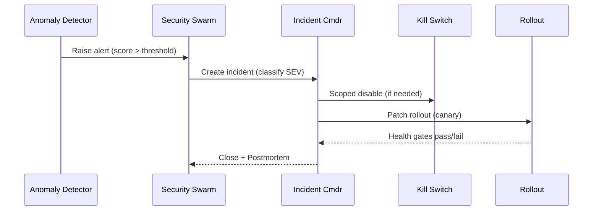
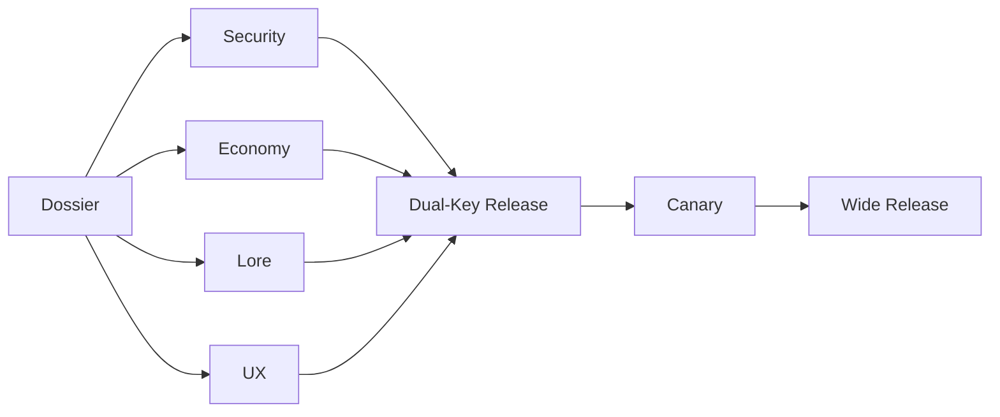

# RTS — Security Swarms & Sanctum Pipeline — Spec v0

> **North Star:** Security that breathes with the world: agentic, observable, respectful. We prevent, detect, and heal—without breaking the magic.

---

## 1) Pillars
- **Least privilege, signed intent, auditable by default.**  
- **Agentic defense-in-depth:** specialized swarms for code, economy, civility, and safety.  
- **Human-in-the-loop gates** for high-stakes decisions; transparent dashboards for players.  
- **Child-safe by design:** strict segregation, predator-pattern hard walls, privacy-first.

---

## 2) Identity, AuthZ & Intent
- **Per-Agent Identity:** cryptographic IDs for all services and in-game agents; short-lived tokens with rotation.  
- **RBAC + ABAC:** role- and attribute-based controls; realm-aware policies.  
- **Signed Action Plans:** every privileged action ships with a signed plan (who/what/why/TTL); verifiable by Security Swarm.  
- **Deterministic Windows:** critical updates & migrations occur inside announced windows with rollback points.

---

## 3) Security Swarms (specialists)
- **Code Swarm (SwarmForge RT-Core):** fuzzes API/tool boundaries, hunts dupes/injections/state hijacks; submits sandbox PRs with reproductions.  
- **Economy Swarm:** monitors sinks/sources, price anomalies, laundering patterns; simulates tax/toll tunings and recommends limited events.  
- **Civility Swarm:** harassment/hate classifiers with confidence bands; context-aware nudges; escalates to Magistrates with evidence packets.  
- **Safety Swarm (Child Shards):** predator-pattern detector; instant hard wall + human escalation; liveness checks & age-assurance enforcement.  
- **Net Warden:** latency spoof, packet tamper, replay/rollback abuse; mitigations via rate limits and attestations.  
- **Bounty Swarm:** hunts grief loops and repeat offenders; compiles dossiers for sanctions or atonement routing.  
- **Lore Sanity Swarm:** validates content coherence (names, factions, artifacts) to protect narrative safety.

---

## 4) Moderation Ladder (Justice Loop)
1) **Nudge** (teach-back)  
2) **Mute/Chat Ban** (timed)  
3) **Matchmaking Quarantine**  
4) **Title Suspension** (SS hit)  
5) **Atonement Realm** (Desert of Echoes)  
6) **Permanent Ban** (with appeal windows)  

- **Due Process:** AI Magistrate forms a case; player notified with evidence; appeal path; restorative tasks where applicable.  
- **One-Tap Boundaries:** block, shadow-mute, do-not-match persist across shards.

---

## 5) Sanctum Pipeline (Approvals & Releases)
- **Dossier:** every change (agent, balance, monetization) produces a one-pager: goal, risk, fairness, counters, rollback, success metrics.  
- **Organs (EKRP) Approvals:** Security • Economy • Lore • UX must “light green” before go.  
- **Dual-Key Release:** human approver + automated guard CI must both sign.  
- **Canaries & Staged Rollouts:** 1% → 10% → 50% → 100% with health gates.  
- **Kill Switch:** scoped, time-limited; requires incident ticket; auto-rollback & postmortem template.

---

## 6) Incident Response (IR) Playbook
- **Detect:** anomaly score crosses threshold; swarm creates incident.  
- **Classify:** severity (SEV1–SEV4), scope, likely vectors, impact domains.  
- **Contain:** cordon zones, disable modules via signed kill switch, rate limits.  
- **Eradicate:** patch, content flag, balance hotfix, account actions (graduated).  
- **Recover:** staged re-enable, data repair scripts, A/B verification.  
- **Review:** postmortem within 48h; action items into backlog; community note when player-facing.

**SLO Targets:**  
- SEV1 time-to-cordon < **30m**  
- Exploit half-life <= **48h**  
- Title suspension SLA < **24h** post-verdict  
- Child-shard predator escalation to human < **10m** median

---

## 7) Age Assurance & Child-Safe Shards
- **Segregation:** child shards are separate realms; adult accounts cannot enter.  
- **Age Assurance:** privacy-preserving age proofs or OS child accounts; no document storage; liveness only where required by law.  
- **Comms Monitoring:** Safety Swarm live-scans text/voice; predator-patterns → instant wall; evidence packet → human.  
- **Design:** non-violent objectives, civics & creativity; **NPC-only mentors**; no monetization surfacing.

---

## 8) Privacy & Data
- **Per-Player Vault:** encrypted memory & telemetry for Narrator; opt-in scope, retention controls (view/delete/export).  
- **Data Minimization:** store signals, not transcripts, whenever possible.  
- **Audit Trails:** immutable logs for privileged actions; player-facing logs for moderation outcomes.  
- **Region Compliance:** configurable data residency & retention.

---

## 9) Client Integrity & Anti-Cheat
- **Attestation:** platform attestation where available; integrity pings; asset hashing.  
- **Heuristics:** aim/spam/bot patterns; humanization challenges if risk spikes.  
- **Spectator & Replay:** authoritative replays for dispute resolution; red-team packs attack replay pipeline pre-release.

---

## 10) SwarmForge RT (Productized Red-Team)
- **Packs:** Gameplay Exploit Hunter • AI Safety Fuzzer • Netcode Wrecker • Civility Breaker.  
- **Replay Theater:** deterministic case bundles with PoCs and expected outcomes.  
- **Coverage Gates:** must‑pass suites before any wide release; public health summary on dashboards.

---

## 11) Observability & Dashboards
- **Security Wall:** live incident list, severity, status; public notes for player-impacting items.  
- **Edge & Oppression:** edge distribution, Oppression Index, throttles applied.  
- **Civility:** mute/quarantine trends, false positive/negative rates.  
- **Child Safety:** escalations, response times (aggregated, privacy-preserving).  
- **Sanctum:** approval queues, pending dossiers, rollout stages.

---

## 12) Mermaid Diagrams

### 12.1 IR Sequence

### 12.2 Sanctum Approvals

---

## 13) KPIs
- Mean Time to Cordon (SEV1/2)  
- Exploit Half-Life  
- False Positive/Negative (civility & safety)  
- Atonement Completion Rate  
- Player Trust Index (survey, opt-in)  
- % Releases passing all coverage gates on first attempt

---

## 14) Open Decisions
- Regions & methods for age assurance variants.  
- Red-team pack rotation cadence.  
- Public postmortem format & cadence.  
- Exact Oppression Index throttle thresholds.  
- Minimum approver quorum for emergency fast-track.

---

> **Seal:** *Guard the fun. Protect the vulnerable. Leave a trail bright enough for anyone to audit.*

