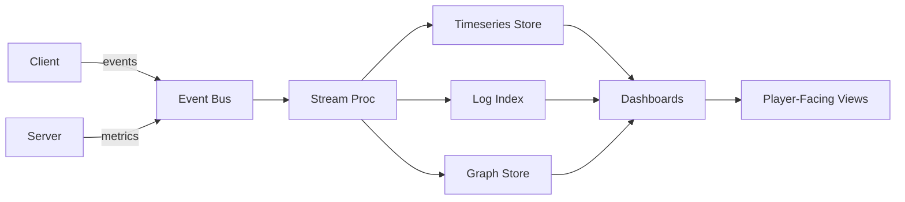

# RTS — Telemetry, KPIs & Ethics Dashboards — Spec v0

> **North Star:** If we can’t see it, we can’t steward it. Instrument the world so fairness, fun, and safety are visible—and correctable—at a glance.

---

## 1) Observability Stack (v1)
- **Ingest:** client + server events → Event Bus → Stream Processor.  
- **Storage:**
  - **Timeseries:** metrics → columnar store (Parquet/Delta).  
  - **Events/Traces:** log index with PII scrub rules.  
  - **Graphs:** social/economy relations.  
- **Dashboards:** engineer (Graf/Tempo), producer (Metabase/Superset), player‑facing (in‑game webviews).  
- **Governance:** data contracts per event; schema versioning; privacy tags.

---

## 2) Core Event Taxonomy
- **Session:** start/stop, realm, stim preset, device class.  
- **Combat:** damage, FF incidents, band deltas, artifact use (context).  
- **Economy:** trades, sinks/sources, price ticks, NPC proceeds routing.  
- **Civics:** mentorship, public works contributions, votes, council actions.  
- **Security:** anomaly scores, sanctions, incident states, red‑team gates.  
- **Narrator:** queries, mode swaps, advice follow‑through, privacy actions.  
- **Microgames:** entries, clears, fail points, difficulty band.  
- **Titan:** choir timings, slot XP, counterplay outcomes.  
- **Age Safety:** child‑shard contact walls, escalations.

Event fields carry: `actor_id, party, realm, band, context_id, ts, privacy_tag`.

---

## 3) KPIs (Roll‑Up)
### Fairness & Safety
- **Oppression Index:** % sessions with >2 low‑band deaths by high‑band **outside** consent windows (target < 2%).  
- **Atonement Throughput:** % exiled who return via service (target > 60%).  
- **Predator MTTR (child shards):** median < 10m to human review.  
- **FF Incident Rate:** per 1k sessions (downward trend; spikes alert).  
- **Edge Budget Violations:** auto‑throttles triggered.

### Progression & Engagement
- **F2P Ascent:** median days to first artifact (≤ 10 days).  
- **Cycle Participation:** active players partaking in current cycle/festival.  
- **Research Pacing:** time‑to‑tier distributions vs. targets (T1–T4).  
- **Microgame Satisfaction:** post‑run rating ≥ 4.2/5 on Novice.

### Economy & Transparency
- **NPC Proceeds Ledger:** distribution across public works/education/charities; player choice heatmap.  
- **Market Health:** dupe detection rate (zero in prod), transaction escrow times, price volatility bands.  
- **Creator Forge Payouts:** royalties on time %, disputes resolved.

### Stability & Quality
- **Exploit Half‑Life:** ≤ 48h from detection to fix.  
- **SEV1 Time‑to‑Cordon:** < 30m.  
- **Crash Rate:** per platform per 1k sessions.  
- **Patch Success:** % releases passing coverage gates first try.

---

## 4) Player‑Facing Ethics Dashboards
- **Edge Distribution:** who uses edges, where, when; counters available; throttle notices.  
- **Oppression & Safety:** index trend, sanctions summary (privacy‑safe), atonement stats.  
- **NPC Proceeds:** flows to works/education/charity; top funded projects; individual NPC ledgers.  
- **Public Works:** budget vs. delivery, photos/progress, contributor rolls.  
- **Creator Forge:** new approved items, revenue shares, heritage reissues schedule.

Design: clean cards, trend sparklines, drill‑downs; exportable snapshots for community posts.

---

## 5) Alerting & SLOs
- **Fairness Alerts:** Oppression Index > threshold; FF spikes; edge clustering by a single group.  
- **Economy Alerts:** price anomalies, sink starvation, laundering patterns.  
- **Security Alerts:** anomaly score crossings, cheat heuristics, replay tamper.  
- **Narrator Alerts:** help latency > 800ms; safety false‑positive drift.  
- **SLOs:** as defined in Security Spec; dashboards display burn rates.

---

## 6) Experiments & A/B
- **Feature Flags:** per cohort; shard‑aware.  
- **Ethics Guard:** experiments cannot increase Oppression Index beyond guard bands.  
- **Reporting:** effect sizes with confidence; player‑facing summaries for major changes.

---

## 7) Privacy & Compliance
- **PII Minimization:** hash actor IDs; store signals over transcripts; child shards segregated.  
- **Consent Ledger:** track opt‑ins (memory, Local Sky, voice).  
- **Data Subject Rights:** in‑game export/delete views; 30/60/90‑day retention options; region residency.

---

## 8) Data Schemas (starter)
### 8.1 Event (JSON)
```
{
  "event": "combat.ff",
  "actor": "A1",
  "victim": "A2",
  "realm": "vikings_aliens",
  "band": "mid",
  "ctx": {"war_window": false, "location": "north_gate"},
  "ts": 1731111111,
  "privacy": "pseudonymized"
}
```

### 8.2 KPI Table (Parquet)
`kpi_date, realm, metric, value, target, band, notes`

---

## 9) Dashboard Catalogue
- **Fairness Wall:** Oppression Index, FF rate, edge throttles, atonement throughput.  
- **Economy Lens:** sinks/sources, price bands, NPC proceeds, Creator payouts.  
- **Security Ops:** incidents, red‑team coverage, exploit half‑life, cordon timer.  
- **Narrator Panel:** latency, usage, helpfulness, privacy actions.  
- **Festival Board:** cycle participation, playlist fatigue, reward redemptions.

---

## 10) Mermaid: Data Flow


---

## 11) Roles & Permissions
- **Audit Guild:** read dashboards + logs (privacy-scrubbed), publish audits.  
- **Council:** view fairness/economy panels; propose actions.  
- **Security:** full ops dashboards; incident controls.  
- **Players:** public ethics dashboards and personal summaries.

---

## 12) Open Decisions
- Exact Oppression Index throttle curve.  
- KPI targets per shard tier.  
- Public postmortem cadence & format.  
- Player-facing export formats (CSV/JSON/PDF).  
- Which dashboards surface in-game vs. web.

---

> **Seal:** *Numbers with a conscience. May our meters light the path to a kinder, fiercer game.*

