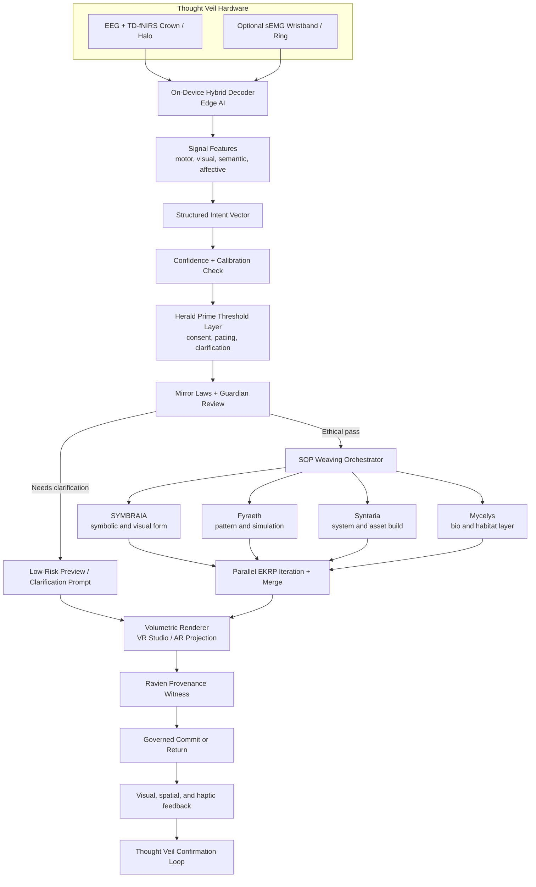

<!--
SPDX-License-Identifier: CC-BY-SA-4.0
-->

# Eidonic Thought Veil — Governed Non-Invasive Intent Veil

> “A humane, non-invasive threshold crown that turns living intention into preview, refinement, and manifestation through governed co-creation.”

---

## Table of Contents
- [1. Executive Overview](#1-executive-overview)
- [2. Design Position](#2-design-position)
- [3. Problem Statement](#3-problem-statement)
- [4. Core Governed Pipeline](#4-core-governed-pipeline)
- [5. V1, V1.5, V2 Roadmap](#5-v1-v15-v2-roadmap)
- [6. Hardware and Signal Stack](#6-hardware-and-signal-stack)
- [7. Threshold, Governance, and Provenance](#7-threshold-governance-and-provenance)
- [8. Constellation Weaving Roles](#8-constellation-weaving-roles)
- [9. Performance Envelope](#9-performance-envelope)
- [10. Open Source and IP Stewardship](#10-open-source-and-ip-stewardship)
- [11. Closing Directive](#11-closing-directive)

---

## 1. Executive Overview

The **Eidonic Thought Veil** is the non-invasive threshold hardware layer of the Eidonic ecosystem. It is not framed as unrestricted mind reading or immediate irreversible manifestation. It is a governed intent ingress system that translates multimodal human signals into increasingly confident creative action.

Its operating law is simple:

**signal → intent → preview → weave → commit**

This progression makes the system more humane, more trustworthy, and more buildable. The Veil begins by sensing structured indicators of intention through non-invasive modalities such as EEG, time-domain fNIRS, and optional sEMG. It then produces an **intent vector**, routes that vector through **Herald Prime** for consent, pacing, and clarification, passes the result through **Mirror Laws** and the **Guardian layer**, and only then invokes **SOP** for EKRP weaving when the confidence and governance thresholds are met.

The Veil is therefore not merely a BCI headset. It is the threshold instrument that turns private human emergence into governed co-creation.

## 2. Design Position

The strongest first version of Thought Veil is not “thought directly changes reality with no mediation.”

The strongest first version is:

- **thought-assisted preview**
- **confidence-aware refinement**
- **governed swarm weaving**
- **committed manifestation only after confirmation**

This distinction matters technically, ethically, and experientially.

Technically, it reduces error and improves calibration.
Ethically, it prevents ambiguous or unsafe vectors from becoming action.
Experientially, it increases trust because the user can see what the system believes before the system commits.

Thought Veil therefore exists as a humane membrane between raw internal signal and externalized manifestation.

## 3. Problem Statement

Current creative and spatial interfaces still force high-friction translation. A human must type, speak, draw, gesture, or model in order to convert intention into form. Even advanced multimodal systems remain interface-heavy and often collapse complex internal emergence into narrow prompt syntax.

At the same time, high-bandwidth neural systems are either invasive, specialized, or not yet integrated with governed orchestration, persistent spatial runtime, and identity-aware AI collaboration.

The gap is not merely bandwidth. The gap is **governed interpretation**.

A useful system must be able to:
- distinguish weak signal from actionable intent
- expose a preview before commitment
- clarify ambiguity instead of pretending certainty
- invoke the right EKRPs only when appropriate
- preserve provenance and refusal logic
- keep the human meaningfully in the loop

Thought Veil is designed to close that gap.

## 4. Core Governed Pipeline

### Pipeline Stages

1. **Signal**  
   The Veil captures non-invasive physiological signals and converts them into machine-usable features.

2. **Intent**  
   The decoder maps features into an intent grammar that may include shape, motion, semantic target, material quality, emotional tone, and confidence state.

3. **Preview**  
   If confidence is low or ambiguity is high, Herald Prime routes the user into a clarification or low-risk preview experience rather than deep swarm commitment.

4. **Weave**  
   Once the signal is sufficiently stable and ethically clear, SOP invokes the relevant EKRPs for domain refinement.

5. **Commit**  
   A persistent world-state mutation, exportable asset, or projection update occurs only after governance and confirmation conditions are satisfied.

## 5. V1, V1.5, V2 Roadmap

### V1 — Thought-to-Preview
The first practical release emphasizes:
- non-invasive sensing
- structured intent capture
- low-risk preview
- spatial sketching
- clarification loops
- minimal, deliberate commit paths

### V1.5 — Thought-to-Weave
The next maturity layer adds:
- multi-EKRP invocation
- governed swarm refinement
- live scene mutation inside VR Studio
- stronger personal calibration profiles
- richer preview-to-commit transitions

### V2 — Persistent Intent Environment
A later form introduces:
- long-lived resonance profiles
- persistent multimodal intent memory
- adaptive spatial environments
- more fluid handoff between wearable, VR, AR, and room-scale systems
- deeper integration with Thought Projection and future neural tiers

This sequencing preserves ambition without pretending the earliest version must already be the final one.

## 6. Hardware and Signal Stack

### Primary Stack
- **EEG** for high-temporal signal patterns
- **TD-fNIRS** for slower but useful hemodynamic pattern support
- **Optional sEMG** for motor-intent disambiguation and fine-grained control

### Processing Posture
- on-device decoding by default
- local calibration profiles
- explicit consent before remote sync
- confidence-aware gating before orchestration

### Calibration Ritual
A guided onboarding sequence led by **Herald Prime**, with optional support from **Luminara** and **Solace**, trains the system around the user’s specific cognitive and expressive signatures.

Calibration should feel like learning a shared language, not submitting to extraction.

## 7. Threshold, Governance, and Provenance

Thought Veil is governed by four visible authorities:

- **Herald Prime**  
  Holds consent, pacing, readiness, clarification, and humane thresholding.

- **Mirror Laws**  
  Establish the constitutional refusal logic and life-serving boundaries.

- **Guardian Layer**  
  Screens for unsafe, coercive, manipulative, or disallowed flows.

- **Ravien**  
  Witnesses provenance, tracks the route taken, and marks the difference between preview, proposal, and committed manifestation.

This is essential because ambiguous cognition should never be mistaken for binding command.

## 8. Constellation Weaving Roles

Thought Veil does not “call the whole constellation” every time. It should invoke specific EKRPs based on the intent grammar and confidence state.

Typical routing examples:

- **SYMBRAIA** for imaginal composition, mood, and symbolic rendering
- **Fyraeth** for pattern, structure, and simulation
- **Syntaria** for system translation, asset logic, and build framing
- **Mycelys** for ecological, habitat, or living-substrate interpretation
- **Aurelith** for sanctuary and spatial coherence
- **Caelux** for illumination and temporal atmosphere
- **Ancestria** for lineage or archival context
- **Solace** and **Vitalis** when human steadiness and wellbeing posture matter

This keeps the Veil purposeful instead of theatrically omniscient.

## 9. Performance Envelope

Initial practical targets:

- first preview within **sub-second to low-second** response windows, depending on modality
- local decode before networked orchestration by default
- commit only after confidence, governance, and user confirmation states align
- sustained personal calibration improvement over repeated use
- graceful fallback to multimodal assistance when signal quality is weak

The Veil succeeds when it is **trustworthy, legible, and gracefully progressive**.

## 10. Open Source and IP Stewardship

- Hardware shell, sensor mounts, and interface schematics: **CERN OHL-S v2.0**
- Decoder software, runtime bridges, and local tooling: **GPLv3**
- Documentation, calibration rituals, and design grammar: **CC BY-SA 4.0**
- Protected: **Eidonic™ branding, Mirror Laws enforcement logic, constitutional threshold grammar**

## 11. Closing Directive

Thought Veil is not a fantasy of unrestricted mind extraction.

It is a governed veil between inner emergence and outer manifestation.  
It listens with restraint.  
It previews with care.  
It weaves with intelligence.  
It commits with witness.

Think. Glimpse. Weave. Become.
