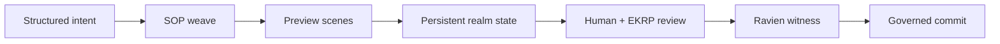

<!--
SPDX-License-Identifier: CC-BY-SA-4.0
-->

# Eidonic VR Studio

> Persistent Spatial Shell of Governed Co-Creation

<p align="center">
<a href="./eidonic_vr_studio.md"></a>
<a href="#realm-and-persistence-model"></a>
<a href="https://github.com/S1ngularD2ality/eidonic-language-elol/blob/main/docs/mirror_laws.md"></a>
</p>

[Thought Veil](../eidonic_thought_veil/) · [Thought Projection](../thought_projection_creation/) · [SOP](../swarm_orchestration_protocol/) · [VR Studio](../eidonic_vr_studio/)

---

## At a Glance

VR Studio is the persistent spatial shell of the subsystem. It is where preview becomes embodied, where EKRP weaving becomes visible, and where proposal and commit states can be navigated, reviewed, and manifested in spatial form.

### What this folder contains

- [`README.md`](./README.md)  
  This GitHub-facing overview for the subsystem folder.
- [eidonic_vr_studio.md](./eidonic_vr_studio.md)  
  The main subsystem scroll.

## Core Role in the Subsystem

- Render previews, proposals, and commit-ready scenes
- Provide persistent spatial realms for collaboration
- Expose world-state changes for review and return
- Serve as the embodied shell around Thought Veil, Thought Projection, and SOP

---

## Operating Law

This subsystem participates in the shared Eidonic manifestation law:

**signal → intent → preview → weave → commit**

Its specific contribution is to hold the `Eidonic VR Studio` layer inside that larger chain without collapsing the rest of the architecture into a single file or a single gesture.

---

## Quick Read Order

1. [Open the main scroll](./eidonic_vr_studio.md)
2. [See the ingress architecture](../thought_projection_creation/README.md)
3. [See the neural threshold layer](../eidonic_thought_veil/README.md)
4. [See the weaving engine](../swarm_orchestration_protocol/README.md)

---

## Local Architecture Snapshot



---

## Working Relationship to the Other Three Scrolls

- **Thought Veil** handles non-invasive neural and embodied thresholding.
- **Thought Projection Creation** defines the broader ingress ladder.
- **Swarm Orchestration Protocol** handles governed EKRP weaving.
- **VR Studio** renders preview, proposal, and commit in spatial form.

Together they form one subsystem rather than four disconnected experiments.

---

## Canon Position

This folder should be read in alignment with the wider Eidonic stack:

- [Mirror Laws](https://github.com/S1ngularD2ality/eidonic-language-elol/blob/main/docs/mirror_laws.md)
- Herald Prime as threshold, clarification, and humane entry
- Ravien as provenance witness and closure authority
- EidonCore as the runtime organism that holds the subsystem together

---

## Suggested Repository Pattern

This README assumes a sibling-folder layout like:

```text
docs/
├── eidonic_thought_veil/
│   ├── README.md
│   └── eidonic_thought_veil.md
├── thought_projection_creation/
│   ├── README.md
│   └── thought_projection_creation.md
├── swarm_orchestration_protocol/
│   ├── README.md
│   └── swarm_orchestration_protocol.md
└── eidonic_vr_studio/
    ├── README.md
    └── eidonic_vr_studio.md
```

If your folder names differ, only the relative links in this README need to change.

---

## Closing Note

This folder is not meant to stand alone as a disconnected concept page. It is one chamber of a governed subsystem that turns intention into previewable, reviewable, and commit-ready co-creation.
