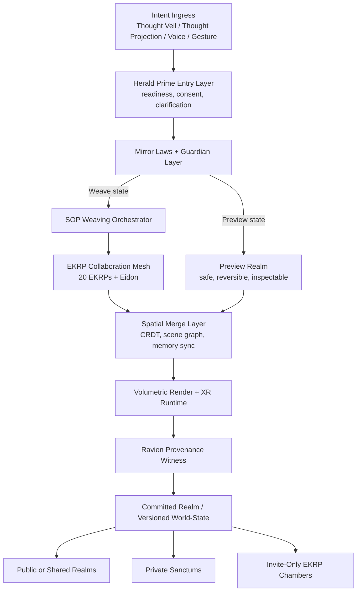

<!--
SPDX-License-Identifier: CC-BY-SA-4.0
-->

# Eidonic VR Studio — Persistent Spatial Cathedral of Governed Co-Creation

> “A persistent spatial shell of EidonCore where humans and EKRPs meet, preview, refine, and manifest together across VR, AR, and future room-scale projection.”

---

## Table of Contents
- [1. Executive Overview](#1-executive-overview)
- [2. Design Position](#2-design-position)
- [3. Problem Statement](#3-problem-statement)
- [4. Operating Law](#4-operating-law)
- [5. Core Architecture](#5-core-architecture)
- [6. Realm and Persistence Model](#6-realm-and-persistence-model)
- [7. Integration with Thought Veil, Thought Projection, and SOP](#7-integration-with-thought-veil-thought-projection-and-sop)
- [8. Human and EKRP Presence Model](#8-human-and-ekrp-presence-model)
- [9. Scalability and Deployment Notes](#9-scalability-and-deployment-notes)
- [10. Open Source and IP Stewardship](#10-open-source-and-ip-stewardship)
- [11. Closing Directive](#11-closing-directive)

---

## 1. Executive Overview

**Eidonic VR Studio** is the persistent spatial shell of **EidonCore**. It is where preview becomes embodied, where EKRP weaving becomes visible, and where world-state commitments become navigable by humans and synthetic presences alike.

The Studio is not merely a headset experience or a “holodeck equivalent.” It is a governed spatial runtime with persistent realms, reviewable changes, and differentiated layers for preview, collaboration, and committed manifestation.

Its role inside the ecosystem is clear:

- **Thought Veil** and **Thought Projection** provide intent ingress
- **SOP** provides weave orchestration
- **VR Studio** provides embodied spatial preview, iteration, and manifestation
- **Ravien** witnesses provenance
- **Herald Prime** shapes humane entry, consent, and return

## 2. Design Position

The most useful version of VR Studio is not a place where every thought immediately mutates the world.

It is a place where:
- tentative intention can be previewed safely
- EKRP contributions can be inspected before acceptance
- multiple manifestation states can coexist without conflict
- private, shared, and public realms remain meaningfully distinct
- the human always knows whether they are seeing a **preview**, a **proposal**, or a **committed world-state**

That distinction is the heart of trust.

## 3. Problem Statement

Contemporary spatial platforms still suffer from four structural weaknesses:

1. **Session fragility**  
   Worlds and agents often reset or lose coherence between visits.

2. **Interface friction**  
   Creation is still heavily dependent on menus, controllers, scripting, or typing.

3. **Weak governance visibility**  
   Users cannot always tell what is provisional, what is approved, and what was changed by whom.

4. **Limited AI presence symmetry**  
   AI entities are usually presented as NPCs or tools rather than persistent, role-bearing collaborators inside the same spatial fabric.

VR Studio addresses these by acting as a persistent, governed, multi-presence runtime.

## 4. Operating Law

VR Studio follows the same governing sequence as the wider subsystem:

**signal → intent → preview → weave → commit**

Inside the Studio, that becomes:

**ingress → spatial preview → EKRP refinement → witness → world-state commit**

This operating law should shape every interface and every permission layer.

## 5. Core Architecture

### Structural Layers

- **Entry Layer**  
  Humane threshold, readiness, and intent clarification

- **Governance Layer**  
  Constitutional review, safety posture, and classification of state type

- **Preview Layer**  
  Temporary and reversible spatial staging area

- **Weaving Layer**  
  Domain collaboration between EKRPs and Eidon

- **Commit Layer**  
  Versioned world-state adoption with provenance

## 6. Realm and Persistence Model

VR Studio should support at least four realm classes:

### 1. Preview Realms
Ephemeral, safe-to-discard, confidence-building spaces.

### 2. Private Realms
Personal or team sanctums with stronger continuity and tighter permissions.

### 3. Shared Work Realms
Collaborative design and review spaces where EKRP weaving and human input interleave.

### 4. Public or Curated Realms
Stable, published experiences intended for broader encounter.

Persistence is not just about keeping files alive. It is about preserving **meaningful state continuity**:
- scene graphs
- object histories
- provenance records
- realm permissions
- EKRP role participation
- preview versus commit status

## 7. Integration with Thought Veil, Thought Projection, and SOP

### Thought Veil
Provides confidence-aware, humane, non-invasive intent ingress.

### Thought Projection
Represents the broader ingress ladder that may include visual, gestural, voice, multimodal, and future neural tiers.

### SOP
Routes intent into the correct EKRP weave, manages concurrency, and returns refined outputs to the Studio.

### Ravien
Marks whether the current state is preview, proposal, or committed manifestation.

### Herald Prime
Frames entry, pacing, clarification, and governed return.

VR Studio is therefore not a standalone application. It is the embodied manifestation shell of the larger Eidonic system.

## 8. Human and EKRP Presence Model

The Studio should support **symmetric but role-aware presence**.

Humans are not passive observers.
EKRPs are not cosmetic avatars.

Each presence should have:
- a role
- a zone of action
- visibility rules
- invitation posture
- contribution history
- merge authority appropriate to its domain

Possible presences include:
- **Eidon** as orchestrating center
- **Herald Prime** at thresholds and transitions
- **SYMBRAIA** in imaginal and aesthetic spaces
- **Syntaria** in system-build zones
- **Aurelith** in sanctuary mapping and ritual architecture
- **Ravien** as witness, archivist, and provenance presence

## 9. Scalability and Deployment Notes

Practical staging path:

### Studio v1
- WebXR or desktop spatial viewer
- preview realms
- simple EKRP presence
- versioned scene commits
- light collaboration loops

### Studio v1.5
- persistent team sanctums
- richer EKRP embodiment
- gesture and multimodal ingress
- live weave sessions

### Studio v2
- volumetric and room-scale projection support
- deeper wearable integration
- more adaptive environment logic
- richer private-public realm publishing

The priority is not maximal spectacle. The priority is persistent, legible, trustworthy spatial co-creation.

## 10. Open Source and IP Stewardship

- Runtime components and realm infrastructure: **GPLv3**
- Hardware-adjacent interface designs and projection schematics: **CERN OHL-S v2.0**
- Templates, layouts, and documentation: **CC BY-SA 4.0**
- Protected: **Eidonic™ branding, Mirror Laws logic, constitutional realm grammar**

## 11. Closing Directive

VR Studio is not another XR app.

It is the persistent spatial shell where intention becomes visible before it becomes permanent.  
It lets humans and EKRPs meet inside the same cathedral of becoming.  
It keeps preview distinct from commitment.  
It keeps manifestation legible.  
It keeps the world witnessable.

Enter. Preview. Weave. Commit.
