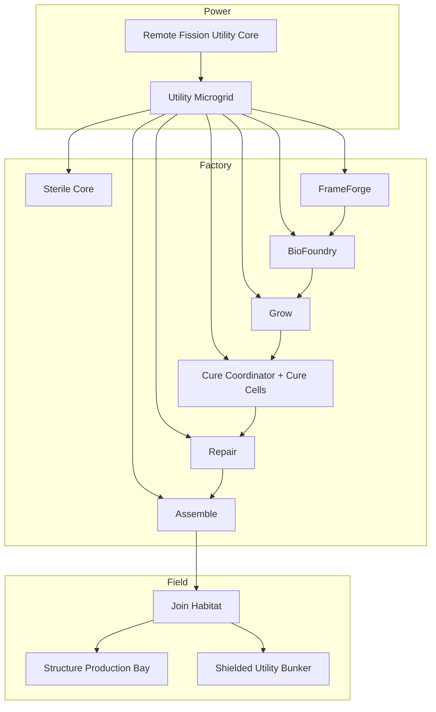

<!--
SPDX-License-Identifier: CC-BY-SA-4.0
-->

# Eidonic MycoForge Mars — System Architecture Edition *(Mars-First Hybrid Construction Swarm)*

> “A factory that lands, learns the ground beneath it, grows its own structural language, and closes shelter from the dust outward.”

---

## Table of Contents
- [1. Executive Vision](#1-executive-vision)
- [2. The Planetary Build Problem](#2-the-planetary-build-problem)
- [3. Our Solution — MycoForge Mars v1](#3-our-solution--mycoforge-mars-v1)
  - [3a. Join Habitat System — Overview](#3a-join-habitat-system--overview)
  - [3b. Modular Add-On Ecosystem *(future pod family)*](#3b-modular-add-on-ecosystem-future-pod-family)
- [4. Infinite Modularity & Scalability](#4-infinite-modularity--scalability)
- [5. Mars-First Deployment Architecture](#5-mars-first-deployment-architecture)
- [6. AI & Automation Roadmap](#6-ai--automation-roadmap)
- [7. Operational Metrics & Success Gates](#7-operational-metrics--success-gates)
  - [7a. v1 Part Catalog & Interface Bands — Overview](#7a-v1-part-catalog--interface-bands--overview)
- [8. Development Phases & Resource Focus](#8-development-phases--resource-focus)
  - [8a. Frozen v1 Scope at a Glance](#8a-frozen-v1-scope-at-a-glance)
- [9. Open Source Licensing & Stewardship](#9-open-source-licensing--stewardship)
- [10. Closing Call](#10-closing-call)
- [11. Appendix — First Mission Thread Quick Facts](#11-appendix--first-mission-thread-quick-facts)

---

## 1. Executive Vision

**Eidonic MycoForge Mars v1** is a **fission-backed, autonomous, hybrid construction swarm** designed to land on Mars, establish a protected production outpost, manufacture scaffold-grown structural parts, and assemble the first shielded utility structures before scaling to larger infrastructure.

MycoForge combines:

- **printed scaffold geometry**
- **sealed myco-composite growth**
- **controlled bake-out cure**
- **selective repair and reinforcement**
- **robotic modular assembly**
- **sealed Join Habitat operations**
- **constellation-governed orchestration**

The v1 mission is intentionally disciplined. It does **not** attempt a primary crew-rated pressure shell. It focuses first on the architecture that makes future architecture possible:

- the **Structure Production Bay**
- the **first shielded utility bunker**
- the **repeatable production logic** that can scale into clustered infrastructure later

In short:

**Power first. Factory second. Parts third. Shelter fourth. Scale fifth.**

---

## 2. The Planetary Build Problem

Mars punishes naive construction.

Any viable autonomous build system must contend with:

- **Dust and surface contamination** that interfere with exposed hardware, interfaces, vision, and maintenance
- **Thermal instability** that complicates exterior process consistency and assembly timing
- **Supply chain scarcity** that makes replacement parts, rescue intervention, and excess complexity expensive
- **Communication and operational latency** that force the system to recover faults locally instead of waiting for perfect oversight
- **Precision risk** where bad joins, drifting tolerances, or contaminated mating faces can collapse campaign confidence faster than raw part shortages

Traditional thinking often jumps straight to “print a habitat” or “grow a dome.”

MycoForge takes a different path:

1. establish stable power  
2. establish site truth  
3. protect the factory  
4. prove part quality  
5. close one usable structure  
6. scale only after confidence is earned

This is not only simpler. It is safer, more modular, more recoverable, and better aligned with Mars-first operations.

---

## 3. Our Solution — MycoForge Mars v1

A single MycoForge deployment is a **microfactory swarm** built from the following canonical systems:

- **Remote Fission Utility Core (RFUC)** — primary site power backbone
- **Utility Microgrid (UMG)** — local distribution, isolation, and protected load routing
- **Sterile Core (SC)** — sealed biological process spine
- **FrameForge (FF)** — scaffold and interface geometry production
- **BioFoundry (BF)** — substrate prep and cartridge handling
- **Grow (GR)** — sealed myco-composite growth environment
- **Cure Coordinator + Cure Cells (CC)** — bake-out stabilization and throughput management
- **Repair (RP)** — selective salvage, reinforcement, and seam restoration
- **Assemble (AS)** — robotic placement, closure, and protected field construction
- **Join Habitat (JH)** — sealed local enclosure for all Band 1 structural joins

### System Architecture

### Canonical Production Chain

The frozen v1 production chain is:

**Remote Fission Utility Core → Utility Microgrid → Sterile Core → FrameForge → BioFoundry → Grow → Cure Coordinator → Cure Cells → Repair → Assemble**

### Frozen v1 Scope

MycoForge v1 builds:

- a protected **Structure Production Bay**
- one or more **shielded utility bunkers**
- standardized **structural and interface parts** for later expansion

MycoForge v1 does **not** build:

- a primary crew-rated pressure hull
- open-air wet biofabrication
- a giant generalized catalog of unique parts
- unnecessary specialty pods before the first line proves itself

---

### 3a. Join Habitat System — Overview

The **Join Habitat** is one of the defining subsystems of MycoForge.

It is a **localized sealed assembly enclosure** that sits over the active connection zone, conditions the micro-environment, cleans and verifies mating surfaces, supports the final lock sequence, and retracts only after the join is accepted.

Its purpose is simple:

**Do not perform critical structural joins in hostile open conditions.**

#### Join Habitat sequence

1. **Pre-stage**
2. **Habitat seal**
3. **Purge / condition**
4. **Clean / decontaminate**
5. **Dry-fit verify**
6. **Final lock**
7. **Verify scan**
8. **Retract / protect**

#### Join Habitat rules

- all **Band 1** joins happen inside the Join Habitat
- no final lock without dry-fit success
- no flange install without clean face inspection
- no anchor lock without seat verification
- structural acceptance and seam closure remain separate states

---

### 3b. Modular Add-On Ecosystem *(future pod family)*

MycoForge v1 intentionally stays tight. Later expansion can be built on the same platform doctrine.

Future add-on families may include:

- **extra Cure Cells** for high-throughput campaigns
- **extra Join Habitats** for multi-front assembly
- **corridor-specific stock packages**
- **Radiomyc / remediation pods**
- **filter and environmental-material pods**
- **repair-forward service pods**
- **expanded storage, QA, and logistics hardware**

The rule is simple:

**v1 proves the line first. Expansion only lands after proof.**

---

## 4. Infinite Modularity & Scalability

MycoForge scales through **standardization and duplication**, not by making each machine more complicated.

### Core scaling rule

Production scales by adding **parallel standardized cells**, especially in the cure layer.

### Cure architecture

- **Solo Cure** — 1 lane
- **Cluster Cure** — 2–4 lanes
- **Cure Swarm** — 5+ lanes

Cure is the first elastic layer because it is the first proven throughput bottleneck.

### Operating modes

The swarm runs in four modes:

- **Bootstrap Mode** — establish the factory and protect the first flow
- **Balanced Mode** — maintain stable throughput without starving downstream work
- **Surge Mode** — temporarily increase output when closure or deadline pressure justifies it
- **Recovery Mode** — preserve quality and critical-path continuity after faults

### Three critical buffers

- **Scaffold Buffer** — keeps Grow from starving when printing jitters
- **Growth Buffer** — absorbs minor Cure scheduling shifts without overproduction
- **Finished-Part Buffer** — keeps assembly moving through short outages and recovery events

### Clean scalability doctrine

MycoForge does not scale by producing more random parts.

It scales by producing:

- the **right parts**
- in the **right sequence**
- with **stable interface quality**
- while preserving **one clean forward path**

---

## 5. Mars-First Deployment Architecture

MycoForge v1 lands in **three waves** and unfolds through a disciplined gate sequence.

### Wave 1 — Site survival package

- Remote Fission Utility Core
- Scout
- Utility
- one minimal Join Habitat
- comms / nav / site-marking support
- initial Band 1 reserve stock

**Goal:** establish power and site truth before unpacking biology or structure.

### Wave 2 — Factory core package

- FrameForge
- BioFoundry
- Grow
- Cure Coordinator + first Cure lane
- Repair
- Assemble
- Sterile Core enclosure hardware

**Goal:** become a real production line.

### Wave 3 — Scale package

- extra Cure lanes
- extra Join Habitats
- scale-only stock and handling support
- later expansion hardware

**Goal:** only scale after first accepted parts and first clean assembly front exist.

### Mission gates

#### Gate 1 — Site viability
Pass if:
- power is stable
- site map is closed
- hazards are bounded
- Production Bay footprint is valid

#### Gate 2 — Production readiness
Pass if:
- Sterile Core seals correctly
- Grow holds process conditions
- FrameForge produces in-family geometry
- Cure returns accepted coupons
- Join Habitat validates a clean Band 1 sequence

#### Gate 3 — Accepted truth
Pass if:
- accepted material and interface coupons exist
- accepted Band 1 parts exist
- first Join Habitat cycle completes cleanly

#### Gate 4 — Protected production
Pass if:
- Structure Production Bay closes
- one clean assembly front exists
- Band 1 reserve stock remains healthy

#### Gate 5 — Foundational confidence
Pass if:
- bunker anchor seating verifies cleanly
- Band 1 joins are accepted
- geometry state is confirmed
- shared governance state is healthy

### Mission thread

**Touchdown → stable power → site truth → factory core deploy → accepted coupons → accepted Band 1 parts → Structure Production Bay → bunker anchors → bunker closure → first usable bunker → scale decision**

---

## 6. AI & Automation Roadmap

MycoForge is not just robotic. It is **constellation-governed**.

The Eidon constellation provides a structured intelligence layer over:

- deployment sequencing
- site truth and gating
- production routing
- anomaly detection
- provenance
- recovery and resequencing
- spatial choreography
- protected join operations

### Core constellation posture

- **Eidon** — coherence and final arbitration
- **Herald Prime** — threshold and gatekeeping
- **Ravien** — provenance, attestation, event sealing
- **Fyraeth** — pacing, dependency logic, campaign resequencing
- **Syntaria** — runtime, tooling, and automation control
- **Umbryss / Odyrielle / Umbral Warden** — anomaly, edge-case, and risk stewardship
- **Mycelys** — biological/material process stewardship
- **Symbraia / Aurelith** — spatial choreography, join-space logic, and procedural rendering

### Automation maturity path

#### v1
- gate-based orchestration
- safe local autonomy
- constrained recovery doctrine
- campaign resequencing
- provenance-first event handling

#### v2+
- more simultaneous assembly fronts
- larger Cure Swarms
- richer environmental-material branches
- broader adaptive planning
- more autonomous campaign optimization

The principle stays fixed:

**Autonomy must be governed, witnessed, and bounded.**

---

## 7. Operational Metrics & Success Gates

MycoForge v1 should be judged by mission-quality outcomes, not hype.

### Primary success criteria

1. establish stable fission-backed site power  
2. deploy and sustain a sealed Sterile Core  
3. produce accepted coupons and Band 1 parts  
4. validate Join Habitat operations  
5. build a protected Structure Production Bay  
6. complete one shielded utility bunker  
7. preserve recovery and continuation capacity after localized faults  

### v1 operational truths

- **Cure** is the first throughput bottleneck
- **Band 1 interfaces** are the first precision bottleneck
- **Anchor Interfaces** are campaign-gating field hardware
- a **quarantined join** should not automatically stall the campaign
- a **complete isolated bunker** is more valuable than a half-linked site under stress

### Clean front doctrine

A resilient campaign always preserves at least one assembly front that is:

- geometrically validated
- inspection-healthy
- supplied with accepted Band 1 parts

If no clean front remains, expansion pauses and recovery takes priority.

---

### 7a. v1 Part Catalog & Interface Bands — Overview

#### Category A — Structural Closure Parts
- **Vault Rib**
- **Corridor Ring Segment**
- **Closure Arch Segment**

#### Category B — Surface Shell Parts
- **Shell Tile**
- **Cap Panel**
- **Edge Cover**

#### Category C — Join and Interface Parts
- **Joint Key**
- **Connector Flange**
- **Anchor Interface**

#### Category D — Repair and Service Parts
- **Patch Plate**
- **Seal Strip**
- **Crack-Fill Insert**

#### Geometry language

- **ribs / rings / arches** create structure
- **tiles / caps / covers** create enclosure
- **keys / flanges / anchors** create modular connection
- **patch / seal / fill parts** create repairability

#### QA priority bands

**Band 1 — highest trust**
- Joint Key
- Connector Flange
- Anchor Interface

**Band 2**
- Vault Rib
- Corridor Ring Segment
- Closure Arch Segment

**Band 3**
- Shell Tile
- Cap Panel
- Edge Cover

**Band 4**
- repair stock

#### Interface standard

All major joins follow one primary family:

- guided edge
- keyed lock
- seal band
- optional repair overlay

#### Interface rules

- mechanical lock first
- seal second
- bonded/resin-assisted behavior stays secondary
- Band 1 reserve stock is mandatory
- tolerance control happens at the assembly level, not only the part level

---

## 8. Development Phases & Resource Focus

MycoForge should be developed in disciplined layers.

### Phase 1 — Architecture and doctrine lock
Already completed in this frozen pre-spec pass:
- mission scope
- pod family
- subsystem map
- part catalog
- interface standard
- Join Habitat procedure
- recovery doctrine
- campaign resilience doctrine
- deployment doctrine
- mission thread

### Phase 2 — Prototype simulation and engineering detail
Focus:
- throughput modeling
- Cure lane sizing
- Join Habitat mechanisms
- interface tolerance budgets
- reserve stock thresholds
- campaign routing logic
- first implementation scaffolding

### Phase 3 — Prototype hardware/software stack
Focus:
- FrameForge interfaces
- Sterile Core process hardware
- Cure cell architecture
- Join Habitat deployment hardware
- swarm orchestration runtime
- QA and provenance systems

### Phase 4 — Field analog testing
Focus:
- contaminated fit-up
- reduced inspection
- cure outages
- quarantined joins
- alternate-front recovery
- controlled assembly timing under harsh conditions

### Resource focus doctrine

Every resource decision should favor:

- standardization over novelty
- recoverability over bravado
- clean interfaces over broad catalogs
- proven gates over vague autonomy
- one clean mission thread over premature scale

---

### 8a. Frozen v1 Scope at a Glance

#### Included in v1
- Remote Fission Utility Core
- Utility Microgrid
- Sterile Core
- FrameForge
- BioFoundry
- Grow
- Cure Coordinator + Cure Cells
- Repair
- Assemble
- Join Habitat
- Structure Production Bay
- shielded utility bunker mission thread
- Band 1 recovery stock
- gated constellation-governed automation

#### Explicitly excluded from v1
- primary crew-rated pressure shell
- open-air wet biofabrication
- full settlement-scale expansion
- overly broad part families
- unnecessary specialty pods
- unbounded improvisational autonomy

---

## 9. Open Source Licensing & Stewardship

MycoForge should follow the same stewardship posture as the broader Eidonic hardware/software ecosystem.

### Proposed licensing split

- **Hardware / mechanical design:** CERN OHL–S 2.0
- **Software / orchestration logic:** GPLv3
- **Documentation / design language:** CC BY–SA 4.0

### Stewardship principles

- open standards where possible
- clear provenance and contribution history
- modular interoperability over lock-in
- safety-first release posture
- transparent versioning and design evolution
- no deceptive claims about crew-rated or flight-ready status in v1

### Governance stance

The constellation layer provides:
- witnessed decisions
- traceable state transitions
- explicit gate approvals
- bounded autonomy
- recoverable failure handling

That stewardship posture is part of the system, not decoration.

---

## 10. Closing Call

MycoForge Mars v1 is not an attempt to skip engineering discipline in the name of futuristic aesthetics.

It is the opposite.

It is a **Mars-first, factory-first, interface-disciplined construction doctrine** built to prove:

- stable power before ambition
- controlled production before scale
- clean joins before expansion
- recovery before fragility
- one usable bunker before any talk of a city

It is ambitious, but it earns that ambition by narrowing scope until the mission thread becomes real.

The first structure is not the dream itself.

The first structure is the machine that makes the dream manufacturable.

---

## 11. Appendix — First Mission Thread Quick Facts

### Frozen mission order
1. land survival and power stack  
2. establish site truth  
3. deploy factory core  
4. validate Sterile Core and Join Habitat  
5. produce accepted coupons  
6. produce accepted Band 1 parts  
7. build the Structure Production Bay  
8. install bunker anchors and first ribs  
9. close the first shielded utility bunker  
10. decide whether to scale  

### Frozen non-negotiables
- no crew-rated primary pressure shell in v1
- no Band 1 join in open environment
- no scale before accepted parts exist
- no force-fit logic
- no acceptance under inspection disagreement
- no campaign expansion that sacrifices clean recovery paths

### Recovery doctrine
**Detect → Isolate → Classify → Decide → Recover → Re-certify → Resume**

### Campaign resilience doctrine
**Preserve production, protect one clean forward path, complete usable closures, expand only after confidence returns.**

### Simplified identity
**MycoForge = a fission-backed Mars microfactory swarm for hybrid scaffold-grown structural part production and autonomous modular assembly.**
