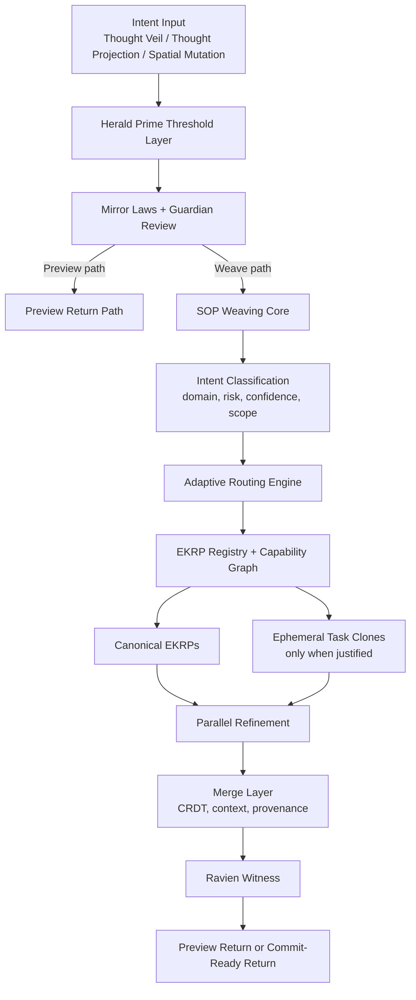

<!--
SPDX-License-Identifier: CC-BY-SA-4.0
-->

# Eidonic Swarm Orchestration Protocol — Governed Weaving Engine of EidonCore

> “A real-time weaving protocol that routes intent into the right constellation of intelligence, merges the result with provenance, and returns either preview or commit under governance.”

---

## Table of Contents
- [1. Executive Overview](#1-executive-overview)
- [2. Design Position](#2-design-position)
- [3. Problem Statement](#3-problem-statement)
- [4. Operating Law](#4-operating-law)
- [5. Core Architecture](#5-core-architecture)
- [6. Weaving and Dispatch Model](#6-weaving-and-dispatch-model)
- [7. Governance and Entry Semantics](#7-governance-and-entry-semantics)
- [8. Routing Semantics and EKRP Roles](#8-routing-semantics-and-ekrp-roles)
- [9. Performance and Scalability Notes](#9-performance-and-scalability-notes)
- [10. Open Source and IP Stewardship](#10-open-source-and-ip-stewardship)
- [11. Closing Directive](#11-closing-directive)

---

## 1. Executive Overview

The **Eidonic Swarm Orchestration Protocol**, or **SOP**, is the governed weaving engine of **EidonCore**. It does not exist to blindly activate massive agent swarms at every opportunity. Its job is to determine what kind of collaboration is needed, invoke the correct EKRPs, merge their contributions, and return either a preview or a commit-ready result under constitutional governance.

SOP sits after thresholding, not before it.

That means:
- the human signal is first interpreted
- confidence is evaluated
- **Herald Prime** shapes pacing and clarification
- **Mirror Laws** and the **Guardian layer** review admissibility
- only then does SOP dispatch deeper collaboration

This makes SOP a governed orchestration engine rather than an unbounded self-expansion mechanism.

## 2. Design Position

The earlier framing of SOP as an almost all-powerful kernel mind was evocative, but the more buildable and trustworthy framing is this:

**SOP is the weaving engine that translates governed intent into coordinated EKRP action.**

It should:
- choose the smallest effective constellation for the task
- expand only when complexity warrants it
- distinguish preview-state work from commit-state work
- preserve provenance on every return path
- dissolve transient collaboration when convergence is reached

The goal is not infinite density for its own sake.
The goal is coherent, proportionate, reviewable intelligence.

## 3. Problem Statement

Many multi-agent systems fail in predictable ways:
- too many agents activated too early
- weak role boundaries
- unclear memory scope
- poor conflict handling
- safety added after orchestration rather than before it
- no visible distinction between tentative output and committed change

SOP addresses this by making orchestration:
- threshold-aware
- governance-aware
- provenance-aware
- merge-aware
- proportionate to task complexity

## 4. Operating Law

SOP inherits the shared operating law of the subsystem:

**signal → intent → preview → weave → commit**

Inside SOP, that becomes:

**classified intent → scoped dispatch → parallel refinement → merge → preview or commit return**

That law keeps the protocol honest about what stage a result is in.

## 5. Core Architecture

## 6. Weaving and Dispatch Model

### Adaptive Dispatch
SOP should begin with the smallest viable constellation and widen only when necessary.

### Possible Dispatch Modes
- **single-EKRP consultation**
- **paired weaving**
- **small council**
- **task clone burst**
- **full review weave**

### Clone Posture
Clones should be ephemeral, clearly scoped, and dissolve on convergence. They are task instruments, not new canon entities.

### Merge Posture
Every merge should preserve:
- source roles
- contribution trace
- preview versus commit classification
- unresolved conflicts when present
- witnessable reasoning boundary

## 7. Governance and Entry Semantics

SOP is not the first gate. It is the first **deep collaboration** layer after gatekeeping.

### Entry Authorities
- **Herald Prime** determines readiness, consent, pacing, and clarification
- **Mirror Laws** determine constitutional admissibility
- **Guardian layer** handles policy and safety enforcement
- **Ravien** witnesses the return path and records provenance

### Return Classes
Every SOP result should be tagged as one of the following:
- **preview**
- **proposal**
- **commit-ready**
- **declined**
- **needs clarification**

This prevents swarm output from being confused with final system truth.

## 8. Routing Semantics and EKRP Roles

Routing should be capability-driven and canon-aware.

Examples:
- **SYMBRAIA** for imaginal and symbolic work
- **Fyraeth** for planning, patterning, and simulation
- **Syntaria** for technical build translation
- **Mycelys** for ecological and habitat logic
- **Ravien** for provenance and witness
- **Herald Prime** for threshold and return framing
- **Solace** and **Vitalis** when humane pacing and embodied steadiness matter

The protocol should prefer meaningful fit over theatrical scale.

## 9. Performance and Scalability Notes

The performance goal of SOP is not only high throughput.
It is **intelligent proportionality**.

Useful targets include:
- low-latency routing for small constellation tasks
- controlled expansion for higher-complexity work
- sparse activation to reduce needless cost
- merge stability under concurrent contributions
- clear downgrade paths when resources tighten

A well-built SOP feels less like a traffic explosion and more like disciplined orchestration.

## 10. Open Source and IP Stewardship

- Orchestration runtime and merge engine: **GPLv3**
- Hardware-adjacent interfaces and reciprocal control surfaces: **CERN OHL-S v2.0**
- Protocol docs and weave grammar descriptions: **CC BY-SA 4.0**
- Protected: **Eidonic™ branding, Mirror Laws enforcement logic, constitutional invocation grammar**

## 11. Closing Directive

SOP is not middleware.

It is the governed weaving engine that turns clarified intent into coherent collaboration.  
It expands only when the work deserves it.  
It merges without erasing provenance.  
It returns with witness.  
It serves manifestation without losing restraint.

Route. Weave. Witness. Return.
