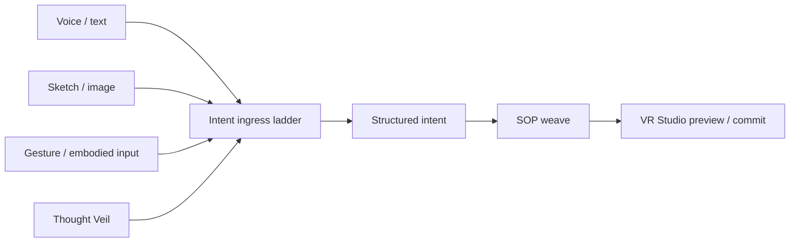

<!--
SPDX-License-Identifier: CC-BY-SA-4.0
-->

# Eidonic Thought Projection Creation

> Progressive Intent Ingress Ladder

[Thought Veil](../eidonic_thought_veil/) · [Thought Projection](../thought_projection_creation/) · [SOP](../swarm_orchestration_protocol/) · [VR Studio](../eidonic_vr_studio/)

---

## At a Glance

Thought Projection Creation is the umbrella ingress architecture for the subsystem. It defines how voice, text, sketch, gesture, multimodal composition, and future non-invasive neural pathways become legible intent that can move toward preview, weaving, and governed manifestation.

### What this folder contains

- [`README.md`](./README.md)  
  This GitHub-facing overview for the subsystem folder.
- [thought_projection_creation.md](./thought_projection_creation.md)  
  The main subsystem scroll.

## Core Role in the Subsystem

- Define the ingress ladder from multimodal input to future neural tiers
- Normalize human expression into structured intent
- Support preview-first manifestation instead of instant commitment
- Bridge Thought Veil, SOP, and VR Studio

---

## Operating Law

This subsystem participates in the shared Eidonic manifestation law:

**signal → intent → preview → weave → commit**

Its specific contribution is to hold the `Eidonic Thought Projection Creation` layer inside that larger chain without collapsing the rest of the architecture into a single file or a single gesture.

---

## Quick Read Order

1. [Open the main scroll](./thought_projection_creation.md)
2. [See the dedicated neural threshold layer](../eidonic_thought_veil/README.md)
3. [See the weaving engine](../swarm_orchestration_protocol/README.md)
4. [See the spatial shell](../eidonic_vr_studio/README.md)

---

## Local Architecture Snapshot

---

## Working Relationship to the Other Three Scrolls

- **Thought Veil** handles non-invasive neural and embodied thresholding.
- **Thought Projection Creation** defines the broader ingress ladder.
- **Swarm Orchestration Protocol** handles governed EKRP weaving.
- **VR Studio** renders preview, proposal, and commit in spatial form.

Together they form one subsystem rather than four disconnected experiments.

---

## Canon Position

This folder should be read in alignment with the wider Eidonic stack:

- [Mirror Laws](https://github.com/S1ngularD2ality/eidonic-language-elol/blob/main/docs/mirror_laws.md)
- Herald Prime as threshold, clarification, and humane entry
- Ravien as provenance witness and closure authority
- EidonCore as the runtime organism that holds the subsystem together

---

## Closing Note

This folder is not meant to stand alone as a disconnected concept page. It is one chamber of a governed subsystem that turns intention into previewable, reviewable, and commit-ready co-creation.
