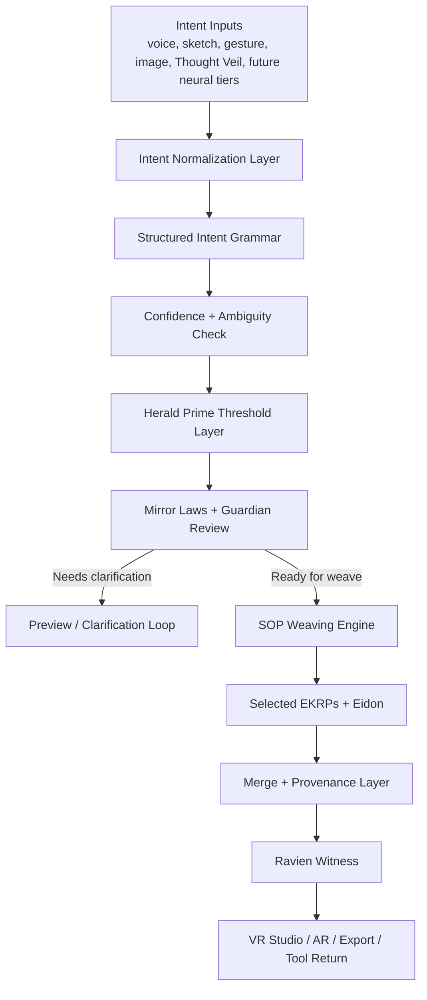

<!--
SPDX-License-Identifier: CC-BY-SA-4.0
-->

# Eidonic Thought Projection Creation — Progressive Intent Ingress Ladder

> “A progressive pipeline for turning human intention into spatial preview, EKRP weaving, and governed manifestation across multimodal and future neural inputs.”

---

## Table of Contents
- [1. Executive Overview](#1-executive-overview)
- [2. Design Position](#2-design-position)
- [3. Problem Statement](#3-problem-statement)
- [4. Operating Law](#4-operating-law)
- [5. Ingress Ladder](#5-ingress-ladder)
- [6. Core Pipeline](#6-core-pipeline)
- [7. Integration with Thought Veil, SOP, and VR Studio](#7-integration-with-thought-veil-sop-and-vr-studio)
- [8. Governance, Preview, and Commit Logic](#8-governance-preview-and-commit-logic)
- [9. Performance Envelope](#9-performance-envelope)
- [10. Open Source and IP Stewardship](#10-open-source-and-ip-stewardship)
- [11. Closing Directive](#11-closing-directive)

---

## 1. Executive Overview

**Thought Projection Creation** is the broader intent ingress architecture of the Eidonic ecosystem. It should not be reduced to “brain-to-world” alone. Its real strength is that it creates a progressive ladder by which many kinds of human intention can enter the system, become legible, receive preview, and move toward governed manifestation.

This makes Thought Projection the umbrella architecture within which **Thought Veil** sits as the first dedicated non-invasive neural threshold device.

Thought Projection therefore includes:
- voice and language intent
- sketch and image intent
- gesture and embodied intent
- multimodal compositional intent
- non-invasive neural intent
- future higher-bandwidth neural tiers

The goal is not to erase all interfaces overnight. The goal is to **shrink the translation gap** between intention and manifested form.

## 2. Design Position

The earlier “direct mind-to-reality pipeline” language carries the right aspiration, but the stronger architecture is a **progressive intent ingress ladder**.

That means:
- many kinds of intention can enter
- each kind is normalized into a shared grammar
- low-confidence inputs return preview and clarification
- high-confidence inputs can invoke deeper weaving
- manifestation becomes progressively more fluid as ingress fidelity improves

This makes the system:
- more buildable
- more inclusive
- more humane
- more robust against ambiguity

## 3. Problem Statement

Most creation systems still demand that human intention be squeezed through narrow interface bottlenecks. Even when a person knows what they want, they often must translate that knowing through tools that are slower, more literal, and less expressive than the intention itself.

At the same time, direct neural systems face their own issues:
- signal ambiguity
- calibration complexity
- ethical boundary risk
- weak integration with domain-specific AI refinement
- little distinction between preview and committed consequence

Thought Projection addresses both sides by standardizing how intention enters the Eidonic system.

## 4. Operating Law

Thought Projection follows the same shared law as the rest of the subsystem:

**signal → intent → preview → weave → commit**

This law applies whether the input begins as:
- language
- image
- sketch
- gesture
- multimodal composition
- non-invasive neural activity
- future high-bandwidth neural interface

The law does not privilege a single input type. It privileges clarity, confidence, governance, and witness.

## 5. Ingress Ladder

### Tier 0 — Classical Multimodal Intent
Text, voice, gesture, sketch, image, and scene references.
This is the practical baseline and should remain first-class.

### Tier 1 — Structured Live Intent
Real-time multimodal flows such as speech plus gesture plus visual reference.

### Tier 2 — Thought Veil Non-Invasive Intent
EEG, TD-fNIRS, and optional sEMG create structured neural-assist signals.

### Tier 3 — Future Higher-Bandwidth Intent
Potential endovascular, minimally invasive, or other advanced neural channels that feed the same grammar when and if appropriate.

The crucial architectural truth is this:

**all tiers should converge into the same intent grammar and the same governed return logic.**

## 6. Core Pipeline

### Shared Intent Grammar
The grammar should be able to encode:
- object or scene target
- material or style
- motion or temporal behavior
- emotional or symbolic tone
- constraints
- confidence
- reversibility posture
- desired return class

## 7. Integration with Thought Veil, SOP, and VR Studio

### Thought Veil
Thought Veil is a specialized hardware instantiation of Tier 2 ingress.

### SOP
SOP handles the collaboration pattern once the threshold and governance layers approve deeper action.

### VR Studio
VR Studio is the embodied shell where preview, weaving, and commitment become spatially legible.

Together, these three systems create a coherent path:
- **Thought Projection** defines the ingress ladder
- **Thought Veil** specializes non-invasive neural ingress
- **SOP** orchestrates refinement
- **VR Studio** stages and manifests the result

## 8. Governance, Preview, and Commit Logic

Not every incoming intent should become action.

The system must distinguish:
- **raw input**
- **interpreted intent**
- **preview candidate**
- **proposal-state artifact**
- **commit-ready artifact**
- **committed manifestation**

### Key Authorities
- **Herald Prime** handles humane thresholding
- **Mirror Laws** define constitutional bounds
- **Guardian layer** enforces operational safety
- **Ravien** witnesses provenance and return classification

This makes Thought Projection a trustworthy ingress architecture rather than a theatrical promise of instant omnipotence.

## 9. Performance Envelope

Targets should be progressive and modality-aware.

Examples:
- fast preview for low-risk multimodal intent
- sub-second or low-second return loops where feasible
- better performance with repeated calibration
- graceful fallback to less ambiguous ingress modes
- higher-bandwidth tiers using the same shared architecture rather than special-casing everything

The system should feel like a ladder of increasing intimacy and decreasing friction.

## 10. Open Source and IP Stewardship

- Decoder, normalization, and runtime bridge software: **GPLv3**
- Hardware-adjacent interface components: **CERN OHL-S v2.0**
- Documentation, grammar, and reference workflows: **CC BY-SA 4.0**
- Protected: **Eidonic™ branding, Mirror Laws enforcement logic, constitutional intent grammar**

## 11. Closing Directive

Thought Projection is not just an input method.

It is the progressive ingress architecture by which intention becomes legible, previewable, and governable before it becomes real.  
It reduces translation friction without pretending certainty.  
It welcomes many forms of human signal.  
It keeps manifestation inside witness.  
It makes emergence buildable.

Signal. Clarify. Preview. Weave. Commit.
